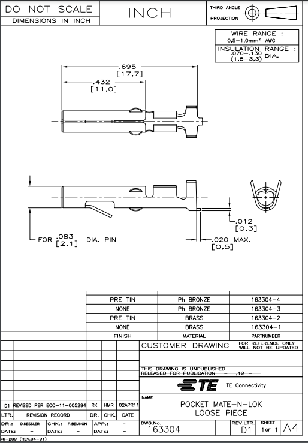
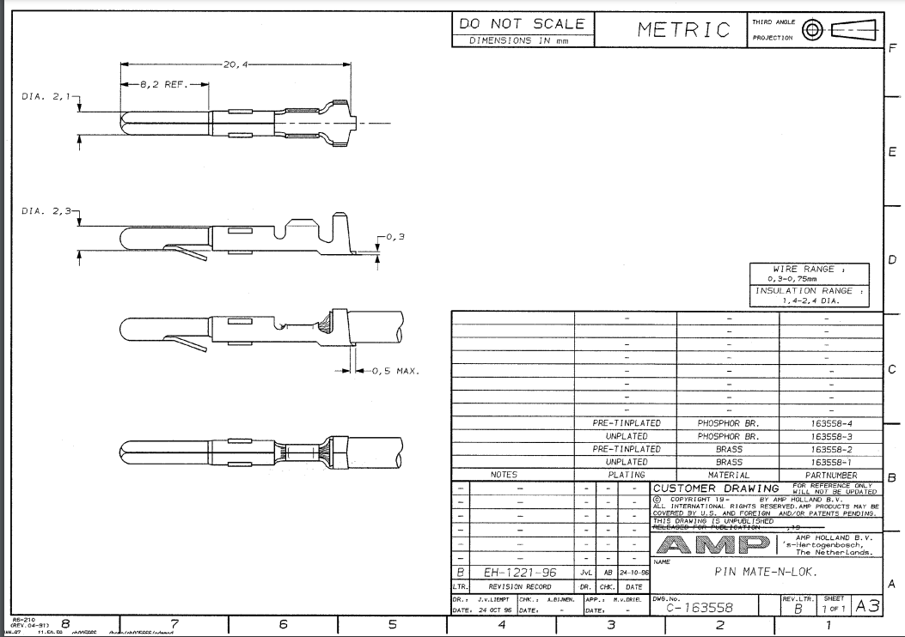

# Backplanes - detailed slot descriptions

# Notes: DD11 Unibus Backplane

## Unibus Backplanes

| Type | Slots | Description |
| --- | --- | --- |
| DD11-A | 4   | The end slots are Unibus in rows A and B, one of the middle sp;slots, row A is for the power connection. Rows C to F are SPC. |
| DD11-B | 4   | The end slots are Unibus in rows A and B, the middle slots, rows A and B are for DF11. Rows C to F are SPC. Power connection is via a harness and faston tabs. |
| DD11-CF | 4   | The end slots are Unibus in rows A and B, the middle slots, rows A and B are MUD (?). Rows C to F are SPC. Power connection is via a soldered harness for a BA11-F mounting box. |
| DD11-CK | 4   | The end slots are Unibus in rows A and B, the middle slots, rows A and B are MUD (?). Rows C to F are SPC. Power connection is via a soldered harness for a BA11-K mounting box. |
| DD11-DF | 9   | The end slots are Unibus in rows A and B, the middle slots, rows A and B are MUD (?). Rows C to F are SPC. Power connection is via a soldered harness for a BA11-F mounting box. |
| DD11-DK | 9   | The end slots are Unibus in rows A and B, the middle slots, rows A and B are MUD (?). Rows C to F are SPC. Power connection is via a soldered harness for a BA11-K mounting box. |

## Detailed Slot Descriptions

Backplanes viewed from the wiring side.

### DD11-A

|     |     |     |     |     |     |     |
| --- | --- | --- | --- | --- | --- | --- |
|     | A   | B   | C   | D   | E   | F   |
| 4   | UNIBUS |     | SPC |     |     |     |
| 3   | Power | unused | SPC |     |     |     |
| 2   | unavailable | unused | SPC |     |     |     |
| 1   | UNIBUS |     | SPC |     |     |     |

### DD11-B

|     |     |     |     |     |     |     |
| --- | --- | --- | --- | --- | --- | --- |
|     | A   | B   | C   | D   | E   | F   |
| 4   | UNIBUS |     | SPC |     |     |     |
| 3   | DF11 |     | SPC |     |     |     |
| 2   | DF11 |     | SPC |     |     |     |
| 1   | UNIBUS |     | SPC |     |     |     |

### DD11-C

|     |     |     |     |     |     |     |
| --- | --- | --- | --- | --- | --- | --- |
|     | A   | B   | C   | D   | E   | F   |
| 4   | UNIBUS |     | SPC |     |     |     |
| 3   | Modified UNIBUS |     | SPC |     |     |     |
| 2   | Modified UNIBUS |     | SPC |     |     |     |
| 1   | UNIBUS |     | SPC |     |     |     |

### DD11-D

|     |     |     |     |     |     |     |
| --- | --- | --- | --- | --- | --- | --- |
|     | A   | B   | C   | D   | E   | F   |
| 9   | UNIBUS |     | SPC |     |     |     |
| 8   | Modified UNIBUS |     | SPC |     |     |     |
| 7   | Modified UNIBUS |     | SPC |     |     |     |
| 6   | Modified UNIBUS |     | SPC |     |     |     |
| 5   | Modified UNIBUS |     | SPC |     |     |     |
| 4   | Modified UNIBUS |     | SPC |     |     |     |
| 3   | Modified UNIBUS |     | SPC |     |     |     |
| 2   | Modified UNIBUS |     | SPC |     |     |     |
| 1   | UNIBUS |     | SPC |     |     |     |

* * *

### UNIBUS Pin Designations

|     |     |     |     |     |
| --- | --- | --- | --- | --- |
|     | Row A |     | Row B |     |
|     | 1   | 2   | 1   | 2   |
| A   | INIT L | +5V | BG6 H | +5V |
| B   | INTR L | GND | BG5 H | GND |
| C   | D00 L | GND | BR5 L | GND |
| D   | D02 L | D01 L | GND | BR4 L |
| E   | D04 L | D03 L | GND | BG4 H |
| F   | D06 L | D05 L | AC LO L | DC LO L |
| H   | D08 L | D07 L | A01 L | A00 L |
| J   | D10 L | D09 L | A03 L | A02 L |
| K   | D12 L | D11 L | A05 L | A04 L |
| L   | D14 L | D13 L | A07 L | A06 L |
| M   | PA L | D15 L | A09 L | A08 L |
| N   | GND | PB L | A11 L | A10 L |
| P   | GND | BBSY L | A13 L | A12 L |
| R   | GND | SACK L | A15 L | A14 L |
| S   | GND | NPR L | A17 L | A16 L |
| T   | GND | BR7 L | GND | C1 L |
| U   | NPG H | BR6 L | SSYN L | C0 L |
| V   | BG7 SO | GND | MSYN L | GND |

aa

### Modified UNIBUS Pin Designations

|     |     |     |     |     |
| --- | --- | --- | --- | --- |
|     | Row A |     | Row B |     |
|     | 1   | 2   | 1   | 2   |
| A   | INIT L | +5V | RESV | +5V |
| B   | INTR L | GND | RESV | TP  |
| C   | D00 L | GND | BR5 L | GND |
| D   | D02 L | D01 L | +5 BAT | BR4 L |
| E   | D04 L | D03 L | INT SSYN | PAR DET |
| F   | D06 L | D05 L | AC LO L | DC LO L |
| H   | D08 L | D07 L | A01 L | A00 L |
| J   | D10 L | D09 L | A03 L | A02 L |
| K   | D12 L | D11 L | A05 L | A04 L |
| L   | D14 L | D13 L | A07 L | A06 L |
| M   | PA L | D15 L | A09 L | A08 L |
| N   | PAR P1 | PB L | A11 L | A10 L |
| P   | PAR P0 | BBSY L | A13 L | A12 L |
| R   | +15 BAT | SACK L | A15 L | A14 L |
| S   | \-15 BAT | NPR L | A17 L | A16 L |
| T   | GND | BR7 L | GND | C1 L |
| U   | +20 CORE | BR6 L | SSYN L | C0 L |
| V   | +20 CORE | +20 CORE | MSYN L | \-5 CORE |

### Unibus / Modified unibus difference

|     |     |     |     |     |     |     |     |     |
| --- | --- | --- | --- | --- | --- | --- | --- | --- |
|     | Row A |     |     |     | Row B |     |     |     |
|     | 1UB | 1MUD | 2UB | 2MUD | 1UB | 1MUD | 2UB | 2MUD |
| A   | INIT L |     | +5V |     | BG6 H | RESV | +5V |     |
| B   | INTR L |     | GND |     | BG5 H | RESV | GND | TP  |
| C   | D00 L |     | GND |     | BR5 L |     | GND |     |
| D   | D02 L |     | D01 L |     | GND | +5V BAT | BR4 L |     |
| E   | D04 L |     | D03 L |     | GND | INT SSYN | BG4 H | PAR DET |
| F   | D06 L |     | D05 L |     | AC LO L |     | DC LO L |     |
| H   | D08 L |     | D07 L |     | A01 L |     | A00 L |     |
| J   | D10 L |     | D09 L |     | A03 L |     | A02 L |     |
| K   | D12 L |     | D11 L |     | A05 L |     | A04 L |     |
| L   | D14 L |     | D13 L |     | A07 L |     | A06 L |     |
| M   | PA L |     | D15 L |     | A09 L |     | A08 L |     |
| N   | GND | PAR P1 | PB L |     | A11 L |     | A10 L |     |
| P   | GND | PAR P0 | BBSY L |     | A13 L |     | A12 L |     |
| R   | GND | +15V BAT | SACK L |     | A15 L |     | A14 L |     |
| S   | GND | \-15V BAT | NPR L |     | A17 L |     | A16 L |     |
| T   | GND |     | BR7 L |     | GND |     | C1 L |     |
| U   | NPG H | +20 CORE | BR6 L |     | SSYN L |     | C0 L |     |
| V   | BG7 SO | +20 CORE | GND | +20 CORE | MSYN L |     | GND | \-5V CORE |

### SPC Pin Designations

|     |     |     |     |     |     |     |     |     |
| --- | --- | --- | --- | --- | --- | --- | --- | --- |
|     | Row C |     | Row D |     | Row E |     | Row F |     |
|     | 1   | 2   | 1   | 2   | 1   | 2   | 1   | 2   |
| A   | NPG IN | +5V | TP  | +5V | GND | +5V | ABG OUT | +5V |
| B   | NPG OUT | \-15V | TP  | \-15V | ASSYN IN H | \-15V | ABG IN | \-15V |
| C   | PA L | GND | A SEL 6 | GND | A12 L | GND | SSYN L | GND |
| D   | LTC | D15 L | A OUT L | BR7 L | A17 L | A15 L | BBSY L | F01 N1 |
| E   | TP  | D14 L | A SEL 4 | BR6 L | MSYN L | A16 L | F01 V2 | D02 L |
| F   | TP  | D13 L | A SEL 0 | BR5 L | A02 L | C1 L | D05 L | D06 L |
| H   | D11 L | D12 L | A IN | BR4 L | A01 L | A00 L | D07 L | A INT ENBB |
| J   | A INT B | D10 L | A SEL 4 | A BR OUT | SSYN L | C0 L | NPR L | GND A |
| K   | TP  | D09 L | A OUT | BG7 SO | A14 L | A13 L | D08 L | A INT B |
| L   | A INT ENBB | D08 L | INIT L | BG7 OUT | A11 L | TP  | D03 L | F01 L2 |
| M   | TP  | D07 L | A INT ENBA | BG6 SO | A IN | A OUT H | INTR L | F01 M2 |
| N   | DC LO | D04 L | A INT A | BG6 OUT | A OUT L | A08 L | F01 N1 | D04 L |
| P   | HALT REQ | D05 L | TP  | BG5 SO | A10 L | A07 L | ABR OUT | F01 P2 |
| R   | HALT GRT | D01 L | TP  | BG5 OUT | A09 L | A SEL 4 | F01 L2 | F01 N1 |
| S   | PB L | D00 L | TP  | BG4 SO | A SEL 6 | A SEL 0 | F01 M2 | F01 P2 |
| T   | GND | D03 L | GND | BG4 OUT | GND | A SEL 2 | GND | SACK L |
| U   | +15/+8 | D02 L | TP  | ABG IN | A06 L | A04 L | A INT A | ABR OUT |
| V   | AC LO | D06 L | ASSYN IN H | ABG OUT | A05 L | A03 L | A INT ENBA | F01 F01 |

* * *

## 11/40 Power Distribution Panel

#### Connector: AMP 9 pin MATE-N-LOC™

|     |     |     |     |     |
| --- | --- | --- | --- | --- |
| Pin | AWG | Color | Function | **Slot Pins** |
| 1   | 18  | violet | DCLO | BF2, CN1 |
| 2   | 18  | yellow | ACLO | BF1 |
| 3   | 18  | blue | \-15V | CB2, CC2, CD2, CE2 |
| 4   | 14  | black | GND |     |
| 5   | 14  | black | GND |     |
| 6   |     |     | n/c |     |
| 7   | 18  | brown | LTC | CD1 |
| 8   | 14  | grey | +15V | CU1 |
| 9   | 14  | red | +5V | AA2, BA2, CA2, DA2, EA2, FA2 |

## DD11-DK Power Connections

#### P2 Connector: AMP 15 pin MATE-N-LOC™ (Also on DD11-CK)

|     |     |     |     |     |
| --- | --- | --- | --- | --- |
| Pin | AWG | Color | Function | **Slot Pins** |
| 1   | 14  | red | +5V | AA2, BA2, CA2, DA2, EA2, FA2 |
| 2   | 18  | grey | +15V | CU1 |
| 3   | 14  | orange | +20V core | AU1, AV1, AV2 |
| 4   | 14  | red | +5V | AA2, BA2 |
| 5   |     |     |     |     |
| 6   |     |     |     |     |
| 7   |     |     |     |     |
| 8   | 14  | black | GND |     |
| 9   | 14  | black | GND |     |
| 10  |     |     |     |     |
| 11  |     |     |     |     |
| 12  | 14  | red | +5VB | BD1 |
| 13  |     |     |     |     |
| 14  | 18  | brown | \-5V core | BV2 |
| 15  |     |     |     |     |

#### P3 Connector: AMP 6 pin MATE-N-LOC™ (Also on DD11-CK)

|     |     |     |     |     |
| --- | --- | --- | --- | --- |
| Pin | AWG | Color | Function | **Slot Pins** |
| 1   | 14  | black | GND |     |
| 2   | 18  | brown | LTC | CD1 |
| 3   | 18  | violet | DCLO | BF2, CN1 |
| 4   | 18  | yellow | ACLO | BF1 |
| 5   |     |     |     |     |
| 6   |     |     |     |     |

#### P4 Connector: AMP 15 pin MATE-N-LOC™ (Not available on DD11-CK)

|     |     |     |     |     |
| --- | --- | --- | --- | --- |
| Pin | AWG | Color | Function | Slot Pins |
| 1   | 14  | red | +5V | AA2, BA2, CA2, DA2, EA2, FA2 |
| 2   |     |     |     |     |
| 3   | 14  | orange | +20V core | AU1, AV1, AV2 |
| 4   | 14  | red | +5V | AA2, BA2, CA2, DA2, EA2, FA2 |
| 5   |     |     |     |     |
| 6   | 18  | white | +15VB | AR1 |
| 7   |     |     |     |     |
| 8   | 14  | black | GND |     |
| 9   | 14  | black | GND |     |
| 10  |     |     |     |     |
| 11  |     |     |     |     |
| 12  |     |     |     |     |
| 13  | 18  | blue | \-15V | CB2, CC2, CD2, CE2 |
| 14  |     |     |     |     |
| 15  | 18  | green | \-15VB | AS1 |

[Original here](https://archives.loomcom.com/pdp11/dd11.html)

# Power supply connectors

These connectors are all “MATE-N-LOK” connectors from TE Connectivity. This connector family consists of housings and pins sold separately in different form factors and pin sizes. Some parts can be obtained from [conrad.nl](http://conrad.nl); search for MATE-N-LOK.

I got the following to work with the connectors:

- TE Connectivity 163304-2 Krimpcontact MATE-N-LOK, female pin, max 15A, 17 AWG Max, 20AWG Min, min dwarsdoortsnede 0.5mm2, max 1.0mm2

The corresponding pin seems to be this:

- [TE Connectivity 163558-2 Krimpcontact MATE-N-LOK](https://www.conrad.nl/nl/p/te-connectivity-163558-2-krimpcontact-mate-n-lok-totaal-aantal-polen-1-1-stuk-s-1422684.html), 15A, max 18AWG, min 22AWG,

A male housing that is not fully compatible but which has at least proper spacing seems to be this:

- [TE Connectivity 350434-1 Male behuizing-board Universal-MATE-N-LOK](https://www.conrad.nl/nl/p/te-connectivity-350434-1-male-behuizing-board-universal-mate-n-lok-totaal-aantal-polen-15-1-stuk-s-1196542.html).