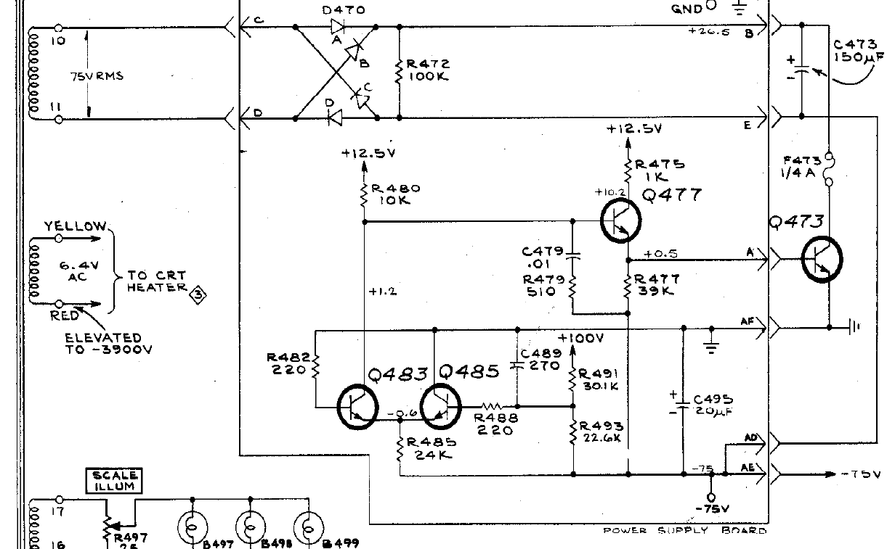
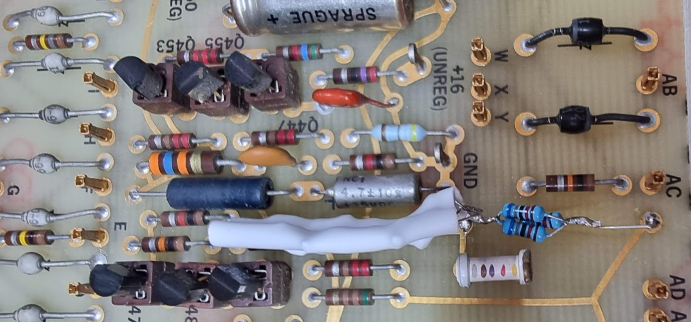
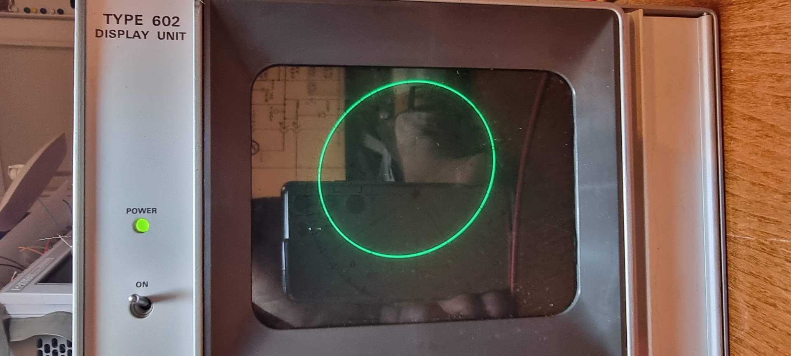
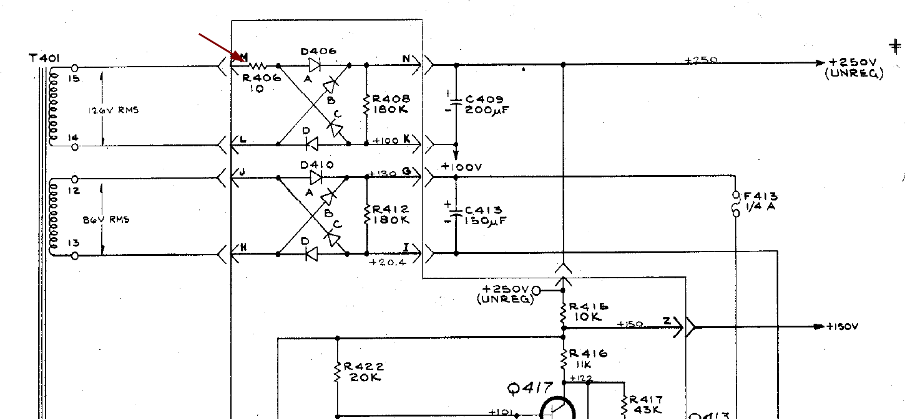
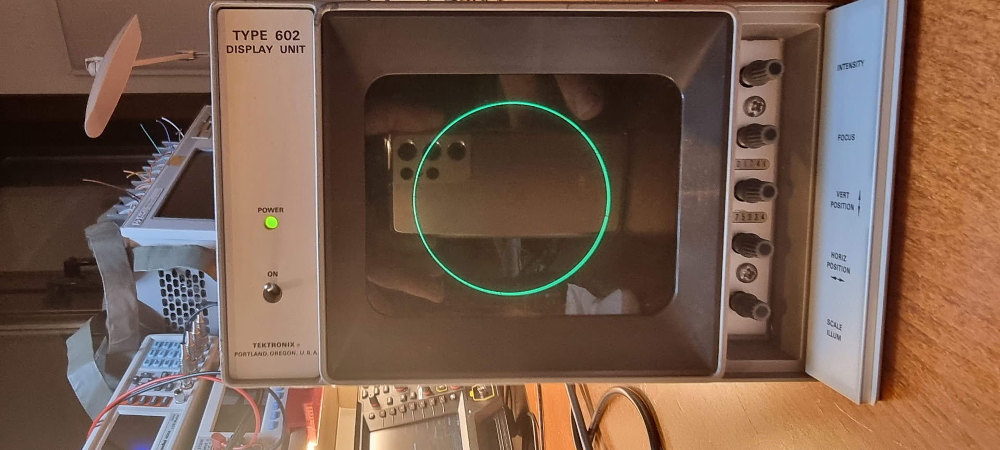

# Tektronix 602 X-Y Display

Links:

- [Tekwiki page](https://w140.com/tekwiki/wiki/602)

Gotten in 2023 from Marktplaats. The device was in nice physical shape.

Checking the capacitors initially found only one capacitor that had a large ESR (C495, a 22uF end cap on the -75V rail), and I replaced that one to be sure.

After checking the capacitors it was switched on. There was a beam, but it was very wide and foggy, and after putting two 180 degrees phase different sine waves at the X and Y input it was found that there was no deflection.

Opening the device and measuring the power supply voltages showed that the 100V was around 110. This was quickly corrected to 100v using the pot for that. All other voltages were OK, except the -75V one: it was around -18V instead.

The schematic for this part of the PSU looks as follows:

All transistors around the -75V regulator checked out fine. Next check was to measure some voltages. What was suspect was that the midpoint of the voltage divider formed by R491 (30.1K) and R493 (22.6K) was -8V. This divider actually “defines” the output voltage; when the -75V rail would be at -75V that voltage should be around 0V. As the transistor was fine I desoldered the resistors and they measured bad: the 22.6K one measured 26.95K instead and the 30.1K measured completely open. That nicely explained the problem.

I did not have replacement resistors for these, of course, and ordering these would be hard here, so I concocted a replacement, as follows:

First, these resistors are 0.5W ones. The current through the combined pair is (175/52.7K) = 3.32mA, and this makes the R491 resistor dissipate 100V \* 3.32e-3 = 0.332W. I only had 1/4W resistors lying about.

The solution to that is to put a set of resistors in parallel, so that each strain takes 1/nth the power.

The 22.6K resistor was replaced by 3x 68K in parallel, forming a 22.66K resistor.

The 30.1K resistor was more messy because I did not have all values that would make it easy. In the end I went with two parallel sets of 60.2K each. Each set consisted of the following resistors in series: 47K + 12K + 510 + 510 = 60.2K.

I encapsulated these Frankenresistors in some shrink wrap tube and replaced the old ones:

This fixed the -75V rail (measuring at -75.6V), and the device started working:

Sadly enough the pleasure was short lived, because after about one minute I got the Magic Smoke coming from R406:

This was a 10 ohm, 1W carbon resistor. I replaced it with a 5w resistor (only one I had) and measured the voltage over the new one when switching on. This voltage was around 3v after a minute or so, which would mean 0.9W dissipation, which sounds fine.

The only thing left to do was to fix the deflection amplifiers to that they have the same deflection for the same signal:

