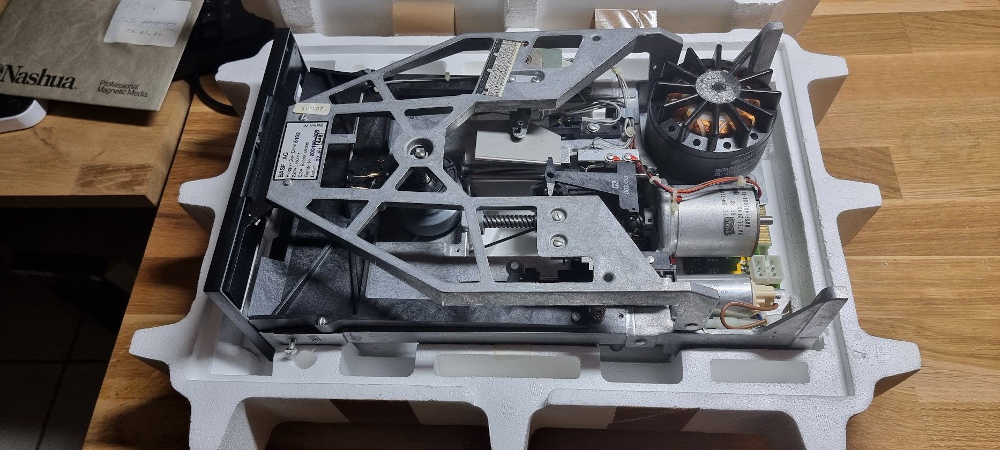
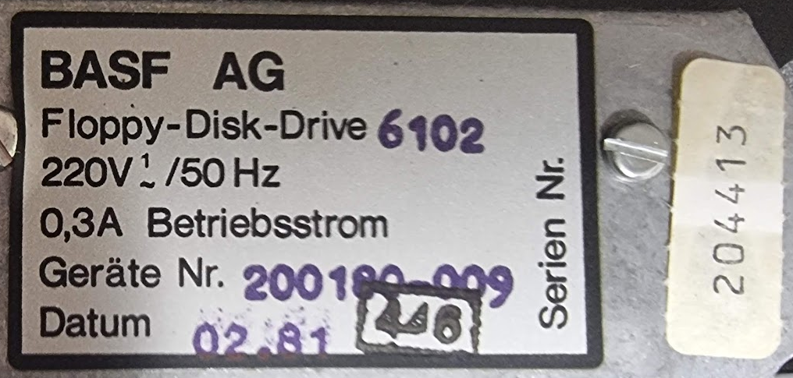
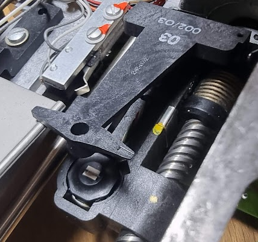
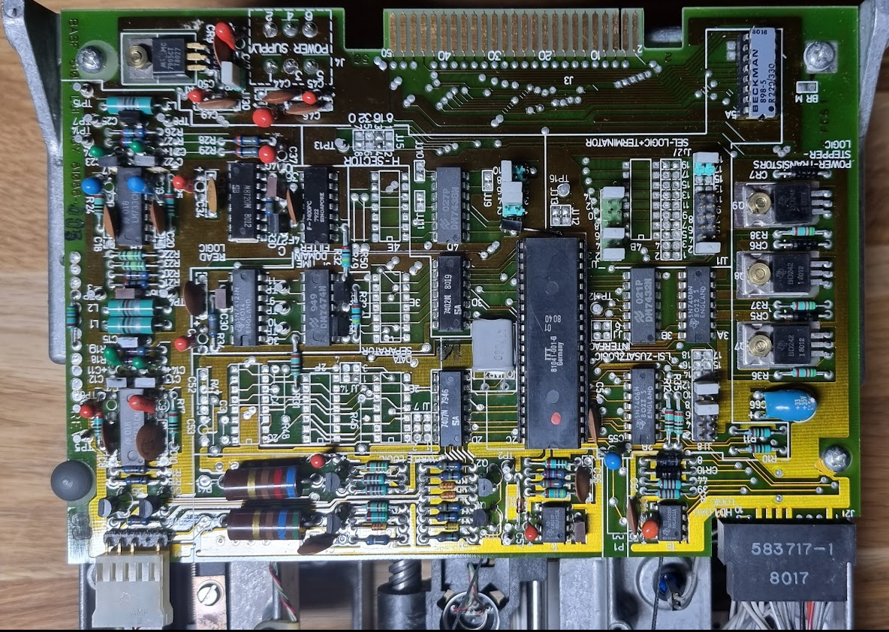
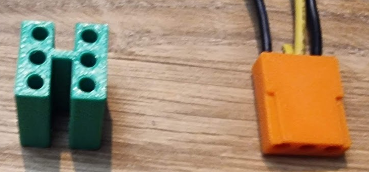
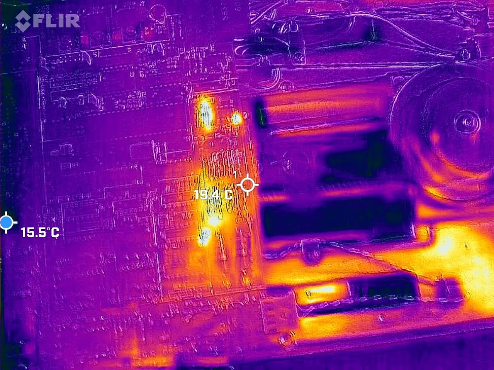
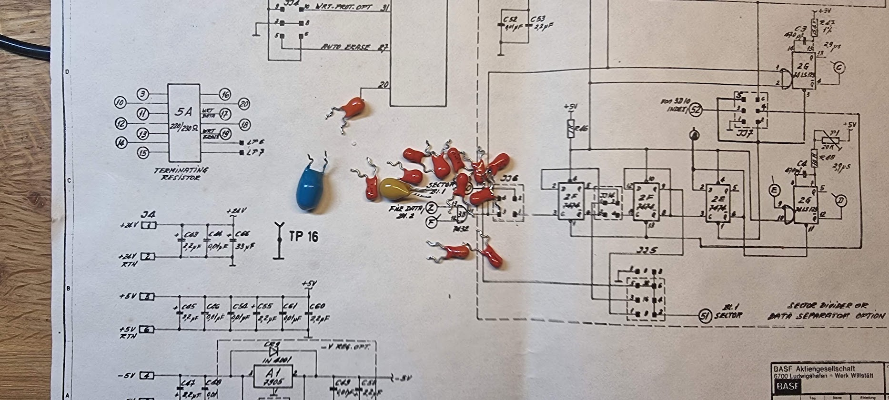
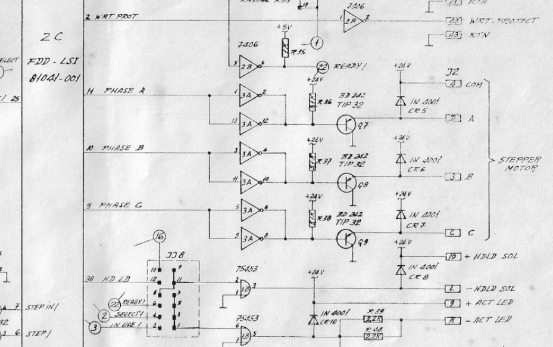

# The BASF 6102 8 inch floppy drive (dead)

- [Testing the drive](#testing-the-drive)
-   [Connectors…](#connectors)
-   [Powering up the logic](#powering-up-the-logic)
-   [Second round](#second-round)

It was a long search but I finally managed to get a “standard” 8” floppy drive! I found it on Leboncoin for a reasonable price (75 EUR). It came in what seemed to be its original foam packaging:

It is a single side drive since it has but a single head:

The controller board has a 50 pin edge connector:

This will require a converter board to connect it using the more usual 34pin cable. This board can be ordered from [Tindy, here](https://www.tindie.com/products/siliconinsider/8-floppy-disk-interface-50-pin-to-34-pin-adapter/). More information on 8” floppy drives can be seen on several CuriousMarc video’s.

.plan is to use this floppy with GreaseWeazle to create new formatted RX02 floppies for the DEC machines.

The device came with original documentation, 6 pages which I scanned to PDF: [basf6102.pdf](./attachments/basf6102.pdf)
 . For higher quality scans please contact me.

# Testing the drive

## Connectors…

The drive has some special form MOLEX connectors. I could not find these, so I decided to 3D print them:

This should make it easier to power the thing..

## Powering up the logic

I tested the drive by putting it on my lab PSU. After switching the power on the 24V rail dropped to 3V and took 2A, so I switched off immediately. There was a burning smell in the air although nothing seemed hot and I did not see the Magic Smoke.

I measured the resistance of the 24V rail to GND which was 0.2ohm, really too low. Then I noticed the plethora of tantalums… I switched on the PSU again and quickly took a picture with the thermal camera:

The hot spots corresponded to some of the tantalums. I decided to replace them all:

There was one 33uF 35V that I did not have, I replaced that with a low ESR electrolytic one. After that the 24V rail behaved.

## Second round

I was hopeful after replacing the Tantalum caps. But after fully powering up the drive I again had a 2A current draw at the 24V line. Removing the connector for the stepper motor fixed that, so apparently something is wrong in driving that. The schematic around that is depressingly simple:

IC 2C, a large LSI of unknown type, drives a set of 7406 inverters (high voltage open collector). These in turn drive a set of PNP transistors. Measuring the outputs of the transistors showed that they all were driven LOW at the same time. Not a Good Plan(tm) because that energizes all coils in the stepper which serves nothing - but it explains the current draw.

I then measured the outputs of the LSI (9, 10, 11) and found each of them at around 1.6V. This is a ‘1' for the inverters so those drive the outputs to 0, and this is what makes the transistors conduct. Removing the LSI does not change anything; the inputs still are at 1.6V so I wondered whether the 7406 was OK. I removed it and replaced it but this had the same effect, in addition my tester told me the 7406’s were fine.

With the 7406 removed the base of the transistors were at 24V, so they would be off.

I would conclude that the large IC should have driven the phase outputs all LOW. It clearly does not do that; its outputs seem to be in high impedance mode. I see no way where that would be a reasonable thing as it will always put all stepper coils on power. This, to me, means that the chip is dead, and with that the drive is not salvageable - that chip is unobtanium.