# The HP 1607A Logic Analyzer

An EBay find. It was quite clean when it arrived. Some pictures:

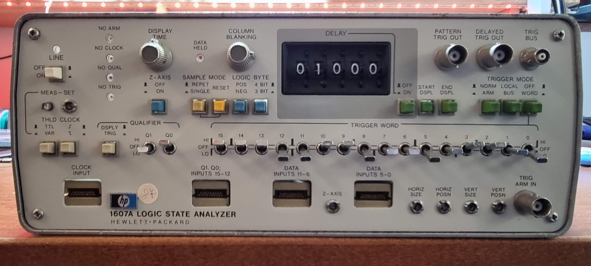

Opening it up (there was something moving around in there, turned out to be a loose screw):

Top side:

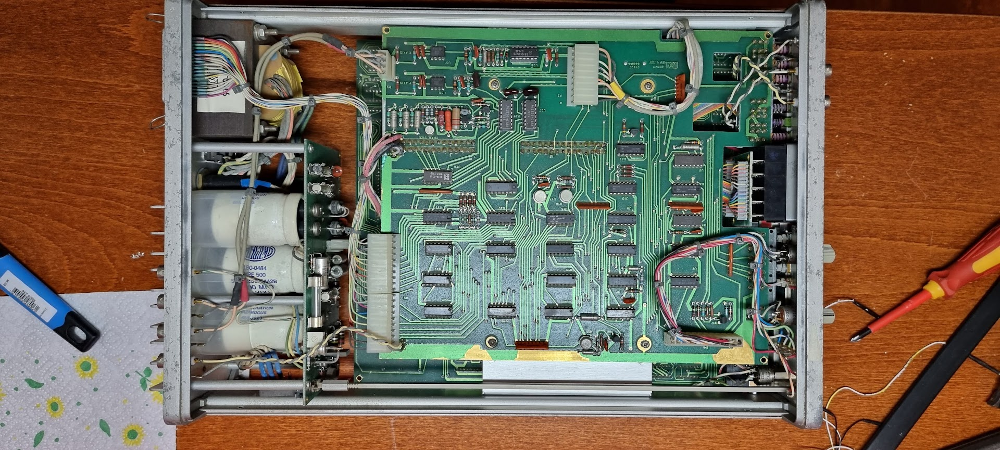

Bottom side:

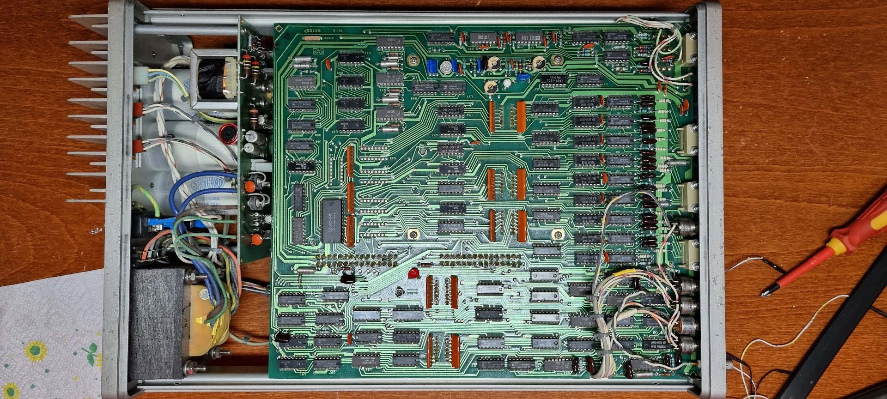

Next step is to check the PSU, those caps look scary..

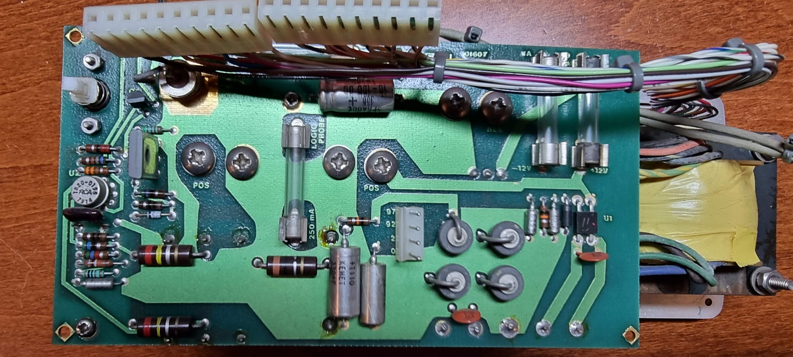

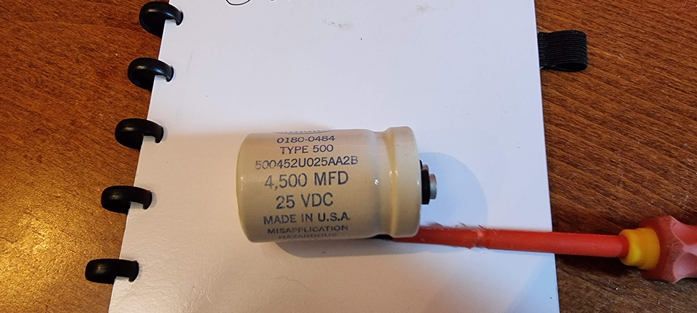

The big caps are 4500mF; way beyond the capability of my LCR meter (ET4401), so I will check them by hand… First reform them for a while by putting them at 25V through a 10K resistor:

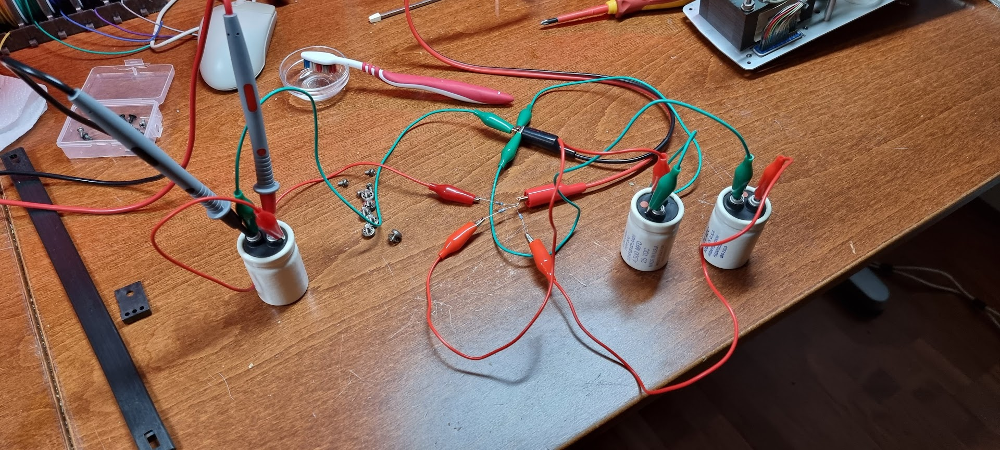

## Fixing the column blanking

Column blanking on the device did not work. First check is the signal on pin3 of U17, which compares the “position” where to blank. The signal shows:

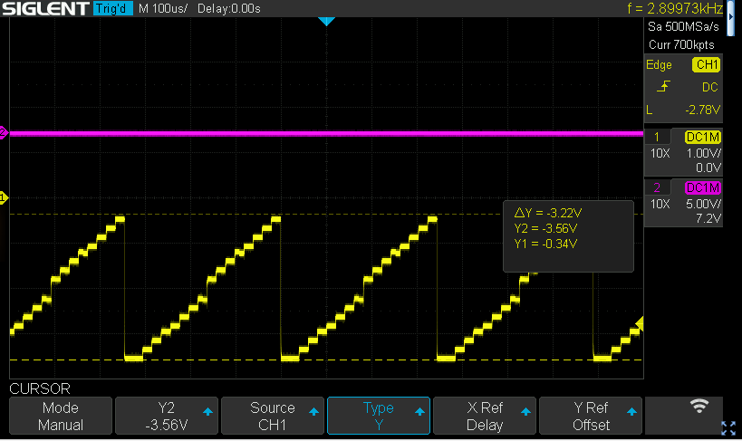

This is with the pot all turned left. Turning it all right shows:

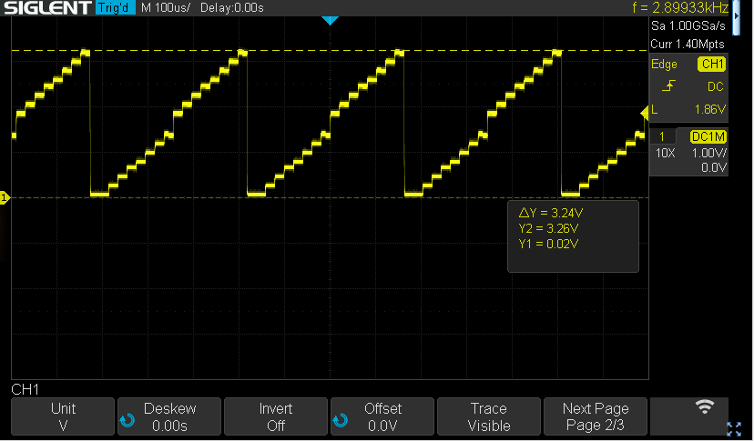

which seems correct as the comparator compares it with ground to see what to blank. Checking pin 7 shows no signal whatshowever, though. Conclusion: dead comparator or shorted U15E inverter..

U17 is an 1820-0321 IC COMPARATOR 710HC, probably a Fairchild uA710. This is a high accuracy and high speed comparator.

After replacing it with a new one from EBay the comparator outputs the correct flip signal.

# Trigger failure

Second fault is that the trigger never fires. I created a small counter using a 74ls393 and monitored that with the 1st probe. The “no trig” light was on all the time. The trigger word was to set bit 0..3 to zero (and word trigger).

Measuring pin8 of U10 shows:

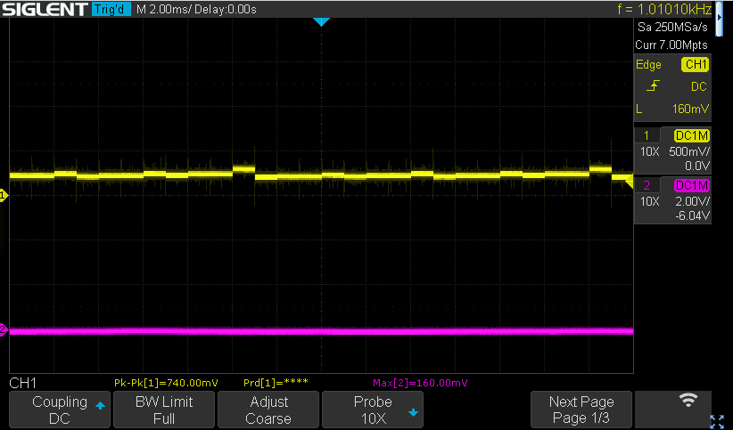

Clearly something holds the trigger line low, because if I increase the amplification to 100mv we see that a trigger does seem to want to come out:

This part of the trigger uses U10..U13 to handle the 1st 8 bits. The 74S65N chips are open collector and clearly the line is held low.

The AND pairs are:

2+3 (E+F)

4+6 (G+H)

10+9 (J+K)

11+13 (D+B)

Testing these pairs on U10..U13 shows that on none of these we have both signals on a single AND HIGH.

So: either one of the 74S65 is bad or U25 is bad.

Cutting pin 1 on U25 does not do anything, so that’s not the one.

Cutting U13 pin 8 does not help either, but after cutting pi8 U12 we see a signal:

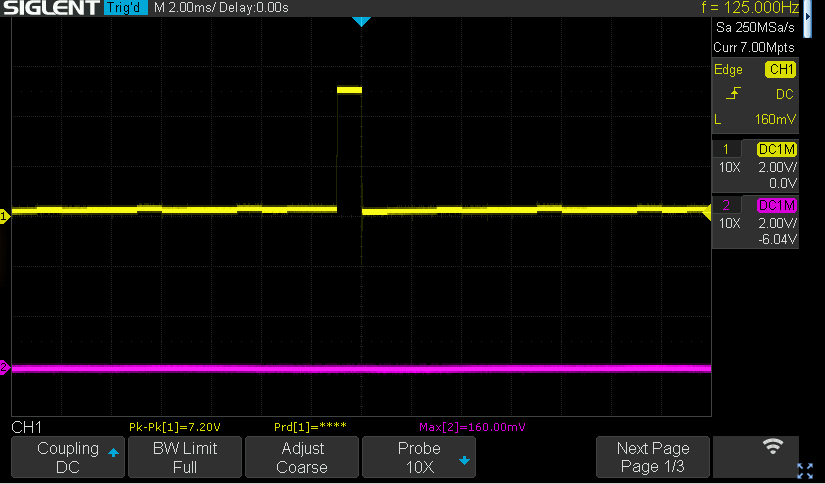

Conclusion: u12 is bad, and another wait for EBay starts, sigh.

After receiving the new 74S65 the trigger circuit worked (at last the parts tested so far), and with the new Tektronix 2236 oscilloscope we finally have a nice picture:

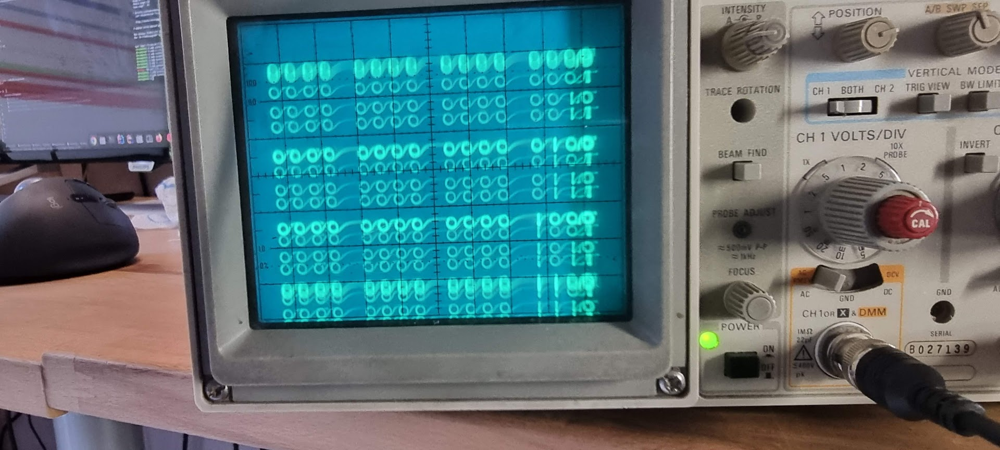