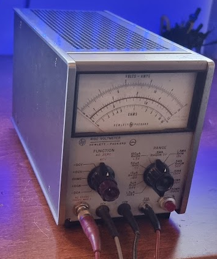
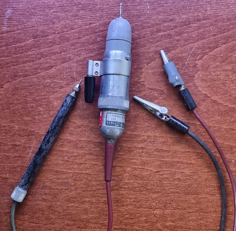
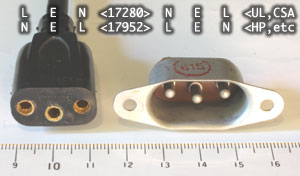
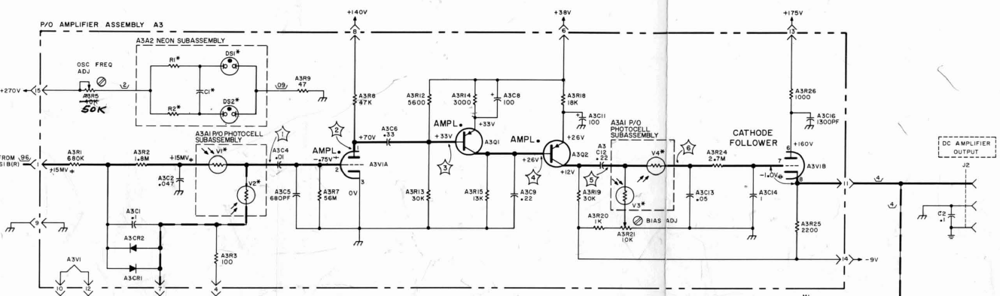
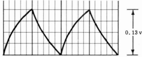
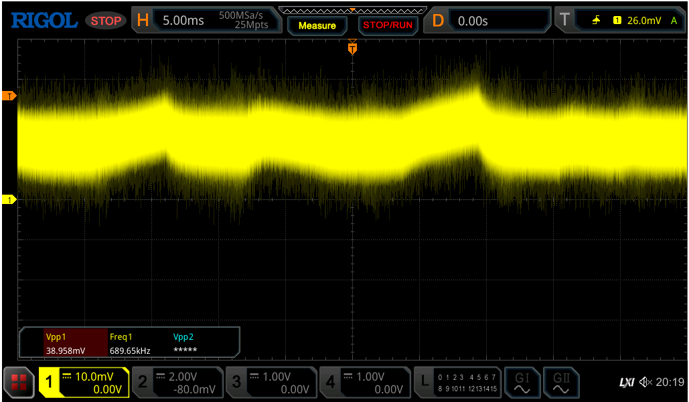
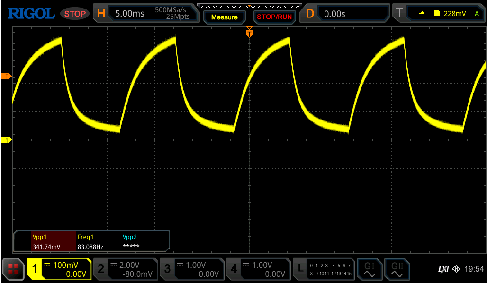

# The HP 410C Voltmeter

Got this for a very good price in what appeared quite good state:

The device was missing its power cord which is not a very common type (anymore): a PH-163 type connector:

(stolen, with thanks, from [http://madrona.ca/e/powerConn/index.html](http://madrona.ca/e/powerConn/index.html))

Cables are hard to find, but someone made a 3D printed model for the plug: [https://www.printables.com/model/182704-ph-163-connector-hp-oval](https://www.printables.com/model/182704-ph-163-connector-hp-oval)

# Power plug replacement

These cables are hard to get, and hence best thing is to replace the plug with a standard EU plug.

This is done with a little bit of metalwork:

- Drill out the rivets from the original plug, desolder the wires and remove the old plug
- Get the smallest EU plug you can find (the vertical room to mount it is very small), and take one that has the drill holes at (nearly) the same position as the original
- Enlarge the mounting hole with a dremel

Make sure to cover the newly soldered connections with shrinkwrap.

# Problems

Once the plug was replaced the device powered up just fine.

## No measurements that are correct

But no measurement was correct: when switched on the meter would slightly peg to the negative side (left), and zero adjust did nothing. Measuring voltages on the setting +v and different scales were all very incorrect, way too low, and the measurement did not really seem to correspond to the voltage: half the voltage would not halve the measurement seen.

All voltages as provided in the manual were checked. Before you do leave the device on for at least 15 seconds as some of these take that long to stabilize.

There was only one voltage wrong: pin 9 on A3 was shown to be +6.3V but I measured 7 volt AC.

Next step was the chopper. Both neon bulbs light up, and I could change the frequency of the oscillation to the 85Hz.

Step after was to provide 0.5V at the input, set mode to +V, and set range to 0.015v. This should show the following waveform at \*1:

I tried to see that with my Rigol MSO5000 but it was a flat and noisy line:

The voltage at the input of the chopper goes up to 19.3mV after 1 minute, instead of the 15mV expected. Problem here is that I am pretty sure my Rigol cannot measure that signal; it is known to be very noisy.

I then disconnected A3C1 and A3C2, cut the connection from A3C4 to the tube, and measured again. This still shows no change.

I then put the .5V directly on the input of the chopper (at the +15mv point) and measured the signal at \*1 which at least now shows the correct waveform:

This does seem to indicate that the chopper circuit is OK, and that something is off in the amplifier section.