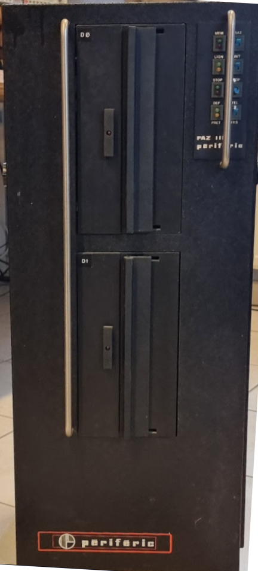
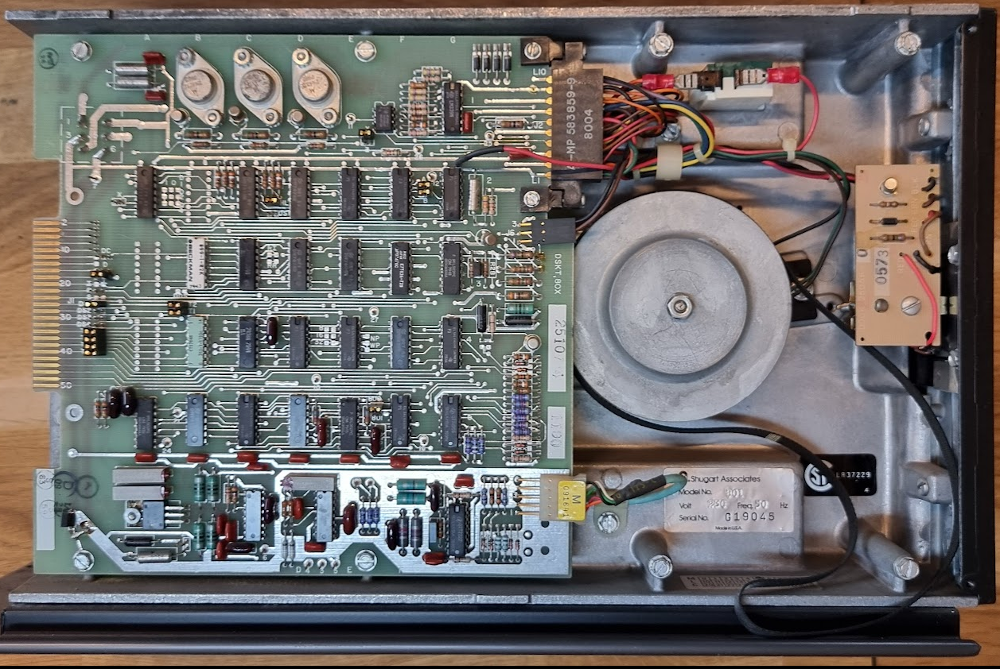

# The Shugart SA801 diskette drive

Let's try again.. I found a very curious device, a FAZ III microcomputer?, which contained 2 8" floppy drives, Shugart SA801's from March and June 1980.

Pictures:


The Shugart SA801:


## Initial work
First work was to cleanup the drive. It was very dirty, and the drive belt, belt motor and stepper motors were all stuck. The belts needed to be removed carefully, and even though they were in quite OK condition they left residue on the wheels that needed mechanical cleanup (scraping off and sanding). The belts themselves cleaned up rather well, and worked without issue after.
The motors were gently prodded until they started to move; after that they were cleaned and oiled/greased which made things work without problems.

## Powering on
Next step was to power up the drive. The 220V motor worked without issues although being a little bit noisy. Perhaps I'll need to do some more work on the bearings, but for now it's OK.
After that we added 24V, +5V and -7V to the drive. The latter is a bit special with those 8-inch drives: both the basf and this drive do have a 7905 regulator on that - rail. You can decide, with a strap, whether that regulator is used (no strap placed), requiring -7..-12V as the input, or to do place the strap and to provide -5V (exactly). **It is important to check this before connecting power: providing -12V when the strap is placed is a good way to learn a lot about repair...**

The drive drew no current at 24V, and around 750mA on +5V. This had me worried for a bit but in the end it proved to be OK.

## Testing with Greaseweazle
So, let's test with Greaseweazle ;). I have a 34-to-50 pin connector [from Tindy](https://www.tindie.com/products/siliconinsider/8-floppy-disk-interface-50-pin-to-34-pin-adapter/), designed by Antoine Bercovici of CuriousMarc fame ;) Nice because it was sent from France where I live too, so it arrived in 2 days. Really nicely made product!

I checked that the drive's DS straps selected ds1, and that termination was enabled for the signals, as required for a single drive chain.

I then started with checking that basic communications was working, by asking
```
gw rpm
(insert result)
```
This meant that the drive reported index pulses, hopeful ;)

Next step was to try a seek:
```
gw seek --drive 0 12
```
This was reporting "Track 0 not found". This led to a bit of walking through the drive's schematics, which can be found in the sa801 reference manual [which can be downloaded here](https://retrocmp.de/fdd/shugart/801/sa801_i.htm). I followed the STEP signal, and put Greaseweazle in a loop to continuously do a seek. That led to the discovery of two straps, DS and HL, on the original schema. These define which signals will power up the stepper motor and the head load solenoid. Closing both of these causes the DS signal to do both, and after that the stepper could be heard.

One thing to remember. The Greaseweaze remembers the track once a seek succeeds, so additional commands to seek to the same track do nothing. That is hard for testing, so add a "gw reset" command before the seek to force a seek to track 0 before going to the real track.

## Reading data
We are now ready to actually read data, yay! I gave the following commands:
```
gw reset
sleep 1
gw delays --step 20000
gw read --tracks=c=0-77:h=0 disk.scp
```
resulting in
```
Select Delay: 10us
Step Delay:   20000us
Settle Time:  15ms
Motor Delay:  750ms
Watchdog:     10000ms
Pre-Write:    100us
Post-Write:   1000us
Index Mask:   200us
Reading c=0-77:h=0 revs=3
T0.0: Raw Flux (303261 flux in 641.10ms)
T1.0: Raw Flux (268480 flux in 564.37ms)
T2.0: Raw Flux (265852 flux in 566.87ms)
T3.0: Raw Flux (244550 flux in 569.86ms)
T4.0: Raw Flux (247603 flux in 574.39ms)
T5.0: Raw Flux (250490 flux in 573.64ms)
T6.0: Raw Flux (252180 flux in 573.05ms)
T7.0: Raw Flux (241177 flux in 572.95ms)
T8.0: Raw Flux (242220 flux in 575.12ms)
T9.0: Raw Flux (249210 flux in 575.00ms)
.....
T73.0: Raw Flux (266300 flux in 570.25ms)
T74.0: Raw Flux (266621 flux in 570.39ms)
T75.0: Raw Flux (265755 flux in 570.31ms)
T76.0: Raw Flux (264942 flux in 570.40ms)
T77.0: Raw Flux (8 flux in 353.62ms)
```
which produced a 33MB file.

## Writing data
Writing went very well too, with:
```
gw delays --step 20000
gw write --tracks=c=0-77:h=0 disk.scp
```
Next round is to see whether we can read that disk on the rx02!


# Links

* [Detailed information with pictures](https://retrocmp.de/fdd/shugart/801/sa801_i.htm)

