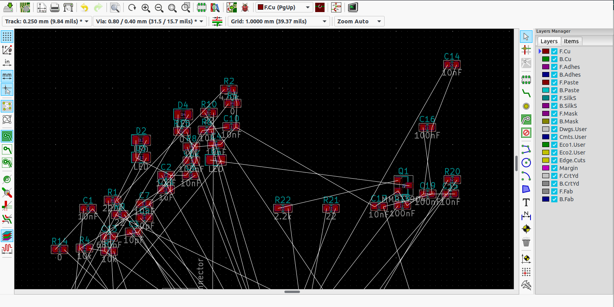
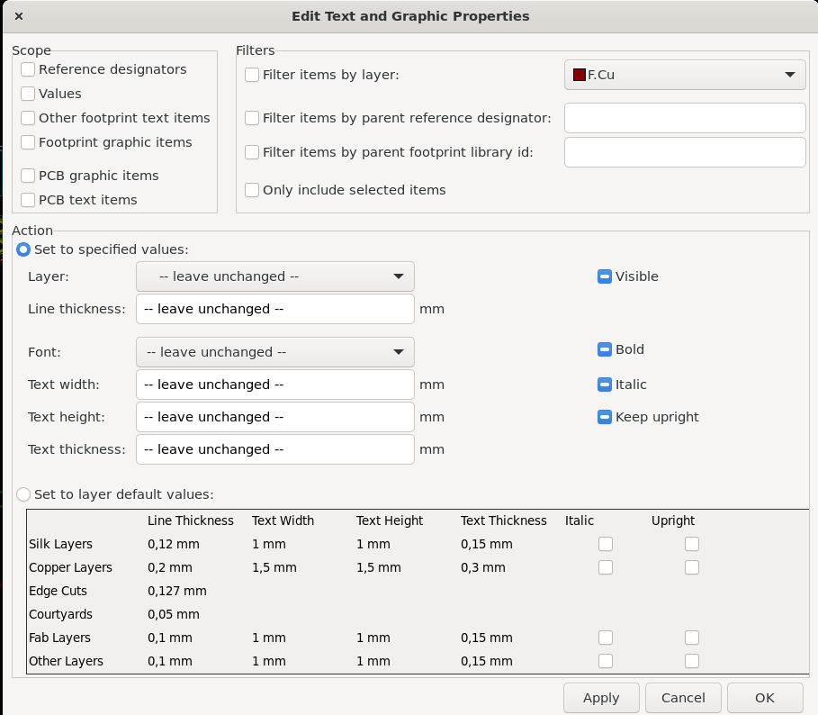
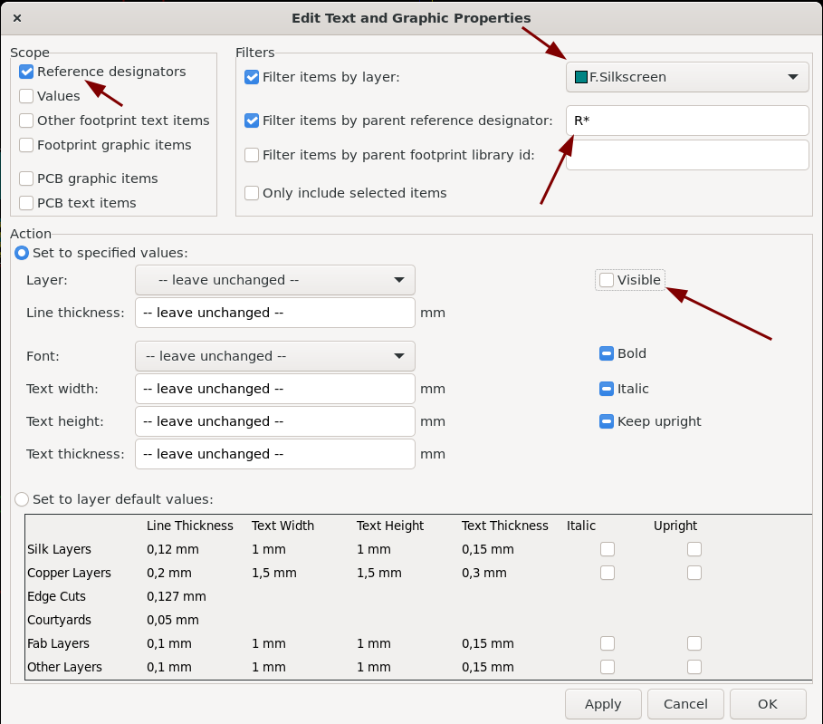
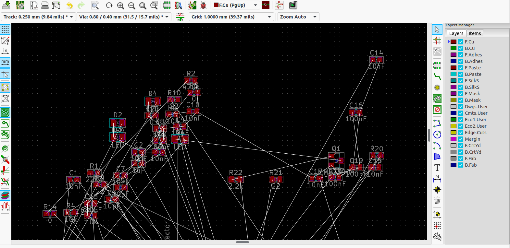

# KICAD Tips and tricks

I’m using this page to keep track of things to know about KICAD easily.

# PCB Editor

## Precise positioning

It is easier to do precise positioning if you have your PCB origin related to some corner of the actual PCB. To do this you first need to set it as a preference:

- Go to Preferences → Preferences
- Under “PCB Editor” select “Origins and axis”
- At “Display Origin” select “Drill/Place file origin”

Now, for every new board:

Select in the menu Place → Drill/Place file origin. After that click on the corner that you want to be (0, 0). This shows a small read “crosshair” at that place.

From now on you can actually calculate positions on the board, using that place as the origin.

## Routing

### Making tracks

When routing a PCB the following is handy:

- Basic routing: key “X” at the place you want to start from
- Key “+” (numeric keypad) changes the layer (top/bottom)
- Key “V” places a Via and after placement (click the mouse) switches to the other layer.

### Changing/editing tracks

Select a track segment and then:

- Press the “U” key to select not just the segment but the entire track. This makes it easy to delete a complete track instead of just one segment at a time.
- Press M to move the segment only (in a shitty way, it becomes unconnected)
- Press D to move the segment **but** this keeps the segment connected → this is the move you usually want. Very useful to straighten lines that have become wiggely because of the push/shove router :wink:

### Removing component references and values

Component values are on the F.Fab and B.Fab layers. You cannot really delete them (that would be handy, God forbid) but you need to do this:

- Select the thing you want to delete
- Press “E” to go to the footprint properties
- Remove the checkbox at “Visible”.

You only have to do this a few hundred times 8-(, once for each thing you want to have away.

But there is a way to do this in bulk [as described here](https://en.dlyang.me/globally-change-footprint-reference-visibility-in-kicad/):

Before changing, the reference symbol looks like:

Step 1. Open ‘Edit’ -> ‘Edit Text & Graphic Properties…’

Step 2. Select ‘Reference Designators’ on the top left panel; check the filter as ‘F.silkscreen’; Specify the footprint you want to change in ‘Filter items by parent footprint reference’, e.g. ‘R\*’, ‘C\*’.

Step 3. \[The most important one\] **Uncheck the ‘Visible’** in the ‘Action’ panel.

Step 4. Done. Here is how it looks after editing:

