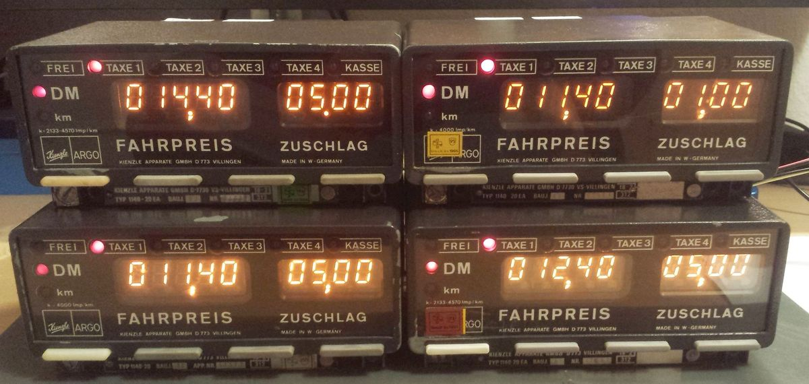

# The Kienzle 1140-20 Taxameter

This is a taxi fare meter from the 1970's, containing an Intel 4004 CPU ;)

If it works it would look something like this:

The electronics are three stacked boards. The CPU board contains the P4004 and some support chips like the P4002-1 (RAM/IO) and the P4308 (?):

## Connections / installation manual

The following was found on [CPU-World](https://www.cpu-world.com/forum/viewtopic.php?p=303885), with lots of thanks to user wepwawet:

* [Installation information](install.pdf)

That document describes a 22 pin connector which my device does not have. The pinout seems to be:

| pin   | Description   |
| ----- | ------------- |
| 10    | +12V perm     |
| 9     | GND           |
| 8     | Ignition +12V |
| 7..2  | Relais lamps  |
| 1     | ?             |

## Documentation

* [The user manual (German)](1140-Komplett.pdf)
