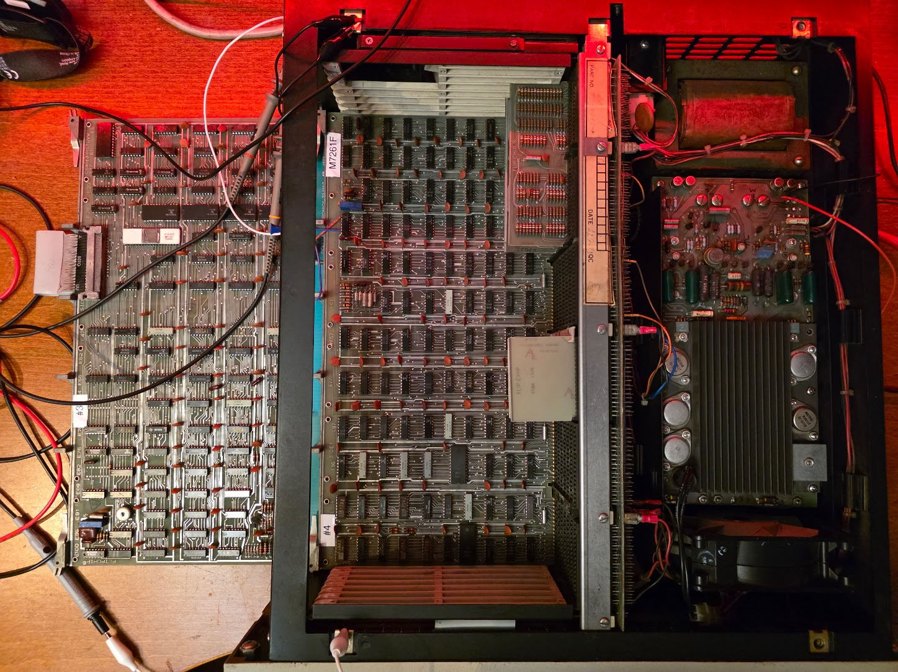

# First power-up

## With all cards present..

Power up with all cards present does not do a lot.. The console lights take a more or less random pattern and no action on the switches shows any response. In general the RUN lamp remains ON, despite switching on HALT.

I made every combination of the M7260 and M7261 cards that I have but nothing really changes.

## Starting measurements..

This is done with a M7261F board, so I use the 1976 drawings.

I removed all but the two CPU boards from the machine, and installed an extender:

### Clock
First measurement was the clock. This requires that the HALT switch is active; this should keep the clock running despite not having any memory. The 7413 (U29) shows a 5MHz (ugly) clock signal, but this might be the cheap scope (my real one's not here).

### Console
Considering the console lamps show different patterns I am going to assume for now that the console display part is working, at least the console flipflops. 

The RUN light is an actual single signal, not a shifted-in serial one.

The console's serial signal comes from the M7260 data path module, E6, a 74150. Pin 10 should show a serial data stream depending on the counter value from the console's shift counters. This pin stays 0, however. Pin 13, S1 input, also stays 0 -> the console counters do not run.

Looking at the console schematic, the 74193 counters are clocked by a pair of 74123 monostable multivibrators. There is one control signal called PUP_L (on J1-CC) which seems to inhibit that clock.

This signal arrives from the BERG connector, of course, which resides on the M7260. There is no exact match for this signal on the drawing, but Data Path DPE shows a signal DPE PUP L from E089 which seems to be the one; it is marked as BERG T on both schematics. That sounds like it's not the same signal, but there is this cable drawing in the console part:

In there you can see that T on the M7260 side maps to CC on the console side. That took an hour or so, sigh. Measuring E089P6 (a 7437) shows it is L, which is incorrect; it should be high under normal operation. Pin 4+5 are 1, so the 7437 is ok. These come from CON H PROC INIT H.

This comes from E81P6 (74H40), its inputs, 1, 2 and 4 are 1, 5 is zero. That is CONH INIT SYNC (1)L, coming from E65P9 (7473)..

The F power circuitry is more complex than the E one, and the user manual describes revision E, so let's swap boards..

### M7261E (#2) - clock and console

Clock (6MHz) present @E19P8. Still no signals on 74150 of the DP. E89P6 0, pins 4+5 1; same as before. These come from CONH PROC INIT H,
coming from E108P8. Its inputs: 12,13=1, 9,10=0. The latter come from E72P6 (7474, Q-BAR).
This flipflop has:

| Pin | Name | Value |
| --- | ---- | ----- |
| 1   | CLEAR-BAR | 1 |
| 2,3 | CLK,D | 0 |
| 4   | SET-BAR | 0 |
| 5   | Q | 1 |
| 6   | Q-BAR | 0 |

The SET line is low which forces the flipflop in its SET state. This set signal comes from E71P7 (9602 monostable multivibrator, "INIT", Q-BAR). 

This E71 is stuck in the "init" phase, somehow. Measuring the signals:

| Pin | Name | Value |
| --- | ---- | ----- |
| 3,5 | CLR-BAR, B-BAR | 4.7V |
| 4   | A | 100HZ square pulse |

That 100Hz pulse is what keeps retriggering the thing, causing the continuous reset like state.

Pin 4 comes from E63P8 (7427). On pin9+10 is a 100Hz block wave (with a 1ms ON time and 9ms off). Pin 11 has a similar pulse, but it starts 1 ms before the one on 9+10. These are the following signals:

* 9+10: COND DC LO H
* 11: CONH PWDN (0)L

COND DC LO H comes from E01P2 (380). This bus receiver has 2 inputs: 

* 6: CONH RUN GND L
* 7: BUS DC LO L (BF2)

Measuring these (which sucks because they are hard to reach under the terminator) shows P7 having the block signal. This actually comes from the power supply (H740), on pin 6 of the PSU.

### PSU repair

Looking at the schematic there is a very obvious candidate for this problem. The power loss detection takes its power directly from the windings of the transformer, rectifies it with two diodes, and stabilizes it with a 20uF capacitor (C9). Measuring the signal on that capacitor showed a huge sine signal, indicating the capacitor was gone.. Indeed, after desoldering and measuring it was found be be open, mostly.
Replacing the capacitor with a new one (47uF, which was the only one I had, and which will mess up DC LO and AC LO timing, probably) did solve the PSU issue.

And that, in turn, solved the console clock problem: there is now data on E006P10 (74150, the console mux).

I was led in the wrong direction because the DC LO L signal measured at around 4V; I did not consider using a scope on it.
