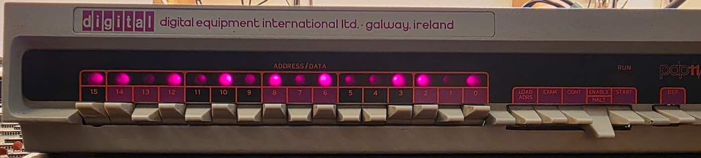
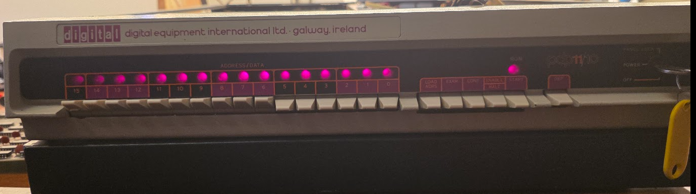

# Console work

With a working power supply I see signals on the console: when switching on
the lamps start in one state, then move to another. Next step is to see whether
deposit and examine work.

Entering a pattern in the switches and clicking "Load address" works, but only after using "start" once after powerup:



Rather good sign as this is handled by microcode, and that means that we have a bit working at least!

## Using "exam"

Loading an address (like 70), doing a "Load Addr", then "Exam" does not show anything. Once an exam
has been done the "load addr" stop working; we need a new "Start" to get it back in working order.
The 11/05 exposes part of its registers at address 177700. This addresses the scratchpad RAM (E37..E40 on the DP) which contains the registers. Entering this address and pressing "load addr", then "examine" does work: the examine shows a value, and the load addr switch remains working.

We can [actually run a program there](https://retrocomputing.stackexchange.com/questions/27633/pdp-11-program-to-execute-only-in-the-registers), so let's try that.. The program is this:

| Address | Register | Opcode | Instr |
| --- | --- | --- | --- |
| 177700 | R0 | 000240 | NOP |
| 177701 | R1 | 000777 | BR.-1* |

!i For a program running from the scratchpad registers the PC increments by 1! The registers are addressed sequentially by addresses incremented by 1, despite the registers being words!

This showed an error: depositing the 240 actually deposited 540. Next try: deposit all zeroes in 177700 showed 400; repeated tries always showed that. And it persists: repeating deposit several times shows the same bit set; examine several times also shows it set (the address increment seems to work because the pattern changes after a few clicks). Bit 8 is really stuck, somehow. Not in the console shift regs because load addr sets it to zero.

## The path from switches to scratch register

The console switches are each connected, via the console cable, to the ALU board's "Switch reg mux", made up out of 4x 8266 quad 2-to-1 multiplexers (E33..E36). This multiplexer selects either the switch value (A ports) or the 7489 scratchpad RAM outputs to the ALU's "A" input.

The load-addr process [is described here](../99-schematic-notes/index.md). The microcode:

```
CL-1   BA ← K[207].BAR ; DATI ; CKOFF
CL-2   B ← UNIBUS DATA
CL-3   R[17] ← B ; GOTO H-2
```

puts the switch data into scratchpad RAM at address R17 (177717). The console shows the data as being correct, but the console gets that data from the BREG flipflops. These will have been filled by step CL-2, and do not represent the actual content of the scratchpad RAM. But this does tell us which parts of circuit do seem ok:

* The switch reg mux (E34)
* The ALU (E25)
* The ALU output switch (E08)
* The B register (E13)
* The BLEG MUX (E19).

Reasoned because these are the full path from switches to console display.

What it leaves as possible culprits are:

* The 7489 Scratchpad RAM (E13)

## Odd behavior

While validating the above it was found that the behavior is not stable. I had the hanging bit 8 for quite a while, but after some power-ups it disappeared, and I had random behavior changes: sometimes a deposit and an exam would show wildly different results, but sometimes it would work perfectly. Always great, of course.

## Managed a run (2026/09/06)!

I got the machine to actually run for the 1st time, without any changes to the hardware, using the above program (which stayed stable during the run):




