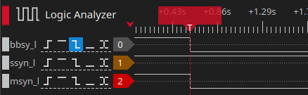
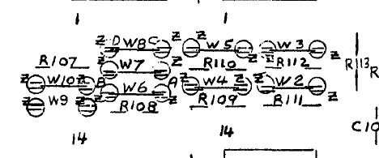
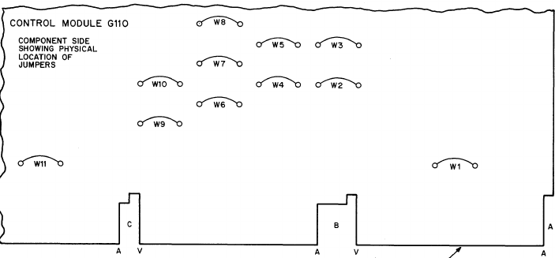
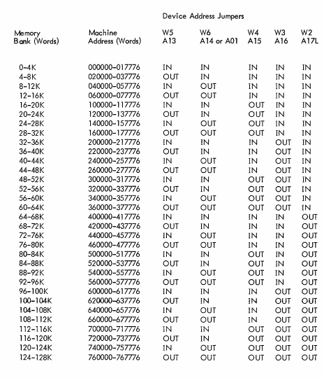
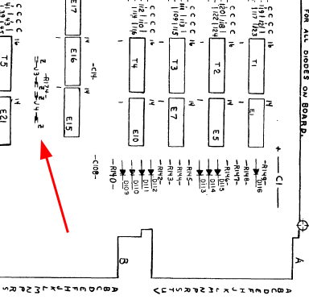
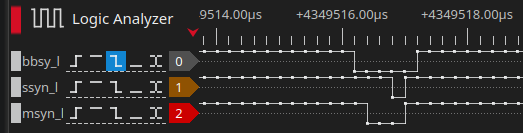
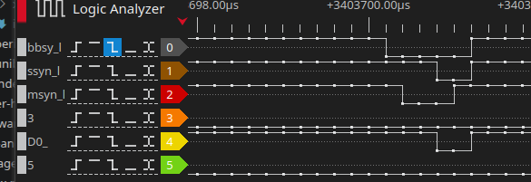

# Memory

Trying to deposit at address 0 hangs the machine. According to the manual this is normal: when a deposit is done to a memory address where nothing answers this requires the "start" switch to be used to re-initialize the system.
The LA also shows there is no response:

## Checking and configuring the G110 board

Next step is to check the G110 (G109C) for its configuration. Jumpers W2..W6 define the address of the board, 

And the same from the manual:

The jumper assignment is as follows:

| Jumper | A line |
| ------ | ------ |
| W5 | A13 |
| W6 | A14 or A01 |
| W4 | A15 |
| W3 | A16 | 
| W2 | A17L |

There is a nice table in the manual describing the address ranges:

On my G110 the following jumpers are placed: W3, W2, W4, W5 (W10). W6 is open. This corresponds to address 8-12K (040000-057776). Quite logical nothing reacts at 0 ;)
Another issue on the G110 I used: W7 and W8 are cross-wired: this is for interleaved operation, another reason why things fail (http://www.bitsavers.org/www.computer.museum.uq.edu.au/pdf/DEC-11-HMFLA-C-D%20MM11-S,%20MF11-L,%20and%20MF11-LP%20core%20memory%20systems.pdf, chapter 2, page 2-11).
The module also needs to be configured for 8KW (H214), which means W9 open, W10 closed.
I removed the cross-wired jumpers and replaced them with straight ones.

## Checking and configuring the G231E board

On the G231 there are jumpers too; for the same 8KW H214 it should be J4 closed and J3 open. These jumpers can be found here:

The topmost jumper is J3, the one under it is J4.

The resulting configuration should be memory from 040000 to 077776 (8KW).

## Deposit and examine at the proper addresses

Examine now shows proper bus behavior:

But the examine always returns all ones for the result. No more hang, though. Examining more addresses always shows ones all over. This is an indication: this is core memory. If you read something the first time but the second time it reads all ones this means that core rewriting somehow fails. But that is not (yet) the case here; basic reading fails.

Looking at D0 while the examine takes place shows that the databus is not stuck, as D0 goes low at the proper time:

Clearly this board needs repair. For now I tried switching it with the other G110 boards I have. Only board#1 seems to work: a deposit followed by an exam reads the same values from address 0. Yay!

