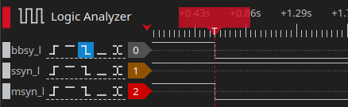
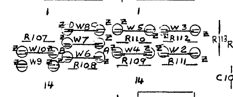
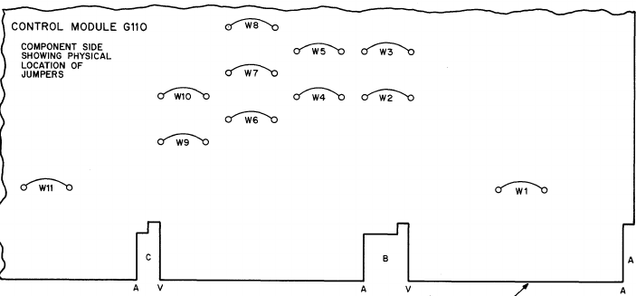
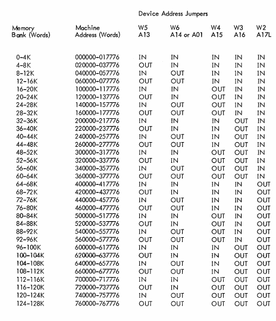
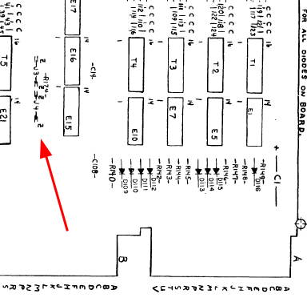
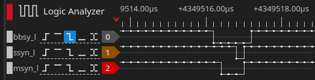
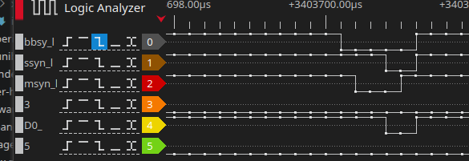

# Memory

Trying to deposit at address 0 hangs the machine. According to the manual this is normal: when a deposit is done to a memory address where nothing answers this requires the "start" switch to be used to re-initialize the system.
The LA also shows there is no response:

## Checking and configuring the G110 board

Next step is to check the G110 (G109C) for its configuration. Jumpers W2..W6 define the address of the board, 

And the same from the manual:

The jumper assignment is as follows:

| Jumper | A line |
| ------ | ------ |
| W5 | A13 |
| W6 | A14 or A01 |
| W4 | A15 |
| W3 | A16 | 
| W2 | A17L |

There is a nice table in the manual describing the address ranges:

On my G110 the following jumpers are placed: W3, W2, W4, W5 (W10). W6 is open. This corresponds to address 8-12K (040000-057776). Quite logical nothing reacts at 0 ;)
Another issue on the G110 I used: W7 and W8 are cross-wired: this is for interleaved operation, another reason why things fail (http://www.bitsavers.org/www.computer.museum.uq.edu.au/pdf/DEC-11-HMFLA-C-D%20MM11-S,%20MF11-L,%20and%20MF11-LP%20core%20memory%20systems.pdf, chapter 2, page 2-11).
The module also needs to be configured for 8KW (H214), which means W9 open, W10 closed.
I removed the cross-wired jumpers and replaced them with straight ones.

## Checking and configuring the G231E board

On the G231 there are jumpers too; for the same 8KW H214 it should be J4 closed and J3 open. These jumpers can be found here:

The topmost jumper is J3, the one under it is J4.

The resulting configuration should be memory from 040000 to 077776 (8KW).

## Deposit and examine at the proper addresses

Examine now shows proper bus behavior:

But the examine always returns all ones for the result. No more hang, though. Examining more addresses always shows ones all over. This is an indication: this is core memory. If you read something the first time but the second time it reads all ones this means that core rewriting somehow fails. But that is not (yet) the case here; basic reading fails.

Looking at D0 while the examine takes place shows that the databus is not stuck, as D0 goes low at the proper time:

Clearly this board needs repair. For now I tried switching it with the other G110 boards I have. Only board#1 seems to work: a deposit followed by an exam reads the same values from address 0. Yay!

## Running a program from memory

Next try is to run a program from memory. I deposited just a 000777 (br .-2) at address 1000, then started from there. This did not work: the run light stayed off. I then checked 177707 (the PC) which read 000000. Not very informative. I then set the following:

| Address | Value | Why |
| ------ | ----- | ----- |
| 4 | 000006 | Bus error goes to address 6, halts, PC should show 10 |
| 6 | 000000 | Target of trap 4, halt instruction |
| 10 | 000012 | Target of illegal instruction trap, when taken PC should show 14 |
| 12 | 000000 | Target of illegal instruction trap, nop |
| 177706 | 1000 | Stack pointer, set to 1000 |

And of course the branch at 1000.

This still produced a PC = 0 - which should not be possible if anything here runs. I also examined SP, and that too remained at 1000. This probably means no traps were taken.

The machine halted, so if anything at all ran then this might mean that for some reason PC was 1777776. 

Next round:
- put a halt at 1000, then start. This delivers the same pc=0.
- put a br .-2 at 1000 (000777), then single step: switch on halt, start at 1000, then a single continue. This shows something odd: the LEDs show 1777776.

This indicates that the first fetch goes to address 1777776, not 1000. This cannot come in any way from a memory issue because every bit is different. My friend Claude reasons this:

    The address itself is the useful clue. 177776 can't come from 001000 through a stuck bit or two, since almost every bit differs. It looks much more like the bus address register (BA) holding a leftover value instead of being loaded with the PC. The 11/05's PS is a bus-addressable register at 177776, and it's plausible that the START microcode touches it, for example to clear it, just before the first fetch. If the BA load that should put the PC into BA doesn't happen, BA still holds 177776 and the fetch goes there. The register-space start could survive this because fetches from 1777xx are handled internally and never depend on that same BA transfer. The console's examine and deposit load BA through the console path, which works. So the prime suspect is the transfer of the PC into BA during instruction fetch: the BA load clock/enable in that microstep, or the multiplexer that selects what goes into BA.

    Two quick checks will confirm which side of that transfer is at fault:

    With the switch on HALT, do LOAD ADDR 1000 and START, but don't press CONT yet. Examine 177707.
    If the PC reads 001000, the PC is correct and the problem is getting it into BA, which is the BA hypothesis.
    If the PC already reads 177776, the START sequence itself loads the wrong value into the PC. Look at the load-address path instead.
    Do the same single-step experiment starting at 177700 and see what the lights show. That will tell you whether that path really bypasses the problem.

Doing that check reveals that the PC is 1000.

Next test: see whether the CPU can do Unibus reads. Deposit the following:

| Address | Value | Why |
| ------ | ----- | ----- |
| 1000   | 123456 | A value to read |
| 177700 | 013703 | MOV @#1000,R3 | 
| 177701 | 1000 | The 1000 operand of the above instr |
| 177702 | 0 | Halt |
| 177703 | 0 | Start with clearing R3 |

Running this shows that R3, after the run, holds 123456 which means that the CPU CAN read Unibus memory.

