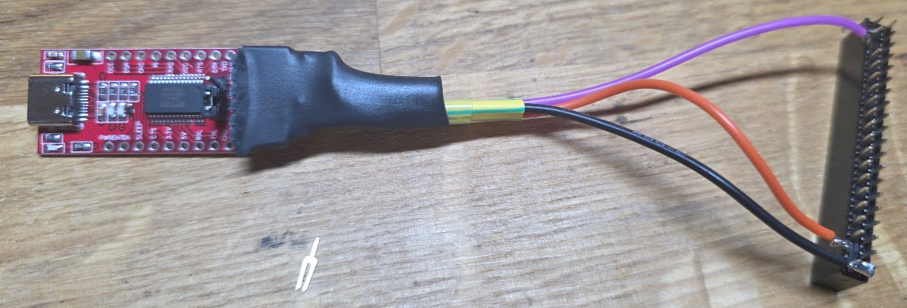

# Trying the SCL console

The M7260 has a DL11-compatible RSR232 interface called the SCL. The console comes out of the 11/05 at the back, on the large BERG connector there. This connector also outputs a TTL level version of the RS232 data with only one caveat: the RXD signal (receive input) is inverted inside the 11/05, so it needs to be inverted before being fed in. I made a small adapter using an FTDI converter:



The black shrinktube hides a 2N7000 FET which handles the inversion of the TXD signal from the FTDI adapter into ~{RXD} for the 11/05.

Links to the information:

* [Ronald's RS232 interface for the 11/05](https://github.com/Roland-Huisman/RS232_converter_for_PDP11)
* [Joerg Hoppe's interface description](https://retrocmp.com/how-tos/interfacing-to-a-pdp-1105)

## Testing the console

To test we need a test program:

```assembly
Addr    Contents   Instruction             Comment
001000  105737     TSTB @#177560           ; RCSR: character received? (bit 7 = DONE)
001002  177560
001004  100375     BPL  1000               ; no -> keep waiting
001006  105737     TSTB @#177564           ; XCSR: transmitter ready? (bit 7 = READY)
001010  177564
001012  100375     BPL  1006               ; no -> keep waiting
001014  113737     MOVB @#177562,@#177566  ; RBUF -> XBUF (reading RBUF clears DONE)
001016  177562
001020  177566
001022  000766     BR   1000               ; loop forever
```

This needs to be toggled in at address 1000~oct~.
