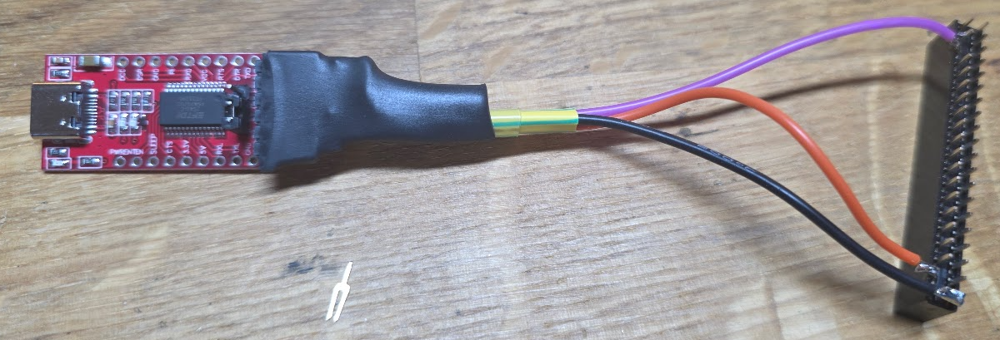

# Trying the SCL console

The M7260 has a DL11-compatible RSR232 interface called the SCL. The console comes out of the 11/05 at the back, on the large BERG connector there. This connector also outputs a TTL level version of the RS232 data with only one caveat: the RXD signal (receive input) is inverted inside the 11/05, so it needs to be inverted before being fed in. I made a small adapter using an FTDI converter:



The black shrinktube hides a 2N7000 FET which handles the inversion of the TXD signal from the FTDI adapter into ~{RXD} for the 11/05. The signals are:

- Black: GND
- Orange: the RX input of the RS232 adapter, which should be connected to the TX signal of the 11/05
- Purple: the inverted TX signal of the RS232 adapter, which must be connected to the RX input of the 11/05

Links to the information:

* [Ronald's RS232 interface for the 11/05](https://github.com/Roland-Huisman/RS232_converter_for_PDP11)
* [Joerg Hoppe's interface description](https://retrocmp.com/how-tos/interfacing-to-a-pdp-1105)

## Testing the console

To test we need a test program:

```assembly
Addr    Contents   Instruction             Comment
001000  105737     TSTB @#177560           ; RCSR: character received? (bit 7 = DONE)
001002  177560
001004  100375     BPL  1000               ; no -> keep waiting
001006  105737     TSTB @#177564           ; XCSR: transmitter ready? (bit 7 = READY)
001010  177564
001012  100375     BPL  1006               ; no -> keep waiting
001014  113737     MOVB @#177562,@#177566  ; RBUF -> XBUF (reading RBUF clears DONE)
001016  177562
001020  177566
001022  000766     BR   1000               ; loop forever
```

This needs to be toggled in at address 1000~oct~. It did not run with M7261#1, but it does run with #2. I checked by halting several times, and this always showed a PC (177707) around 1000, 1004. I did not yet see output on the SCL, though.

## Measuring the UART part

First, the UART clock. On the Rev.E (1973) this comes out of E100P6. This shows a 38.6KHz signal. This goes to a 74197, a divider, then a multi-select switch with select 1 using the full 38KHz, then that enters the UART (P40) as the clock. The bitrate is the UART clock / 16, so 38KHz would give about 2400bps. The rotary switch turned completely anti-clockwise selects that speed.

Serial data enters on P20, and that arrives as expected: high signal, with bits going low. I then measured the exit, P25, which contained the data too.

I rechecked the wiring on the plug, and after a reseat I got the echo from the program ;)


