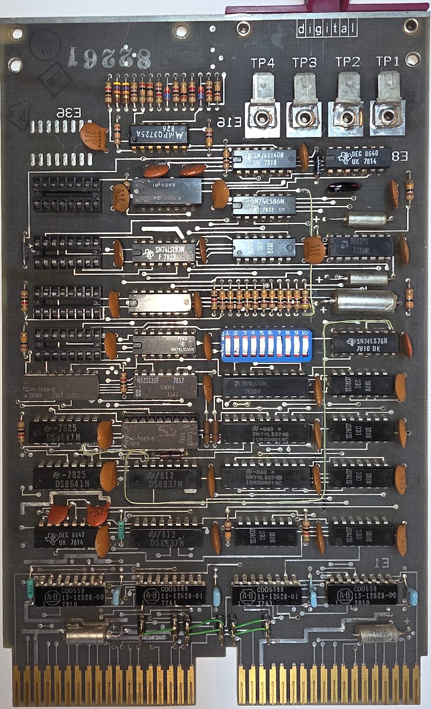
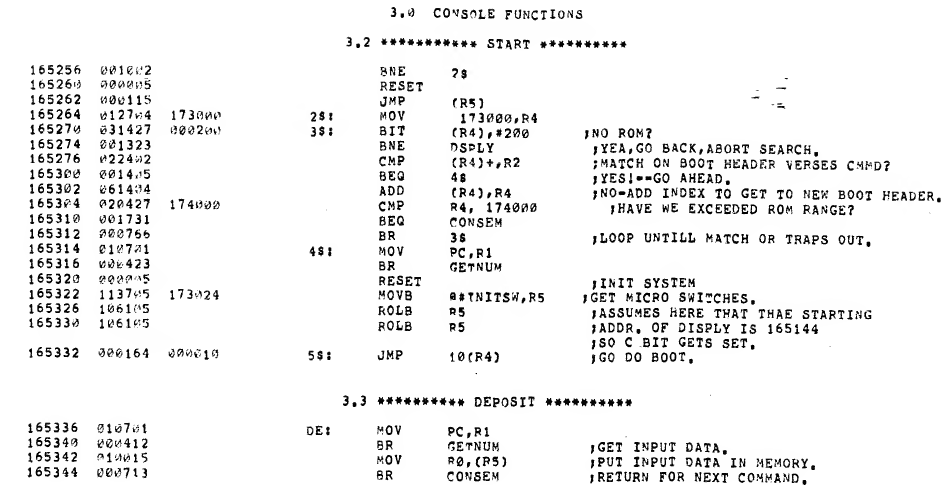
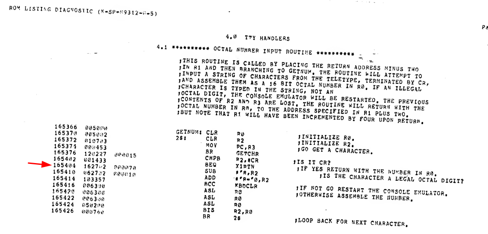
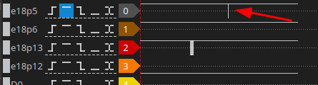
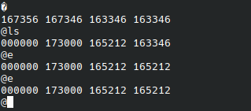

# The M9312 bootstrap terminator

This board combines a terminator with a set of bootstrap ROMs:



It has the following PROMs on it:

- 690a9 (N82S130F): ?
- 248f1 (MI-7643-5): M9312 pdp-11/04/05/34/35/40/45/50/55 Console Emulator and Diagnostic
- 217f1 (MI-7643-5) ?

(The numbers for these PROMs can be found [here](https://ak6dn.github.io/PDP-11/M9312/) and [here](https://oldpc.su/articles/dec_roms/)).

After installing the M9312 in place of the topmost terminator the test is to see whether it starts, as follows:

- Enter 165020 on the switches
- Move halt upwards (not halted)
- Press start

If all goes well this should show the @ prompt on the SCL console. Of course this did not go well; the CPU stopped at 165334~8~. This contains the following according to the listing:



The second attempt started at 165144~8~, which should skip the diagnostics. This ended at 165406~8~:



Neither looks good. I examined the code at 165144, and that does not look at all like the listing. Next check is the PROM contents. The MI-7643-5 is an 1kx4 PROM, an equivalent is 82S137, and this can be read by the TL866. There is one nibble different in my PROM compared to the listing [from here](https://ak6dn.github.io/PDP-11/M9312/):

```
:100000000000060F0000060F00000C090F0F030E82 Published
:100000000000000F0000060F00000C090F0F030E88 Mine
```
a single 6 is missing. That does not explain the totally different code from the examine.

Quick test: replace the M930 terminator, and checks that nothing else answers at 165144; that caused a bus error so no.

I read the first values from the PROM, starting at address 165144:

```
020427
174000
001731
000763
010701
000423
```
and asked Claude to compare it with the 23-248f1 listing. It found out that this is real ROM contents but from a different address:

| Address you examined | You read | Listing at that address | Listing at +140 | 
| ---- | ---- | ---- | ---- |
| 165144 | 020427 |	010701 | 165304: 020427
| 165146 | 174000 |	000554 | 165306: 174000
| 165150 | 001731 |	010701 | 165310: 001731
| 165152 | 000763 |	000526 | 165312: **000766**
| 165154 | 010701 |	010400 | 165314: 010701
| 165156 | 000423 |	000524 | 165316: 000423

This points to an address error: 

165144 has bits 5 and 2 set in its ROM offset (144 = 001 100 100). 165304 has bits 7 and 2 set (304 = 011 000 100). So Unibus address bit 5 is arriving as 0 and bit 7 as 1. Bits 1–4 are fine, since the whole run of consecutive addresses stays lined up. Two faults fit this:

- A05 and A07 are swapped, for example crossed traces, a solder bridge, or a wrong jumper wire from an earlier repair.
- A05 is stuck low and A07 is stuck high.

Two examines will tell them apart:

165000: should read 165000. If it reads 112702, A07 is stuck high.
165200: should read 112702. If it reads 005303, the lines are swapped.

The examine showed 165000 AND 165200 both had 112702, so **A7 is stuck high**. Examining 165040 also shows 112702; it should have been 042440. This means A5 is stuck low.

The PROM is E20 on the board.

## Short overview of how the module works

All PROMs are 4 bit proms. Their outputs are connected to E12, a 74LS374 latch. The outputs of the first 4 bits of the latch are connected to the __inputs__ of the second 4 bits of that same latch. The outputs of those bits are then connected to the inputs of the __second__ 74LS374 latch (E11), and those outputs again go to the last 4 inputs.

This forms a shift register where every clock shifts the existing data 4 bits upward while clocking in the data from the PROMs. The first 2 address bits of each PROM are fed by a byte counter which increments the address while the bus address remains the same; this shifts all nibbles into the latches, forming the actual data word to be read by the CPU.

A07 H and A05 H come directly from the Unibus receivers:
- A07 H from E18; P5 is the bus, P6 is the output.
- A05 H from E18; P13 is the bus, P12 is the output.

The LA shows that there is indeed a problem, when examining 165200:



This one needs a replacement. I actually have them in stock for a change :wink:. Desoldering was a crime but in the end it worked and I placed a low profile socket with a new DS8837, and lo and behold - 165000 read 165000, and 165200 read 112702.

## Retrying the console..

With the replacement the PROMs look OK, and indeed: starting it at 165144 shows:



