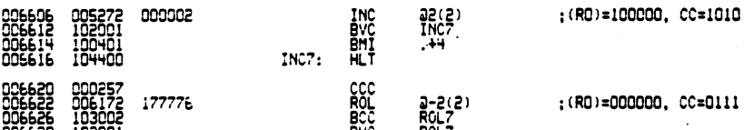
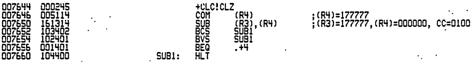

# Running the XXDP tests

Using [PDP 11 Java GUI](https://github.com/fjalvingh/pdp11javagui) I deposited and ran test ZQKCF0. This test, according to its documentation, is suitable for the 11/20 and the 11/05. Run the test initially with all switches off, because setting switches changes how the test works.

The test halted with the following on the display: 10~oct~, which is the PC address. The console showed:

```
 ICNT=0000 PC=006616 PSW=000000 
 ICNT=0000 PC=006634 PSW=000012 
 ICNT=0000 PC=006412 PSW=000004 
 ICNT=0000 PC=006432 PSW=000004 
 ICNT=0000 PC=006506 PSW=000003 
 ICNT=0000 PC=006412 PSW=000004 
 ICNT=0000 PC=006432 PSW=000004 
 ICNT=0000 PC=006506 PSW=000003 
 ICNT=0000 PC=006616 PSW=000000 
 ICNT=0000 PC=006634 PSW=000012 
 ICNT=0000 PC=006412 PSW=000004 
 ICNT=0000 PC=006432 PSW=000004 
 ICNT=0000 PC=006506 PSW=000003 
 ICNT=0000 PC=006616 PSW=000000 
 ICNT=0000 PC=006634 PSW=000012 
 ICNT=0000 PC=006412 PSW=000004 
 ICNT=0000 PC=006432 PSW=000004 
 ICNT=0000 PC=006506 PSW=000003 
 ICNT=0000 PC=006412 PSW=000004 
 ICNT=0000 PC=006432 PSW=000004 
 ICNT=0000 PC=006506 PSW=000003 
 ICNT=0000 PC=006412 PSW=000004 
 ICNT=0000 PC=006432 PSW=000004 
 ICNT=0000 PC=006506 PSW=000003 
 ICNT=0000 PC=006412 PSW=000004 
 ICNT=0000 PC=006432 PSW=000004 
 ICNT=0000 PC=006506 PSW=000003 
 ICNT=0000 PC=006616 PSW=000000 
 ICNT=0000 PC=006634 PSW=000012 
 ICNT=0000 PC=006616 PSW=000000 
 ICNT=0000 PC=006634 PSW=000012 
 ICNT=0000 PC=006616 PSW=000000 
 ICNT=0000 PC=006634 PSW=000012 
 ICNT=0000 PC=007660 PSW=000001 
 ICNT=0000 PC=007660 PSW=000001 
 ICNT=0000 PC=007640 PSW=000004 
 ICNT=0000 PC=007660 PSW=000001 
 ICNT=0000 PC=007660 PSW=000001 
 ICNT=0000 PC=007660 PSW=000001 
 ICNT=0000 PC=007640 PSW=000004 
 ICNT=0000 PC=007660 PSW=000001 
 ICNT=0000 PC=007660 PSW=000001 
 ICNT=0000 PC=007660 PSW=000001 
 ICNT=0000 PC=007640 PSW=000004 
 ICNT=0000 PC=007660 PSW=000001 
 ICNT=0000 PC=007660 PSW=000001 
 ICNT=0000 PC=007640 PSW=000004 
 ICNT=0000 PC=007660 PSW=000001 
 ICNT=0000 PC=007640 PSW=000004 
 ICNT=0000 PC=007660 PSW=000001 
 ICNT=0000 PC=007660 PSW=000001 
 ICNT=0000 PC=007660 PSW=000001 
 ICNT=0000 PC=007640 PSW=000004 
 ICNT=0000 PC=007660 PSW=000001 
 ICNT=0000 PC=007660 PSW=000001 
 ICNT=0000 PC=007640 PSW=000004 
 ICNT=0000 PC=007660 PSW=000001 
 ICNT=0000 PC=007660 PSW=000001 
 ```

 The format is:
 - ICNT is the test pass
 - PC is the PC at the time of the error
 - PSW is the PSW at the time of the error.

Checking PC=6616:


!i Fun fact: the "hlt" in the code is NOT the halt instruction but a "trap 0", which is how the code could log those errors.

Next try is to make the test halt as soon as an error is found, so that we can examine the exact machine state. For that switch 15 must be set. Ran like that the next halt was at 1422, which is the halt inside the error handler; this should have the PC on top of the stack.
Setting the halt switch, then cont once should step through the rti there; this returns 7762~oct~:



We can now check registers:

- R3 7546, (R3) = 177777 (correct)
- R4 7550, (R4) = 177777 (incorrect!)
- Flags: 

This points to an error in sub somehow because (r4) should have been cleared.

Restarting the test for another try: stopped at 26170. Which is not in the listing. Disassembly shows:
```
026160: 103402                bcs     026166
026162: 102401                bvs     026166
026164: 001401                beq     026170
026166: 104400                trap    0
026170: 005442                neg     -(r2)
026172: 005115                com     (r5)
026174: 000277                scc     
026176: 000250                cln     
026200: 042225                bic     (r2)+,(r5)+
026202: 103003                bcc     026212
026204: 102402                bvs     026212
026206: 001401                beq     026212
026210: 100401                bmi     026214
026212: 104400                trap    0
026214: 012742 125252         mov     #125252,-(r2)
026220: 012245                mov     (r2)+,-(r5)
026222: 005125                com     (r5)+
026224: 000262                sev     
026226: 034245                bit     -(r2),-(r5)
```
which is valid test code.. Apparently the program relocates itself, which makes it very hard to test. Switch 12 inhibits this, so let's try with that, sigh...

Testing with that seems to work fine, except that there are no lines logged on the console; it does print spaces after a while - which is odd.

To make sure memory is OK I ran the memory tester from the GUI program which ran fine:

```
MEMTESTER - FINDS THE MEMORY, THEN TESTS IT UNTIL HALTED.
NO MEMORY MANAGEMENT. LOOKING BELOW 00160000
MEMORY FOUND:
  00000000 - 00037777   16 KB
TESTING ALL OF IT FROM 00004400 UP; BELOW THAT IS THIS PROGRAM.
PASS    1: ADDRESS INVERSE ZEROS ONES CHECKER  ERRORS:    0, IN ALL:    0
PASS    2: ADDRESS INVERSE ZEROS ONES CHECKER  ERRORS:    0, IN ALL:    0
PASS    3: ADDRESS INVERSE ZEROS ONES CHECKER  ERRORS:    0, IN ALL:    0
PASS    4: ADDRESS INVERSE ZEROS ONES CHECKER  ERRORS:    0, IN ALL:    0
PASS    5: ADDRESS INVERSE ZEROS ONES CHECKER  ERRORS:    0, IN ALL:    0
PASS    6: ADDRESS INVERSE ZEROS ONES CHECKER  ERRORS:    0, IN ALL:    0
PASS    7: ADDRESS INVERSE ZEROS ONES CHECKER  ERRORS:    0, IN ALL:    0
PASS    8: ADDRESS INVERSE ZEROS ONES CHECKER  ERRORS:    0, IN ALL:    0
```

This means relocation has something to do with the failures.


