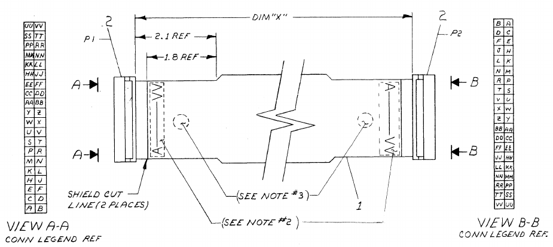

# First power-up

## With all cards present..

Power up with all cards present does not do a lot.. The console lights take a more or less random pattern and no action on the switches shows any response. In general the RUN lamp remains ON, despite switching on HALT.

I made every combination of the M7260 and M7261 cards that I have but nothing really changes.

## Starting measurements..

This is done with a M7261F board, so I use the 1976 drawings.

I removed all but the two CPU boards from the machine, and installed an extender:

### Clock
First measurement was the clock. This requires that the HALT switch is active; this should keep the clock running despite not having any memory. The 7413 (U29) shows a 5MHz (ugly) clock signal, but this might be the cheap scope (my real one's not here).

### Console
Considering the console lamps show different patterns I am going to assume for now that the console display part is working, at least the console flipflops. 

The RUN light is an actual single signal, not a shifted-in serial one.

The console's serial signal comes from the M7260 data path module, E6, a 74150. Pin 10 should show a serial data stream depending on the counter value from the console's shift counters. This pin stays 0, however. Pin 13, S1 input, also stays 0 -> the console counters do not run.

Looking at the console schematic, the 74193 counters are clocked by a pair of 74123 monostable multivibrators. There is one control signal called PUP_L (on J1-CC) which seems to inhibit that clock.

This signal arrives from the BERG connector, of course, which resides on the M7260. There is no exact match for this signal on the drawing, but Data Path DPE shows a signal DPE PUP L from E089 which seems to be the one; it is marked as BERG T on both schematics. That sounds like it's not the same signal, but there is this cable drawing in the console part:

In there you can see that T on the M7260 side maps to CC on the console side. That took an hour or so, sigh. Measuring E089P6 (a 7437) shows it is L, which is incorrect; it should be high under normal operation. Pin 4+5 are 1, so the 7437 is ok. These come from CON H PROC INIT H.

This comes from E81P6 (74H40), its inputs, 1, 2 and 4 are 1, 5 is zero. That is CONH INIT SYNC (1)L, coming from E65P9 (7473), 

!i to be continued...

