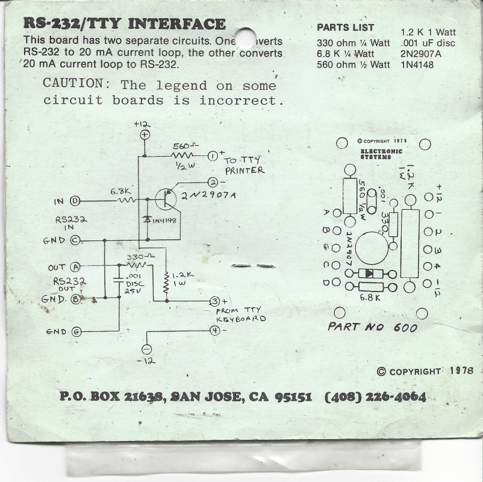

---
menu:
  sort: 20 The PDP 11/10
---
# The PDP 11/10

I got this beauty from Geert again, thanks a lot!

This is one of the earliest PDP 11's. The type was introduced in 1972. The 11/10 is the exact same machine as the 11/05; only the printed label on the console changes, nothing else. The 11/10 was meant for end users while the 11/05 was for the OEM market. All documentation refers to the 11/05.
Mine is one of the early models in a 5 1/4" box:

The machine came empty, but with a full set of cards (see [pdp card inventory](../pdp-common-info/unibus-board-list/index.md)).

## What goes inside

### Boards and board layout

According to Gunkies the board layout changes depending on the backplane model number. This number cannot be seen on my machine, but it came with Unibus terminators in slot#5 and #7, and 4 G727A BR passthrough cards in slots 6 to 9, so I assume my backplane is #54-09818 which should have the following configuration:

|	Connector |
| Slot | A  B | C  D  E  F |
| --- | --- | --- |
|1 | M7260 KD11-A CPU board #0 |
|2 | M7261 KD11-A CPU board #1 |
|3 | G110/G109C Memory Control |
|4 | G231 Memory Driver |
|5 | UNIBUS Terminator | H213/H214 Core stack |
|6 | Unused | SPC |
|7 | UNIBUS Out | SPC |
|8 | KM11-1	KM11-2 | SPC |
|9 | DF11 | SPC |

Slot #1 is at the bottom. Checked against the 11/05 engineering drawings.

### About G109C / G110

The engineering drawings talk about the G110 board, as does most of the public documentation. I actually only have G109C boards. The difference is that G109 boards have two extra "parity" bit channels and the G110 does not. These channels are not useful on an 11/05 because there is nothing using them; the H214 core stack does not have them either. The G110 is the same PCB (so also marked as G109) but with the extra channels unpopulated (details from [Gunkies](https://gunkies.org/wiki/MM11-L_core_memory)).
.

## Multiple machine revisions..

There have been multiple revisions of this machine's internals. I found the following engineering drawing sets:

* [BitSavers revision AH from Jul 76](https://www.bitsavers.org/pdf/dec/pdp11/1105/1105_RevAH_Engineering_Drawings_Jul76.pdf). This seems to match with M7261F boards.
* [pdp-11-05-engineering-drawings-oct-1973](https://archive.org/details/pdp-11-05-engineering-drawings-oct-1973), uploaded by 1944GW. This matches the M7261E board.

The user manual I have (DEC-11-H05AA-A-D_1105um) is for the 1973 revision (A-D).

## Getting the machine to work (in progress)

* [The power supply](20-power-supply/index.md)
* [First power-up](10-first-powerup/index.md)
- [Working with the console](30-console-work/index.md)

## Current loop converter and hidden 5V RS-232

The 11/05 uses a current loop for the console. The following old schematic is a conversion from current loop to RS232 and vice versa:

Further study actually shows that the 11/05 also exposes the RS232 signals as TTL level signals on the BERG connector at the back. There is one oddity: the RXD signal (receive input) is inverted inside the 11/05, so it needs to be inverted before being fed in. I made a small adapter using an FTDI converter:

The black shrinktube hides a 2N7000 FET which handles the inversion of the TXD signal from the FTDI adapter into ~{RXD} for the 11/05.

Links to the information:

* [Ronald's RS232 interface for the 11/05](https://github.com/Roland-Huisman/RS232_converter_for_PDP11)
* [Joerg Hoppe's interface description](https://retrocmp.com/how-tos/interfacing-to-a-pdp-1105)

## Links to documentation

* [Unibone in an 11/05](https://groups.google.com/g/unibone/c/hup_cLA7_7o)
* [11/10 at the DatorMuseum](http://www.datormuseum.se/computers/digital-equipment-corporation/pdp-11-10---s-n-pr0313150)
* [Open view of the 11/05](http://www.b67c.com/DECPDP1105.html)
* [VCFed forums - pdp-11/05 restauration blog](https://forum.vcfed.org/index.php?threads/pdp-11-05-restoration-blog.1249299/)
* [Gunkies](https://gunkies.org/wiki/PDP-11/05)
* [Bitsavers documentation](https://www.bitsavers.org/pdf/dec/pdp11/1105/)
* [DEC Firmware PROM list](https://oldpc.su/articles/dec_roms/)

