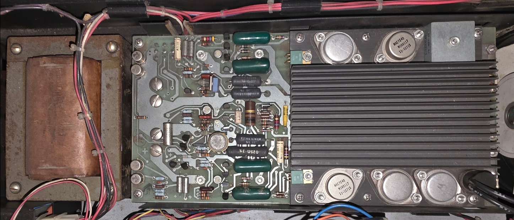
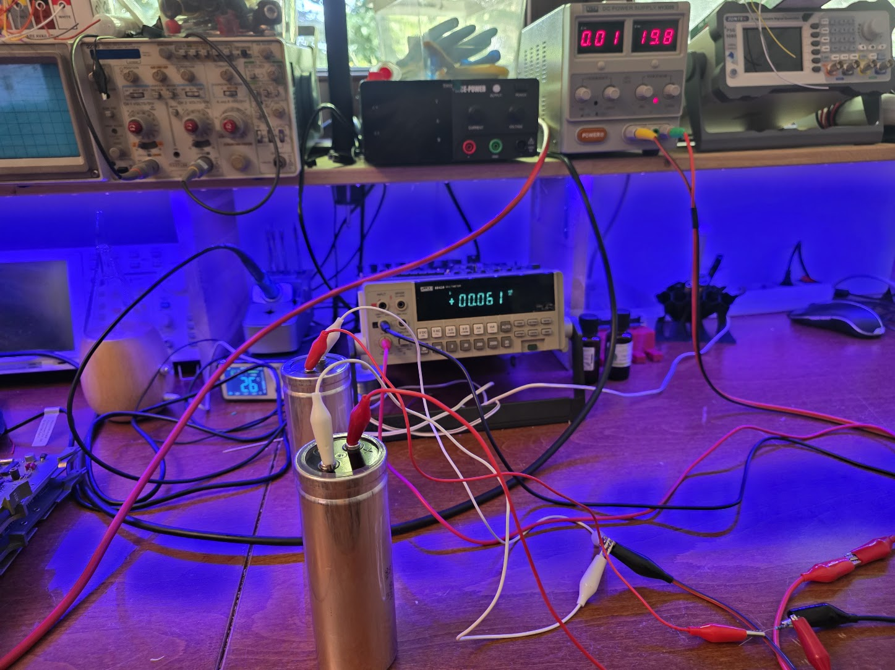
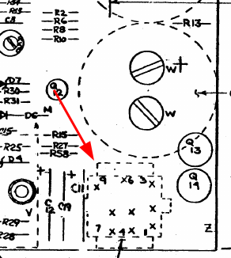

# The H740 Power Supply

According to Gunkies the power supply for this model is unspecified. It looks like this:

But in my 11/05 technical drawings that board with the large cooling fin is called the "Regulator for the H740" with number 5409728. This is indeed the number present on the PCB, so I think it will be that. This power supply is (apparently used in the PDP 8 too)[https://forum.vcfed.org/index.php?threads/h740-power-supply-whats-your-q1.1238205/].

The PSU's specs:
* +5V at 15A max
* +15V at 1A max, for RS-232 and bus termination, apparently
* -15V at 7A max for core memory.

## Preparing the PSU for use

### Capacitors...

The board has some very large capacitors. First round of business is to reform those:

I reformed them by putting them on a voltage through a 100R resistor, slowly increasing the voltage every few hours. All of them seem to work absolutely fine after 50 years!

### Power supply standalone run

Next step is to actually run the power supply without anything attached, to see where things go. For that we need the layout of the power connector, a 9-tip MATE-LOC kind of thing. In the schematic drawings this thing is annotated as follows:

With the connector at the right (and looking on top of the PCB, connector pointing down) the pinout is as follows:

9 6 3 
8 5 2 
7 4 1

The pinout, then, according to the schematic:

| Pin | Name | Function |
| --- | -------- | --------- |
| 1   | BUS AC LO L | Becomes L when AC power drops |
| 2   | GND |
| 3   | +5V |
| 4   | LTC L | The 50Hz signal for the clock function inside the PDP 11 |
| 5   | +15V |
| 6   | BUS DC LO L | Becomes L when DC voltage becomes too low |
| 7   | PWR OK ENABLE | 
| 8   | PWR OK |
| 9   | -15V |

I also checked both fuses which were OK.

