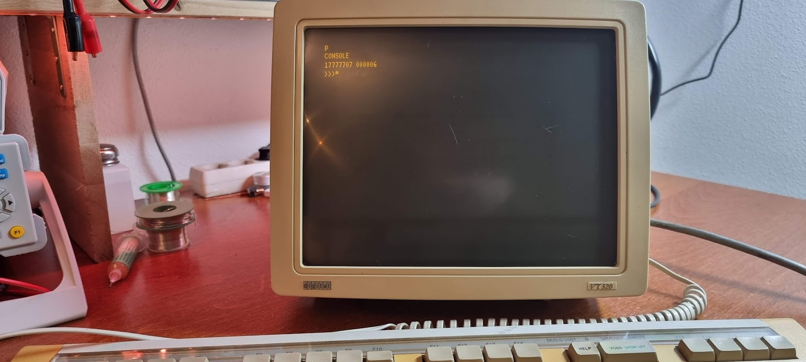

---
menu:
  sort: 30 PDP-11/44
---
# PDP-11/44

I got this beauty from Geert Rolf, thanks Geert!!

What I learned about this machine while getting it running again..

- [The 11/44 board and backplane layout](pdp-11-inventory/index.md)
- [List of boot PROMs](pdp11-boot-proms/index.md)

## Cards and backplanes

- [The DELUA ethernet controller (M7521)](the-delua-ethernet-controller-m7521/index.md)
- [The DD11-DK and DD11-CK backplanes](the-dd11-dk-backplane/index.md)

## Unibone tutorials and details

- [Unibone inside the 11/44](../unibone/unibone-inside-the-pdp-1144/index.md)

## Problems and fixes

- [zmspc0 test failure](zmspc0-test-failure/index.md)

## Operating systems

- [rsx-11](rsx-11/index.md)
- [Trying simh with Ethernet](getting-simh-to-run-with-an-ethernet-connection/index.md)

## Running diagnostics

- [Creating a tu58 (or console) serial cable](pdp11-m7090-console-cable-tu58-cable/index.md)
- [Using tu58 emulation to run the xxdp tests from tape images](running-the-xxdp-tests-using-tu58/index.md)
- [Investigating and testing the H7140 PSU](investigating-and-testing-the-psu-h7140/index.md)

First powerup with only 5 cards (M7094..M7098):

Useful tools:

- xxdpdir.pl: read DEC disk image files
  [xxdpdir.pl](http://xxdpdir.pl) --image=xxdp25.rl02 --directory to get a directory from that file

## Boot PROM resources

- [https://www.pdp-11.de/index.php/2018/06/09/dec-pdp-11-34-m9312-with-new-bootproms/](https://www.pdp-11.de/index.php/2018/06/09/dec-pdp-11-34-m9312-with-new-bootproms/)
- [https://ak6dn.github.io/PDP-11/M9312/](https://ak6dn.github.io/PDP-11/M9312/) Boot PROM files (also for the M7098 Unibus Interface)
- [http://www.bluefeathertech.com/technoid/promfiles.html](http://www.bluefeathertech.com/technoid/promfiles.html) But with the PROM types noted too
