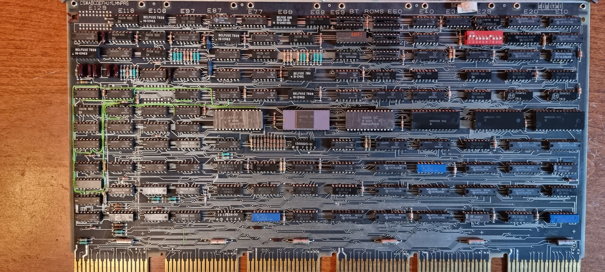

# M7098 UNIBUS Interface

This handles all UNIBUS chores. It contains part of the memory management unit: the Unibus MAP (which handles address translation from 18 bit to 22 bits for peripherals).

It also has an optional set of boot PROMs which contain bootstrap code to allow the machine to boot from different peripherals.

This contains a boot PROM “446F1” which I cannot find info on.
