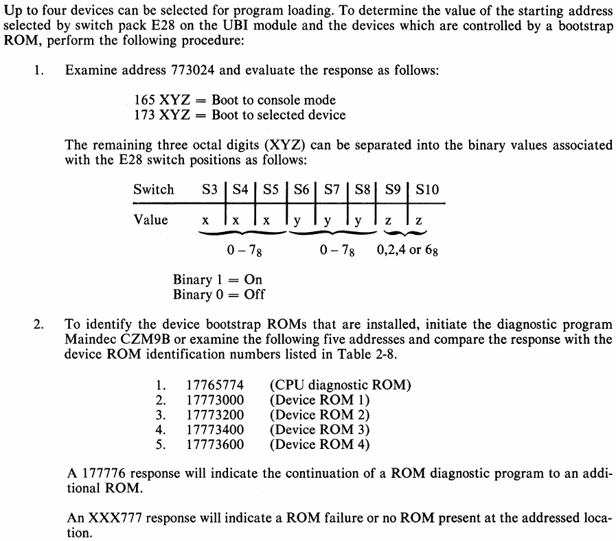
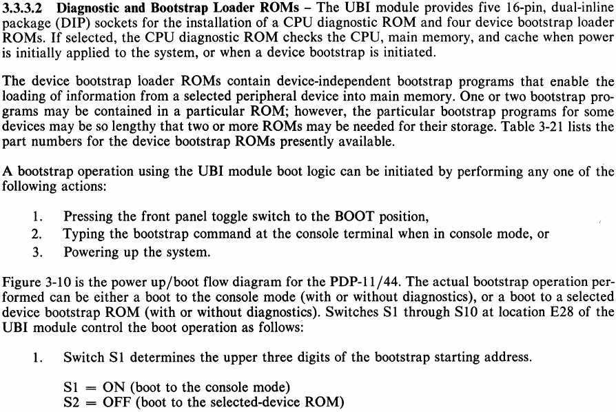
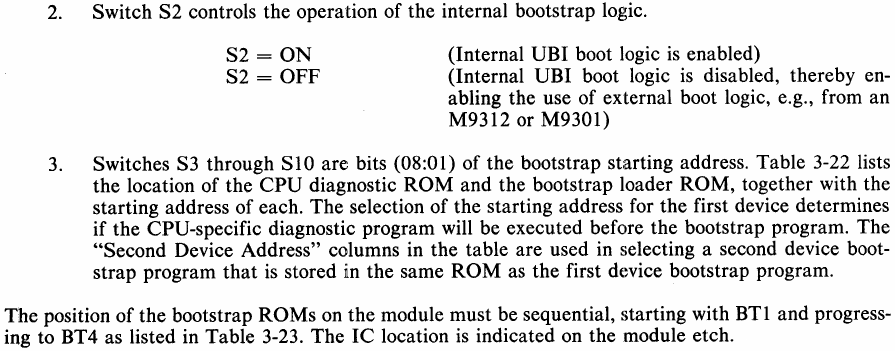
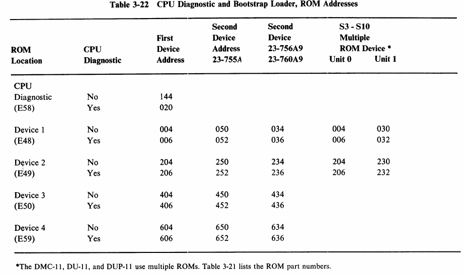
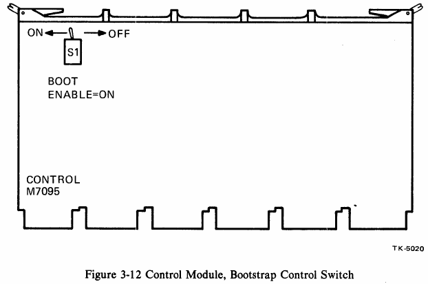

# Pdp11 Boot proms

## My 11/44

The user manual describes this for the boot command:



On my 11/44 the poked memory addresses show the following:

| address | value | Meaning |
| ------- | ----- | ------- |
| 17765774 | 041460 | C0 |
| 17773000 | 046523 | MS |
| 17773200 | 042114 | DL |
| 17773400 | 042104 | DD |
| 17773600 | 161777 | xxx777 means no ROM present |
| 17773024 | 173052	| 173 -> boot to selected device; sel=052? |

The auto-boot mode is controlled on the M7098 Unibus module:







My machine was auto-booting from socket E48, second device (apparently a MS device).


There is also an odd switch on the M7095:



## List of boot proms

* [This can be found here](https://ak6dn.github.io/PDP-11/M9312/)

## PROM Types and equivalents

| DEC Module | Prom details | Allowed types |
| ---- | ---- | ---- |
| M9312 Console PROM | 1024x4 three-state | N82S137, Am27S32, 74S573, MI-7643-5  |
| M9312, 11/44, 11/24 boot PROM | 512x4 Three-state | 82S131, Am27S13, 63S241, 74LS571 |
| M9312, 11/44, 11/24 boot PROM | 256x4 Three-state | 82S129 |


## Creating a boot PROM

Getting the PROMs to burn is a bit challenging, as is getting a device to burn them.. I was very lucky to get an old PROM burner: a Stag Quasar Plus. This comes with Windows XP software that knows a lot of types and which also contains really a lot of older types.

Getting the PROMs themselves was a bit harder.. These devices are old, and not easy to get. The usual route is Ebay, and my first attempt got me 10 MH74S571 proms in two weeks, which according to the number *should* work. But they did not: this manufacturer Tesla) only made them read compatible, writing them uses a different mechanism than all the others. Sigh.

The next attempt was a set of AM27S13 PROMs from Spain. They arrived by snail three weeks later. That is: the envelope arrived, with a nice thank you note for the order - but without PROMs. They had forgotten to put them in the envelope, so yet another three weeks to wait.

Then I got lucky: I actually found a Dutch shop (I live in the Netherlands part-time) which sold 82S129 PROMs for a sweet price - and these finally arrived… And worked :wink:

 I now have an extra boot PROM for the TU58:  

```
CZM9BE0 M9312/1144 UBI BOOT

DIAG. ROM (E20) (FOR 11-44 UBI: E58)C0

BOOTSTRAP ROM ENTRY POINTS AND DEVICE CODES
LOC.             NO DIAG.       RUN DIAG.       DEVICE CODE

ROM 1(E48)      173004          173006          MS
ROM 2(E49)      173204          173206          DL
ROM 3(E50)      173404          173406          DD

PSEUDO POWER-FAIL VECTOR ADR./NEW PC    173024  173052
ROM SEQUENCE IS INCORRECT AS PER INSTALLATION PROCEDURE.

SEQUENCE SHOULD BE:

ROM 1(E48)      DD
ROM 2(E49)      DL
ROM 3(E50)      MS
```

Links:

- [Jorg Hoppe’s site](http://www.retrocmp.com/13-joergs-pdp-1144)
