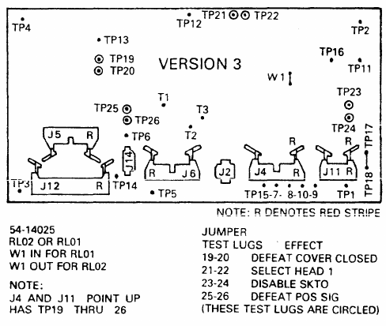
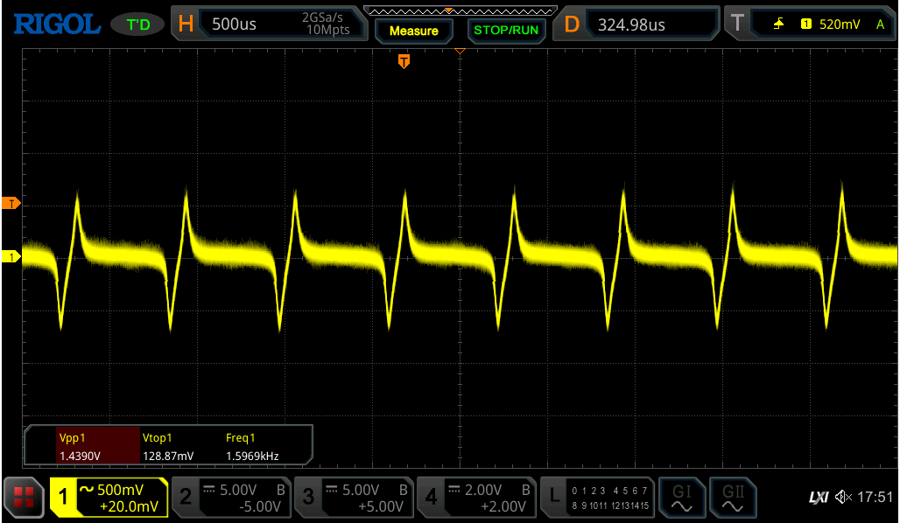
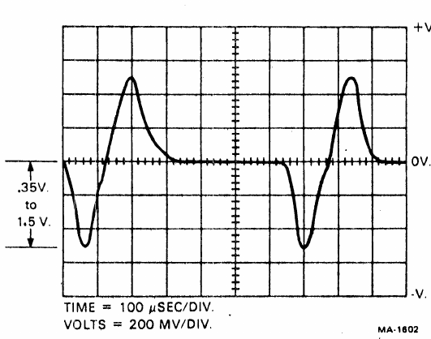
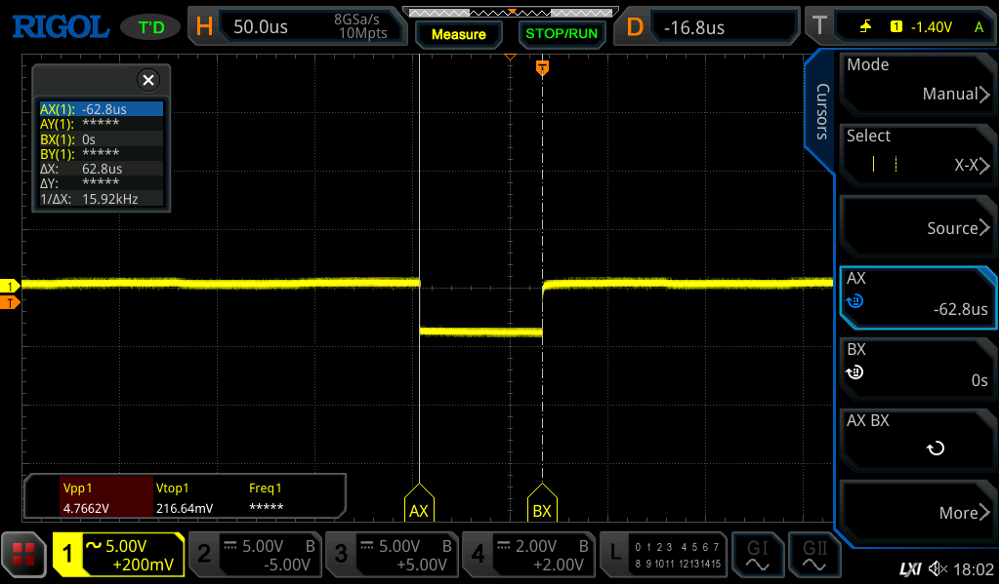
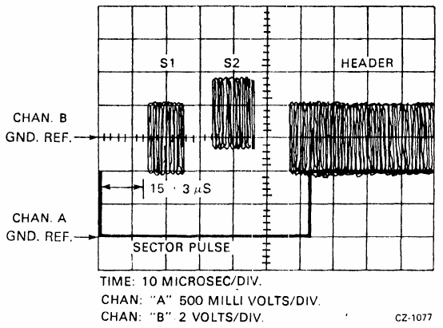
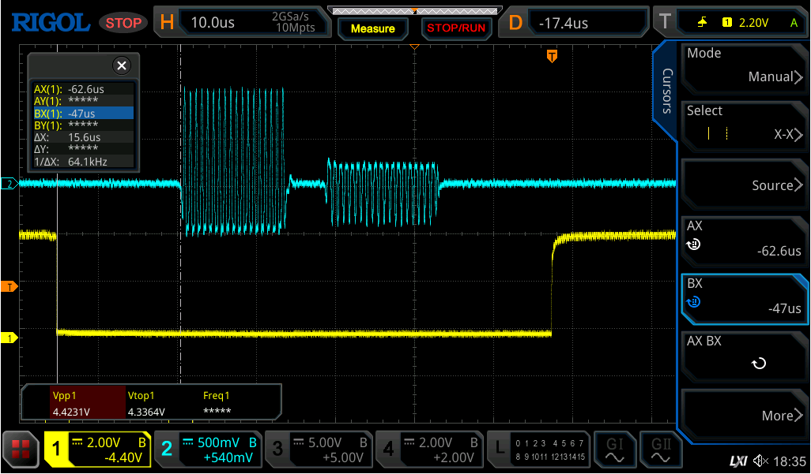

# RL02 drive measurements

I have version 3 of the RL02 controller, which looks as follows:

First test is the sector pulse timing check. For that the oscilloscope is on TP14. The signal looks as follows:

According to the docs this should be:

The downward voltage is about -0.7V which is within spec. The pulse width is 625uS which is ok (624uS is the medior).

Second is sector pulse width on TP11:

This should be 62.5uS; 62.8 seems close enough.

Positioner radial alignment:

We need to disable:

* SKTO (strap on tp23-tp24)
* Cover closed (strap 19-20)
* POS SIG (strap 25-26)

Place probe A on TP11 (sector pulse), place probe B on TP2 in the WRITE module.

The manual says this:

This manual image is confusing. It shows chA at 500mv/Div, and the pulse at 2divs = 1V. But we measured that pulse in the previous test and it is at 5V. I think the values have been swapped and channel A is on 2v/div and B is at 500mv. So the correct picture is this:

This looks OK; the servo burst arrives at 15.6 uS

## Jitter fix

While doing the Head Alignment test I found that the signal had a very large amount of "jitter":

[Drive Jitter](jitter.mp4)

Doing the alignment reduced that to within spec (15 uS +/- 3 uS).

