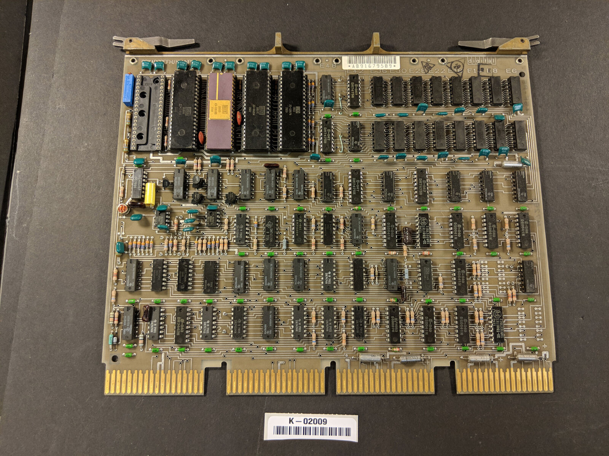
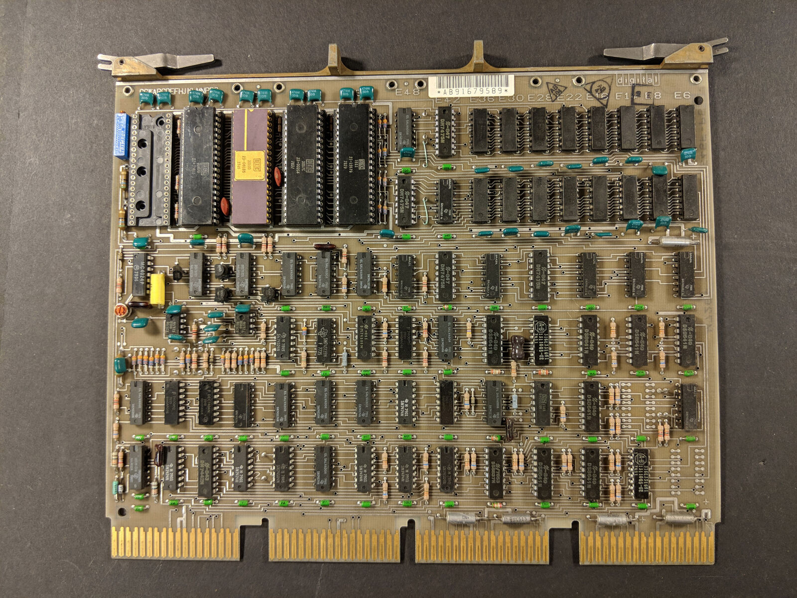
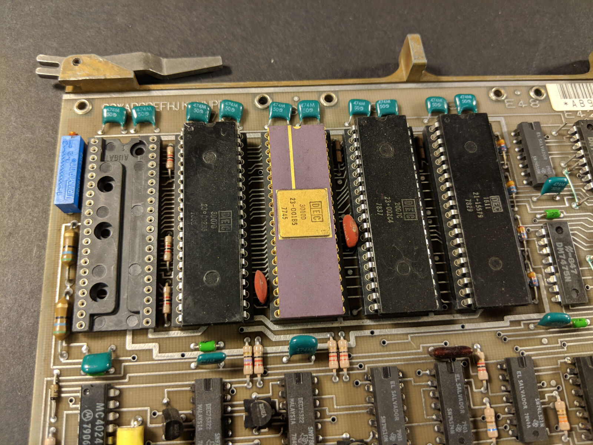
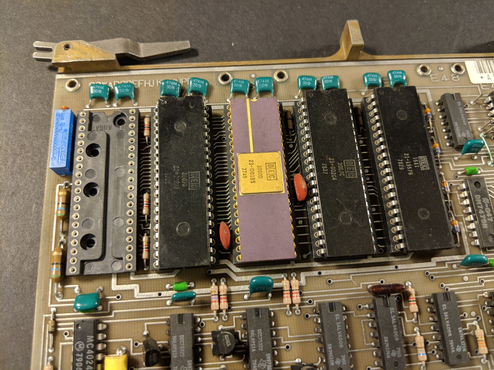
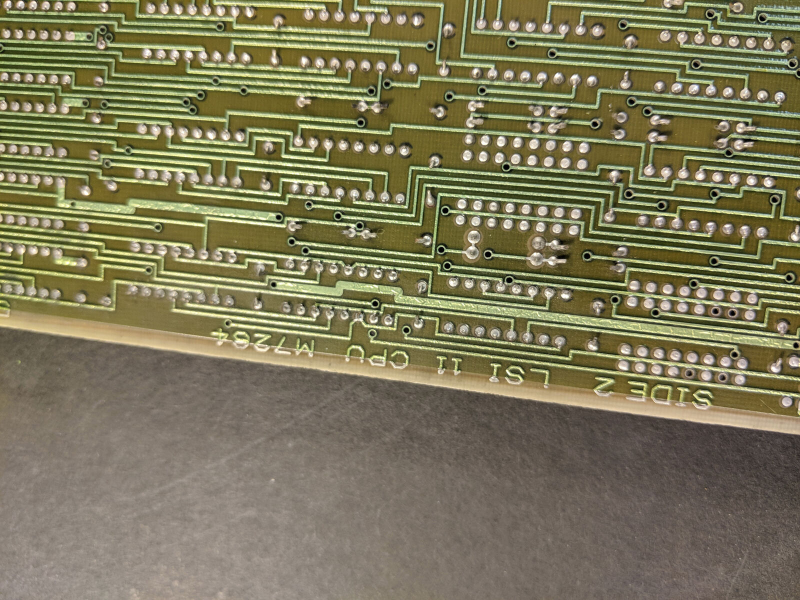

# DEC Digital M7264-EB QBUS LSI-11/03 CPU CARD

From markplaats

Links:

- [http://web.frainresearch.org:8080/projects/pdp-11/lsi-11.php](http://web.frainresearch.org:8080/projects/pdp-11/lsi-11.php)
- [http://gunkies.org/wiki/LSI-11](http://gunkies.org/wiki/LSI-11)
- [https://www.cpushack.com/2017/11/22/cpu-of-the-day-dec-lsi-11-chipset/](https://www.cpushack.com/2017/11/22/cpu-of-the-day-dec-lsi-11-chipset/)
