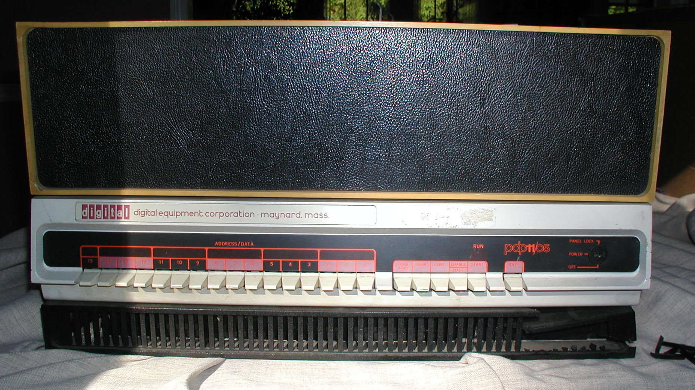
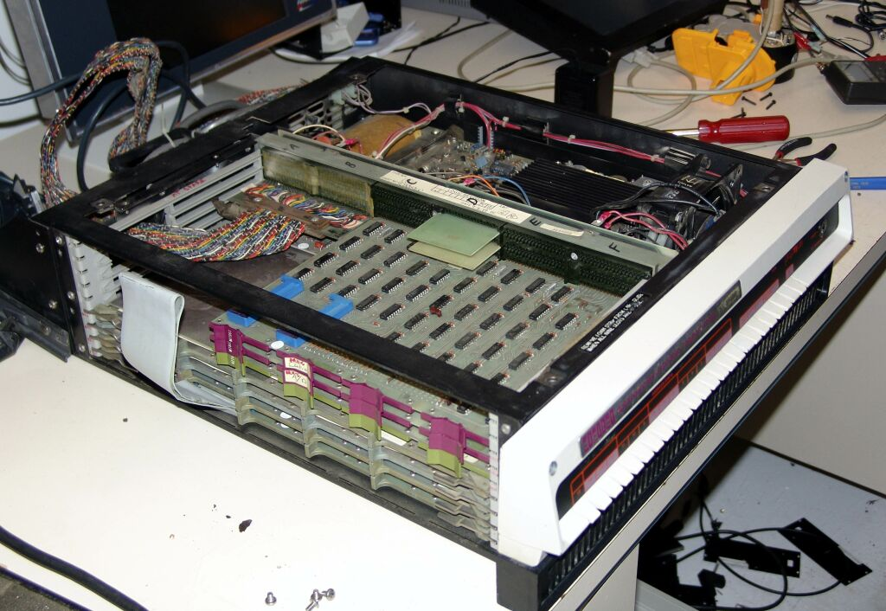

# The PDP 11/10

Investigating this machine.. One of the earliest PDP's. The 11/10 is only a marketing trick: it actually is a PDP 11/05 but with a 11/10 label on the front.

## Pictures

The full machine:

The underside, with the lamps and the switches, houses the actual CPU. The top part is the extension chassis which contains all other cards. The CPU part has no room for extra cards.

Inside view of the CPU chassis:

## Links to documentation

* [Gunkies](https://gunkies.org/wiki/PDP-11/05)
* [Bitsavers documentation](https://www.bitsavers.org/pdf/dec/pdp11/1105/)

