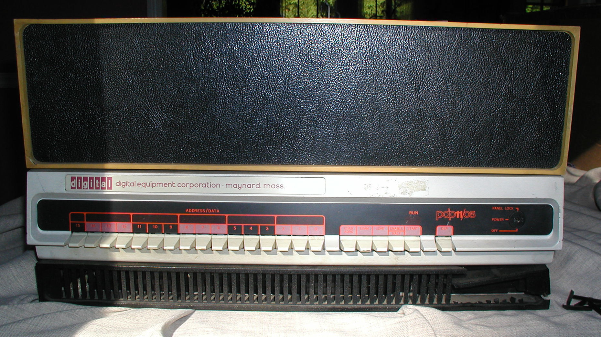
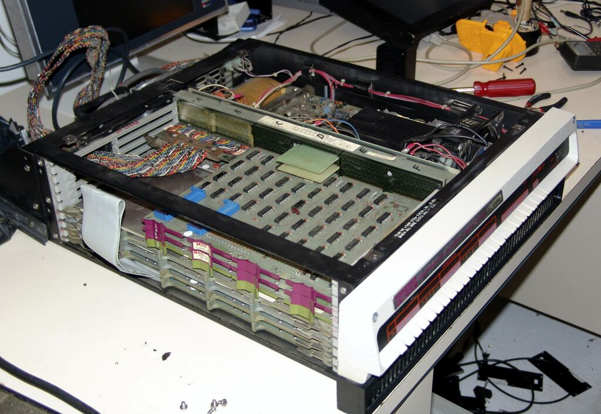

# The PDP 11/10

Investigating this machine.. One of the earliest PDP's. The 11/10 is only a marketing trick: it actually is a PDP 11/05 but with a 11/10 label on the front.

## Pictures

The full machine:

The underside, with the lamps and the switches, houses the actual CPU. The top part is the extension chassis which contains all other cards. The CPU part has no room for extra cards.

Inside view of the CPU chassis:

## Current loop converter

The 11/05 uses a current loop for the console. The following old schematic is a conversion from current loop to RS232 and vice versa:

Further study actually shows that the 11/05 also exposes the RS232 signals as TTL level signals on the BERG connector at the back. There is one oddity: the RXD signal (receive input) is inverted inside the 11/05, so it needs to be inverted before being fed in. I made a small adapter using an FTDI converter:

The black shrinktube hides a 2N7000 FET which handles the inversion of the TXD signal from the FTDI adapter into ~{RXD} for the 11/05.

Links to the information:

* [Ronald's RS232 interface for the 11/05](https://github.com/Roland-Huisman/RS232_converter_for_PDP11)
* [Joerg Hoppe's interface description](https://retrocmp.com/how-tos/interfacing-to-a-pdp-1105)

## Links to documentation

* [VCFed forums - pdp-11/05 restauration blog](https://forum.vcfed.org/index.php?threads/pdp-11-05-restoration-blog.1249299/)
* [Gunkies](https://gunkies.org/wiki/PDP-11/05)
* [Bitsavers documentation](https://www.bitsavers.org/pdf/dec/pdp11/1105/)

