# The Cipher F890 tape drive

I was very happy to get a 10.5 inch 9 track tape drive!!

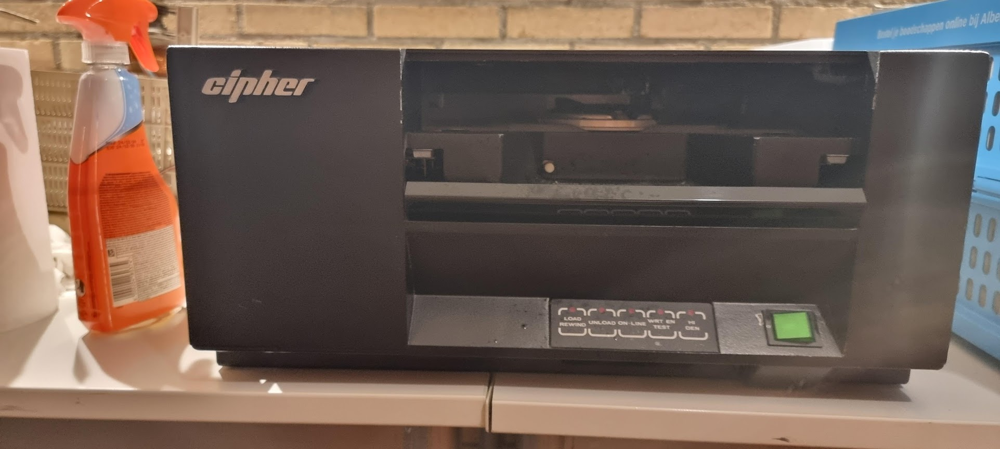

This tape unit support up to 1600BPI tapes, and has a PERTEC interface.

## Initial status
The unit needed a bit of cleaning but seemed in good state overall. It switched on without apparent problems. One thing that needed to be fixed were the rubber like pads on the main drive wheel:

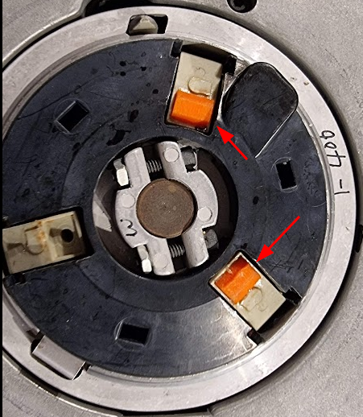

These had already been replaced with newer versions but these were a little too small.

I made a new model in [Onshape](https://cad.onshape.com/documents/5250b162d057a5e5121f53b6/w/216b7eb7df0f59c64dfa8067/e/a828b49ce936e442852a7f1d) which I printed in NinjaFlex TPU and glued back on the grabbers:

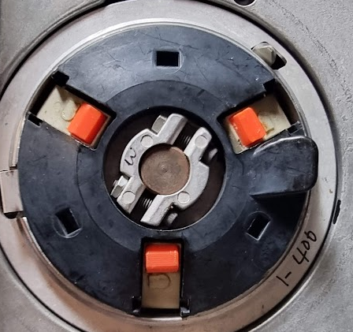

After replacement I tried to load the tape but was greeted by an error 17, a problem with the tensioning arm. The tape did properly wind itself however:

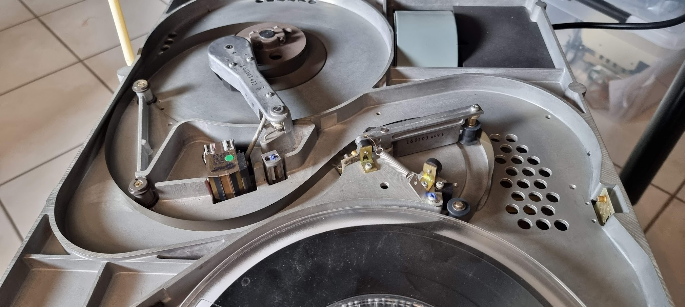

## Debugging the drive
The drive has extensive help for servicing. The details can be found in the service manual (section 3). The drive as a set of numbered "Service Aids". You enable/start a service aid as follows:

* Switch on the drive
* Press TEST, then HI-DEN
* Type in the number of the service aid, using the buttons as numbers from 1..4
* Press 5 (HI-DEN) to enable the SA.
Make sure to press the buttons within 3 seconds.

(!) If the drive enters an error state you do not have to switch it off and on again; you can press the "test" button after which the drive returns to its initial state.

Important service aids:

* 33: This disables the "door open" checks and allows you to see what happens during tape load. WATCH OUT FOR YOUR HANDS!!

## Fixing error 17
I removed the tape from the machine as the first tests need to run without one.

The error message tells us to runSA24. This test shows the voltage from the thing that measures the angle of the tension arm. The measurements here are:

| Position | Binary value | Voltage | Comment |
| -------- | ------------ | ------- | ------- |
| Rest     | 10010        | 2.817V  | Seems high, manual says 1.56 V |
| Extended | 01001        | -0.313V | Manual says -1.565V |
| Delta    | 00110        | 3.75V   | Slightly high, 3.13V |

Running SA11 after that sees both tape wheels move together, switching direction. Does not seem to be wrong..

Adding a tape and doing a load sequence again fails with error 17. But now I can try again with SA33, so that I can see what happens.
The first such attempt showed error 4, which is a "hard" error saying "Arm out of limits during autoload". A more detailed table in the service guide states:
"Compliance arm circuit voltage level is out of tolerance during the autoload sequence", and tells us to use SA24 to check _if_ the tape has been properly captured (which was the case).
This seems another indication that the voltages from the tensioning arm are incorrect, as already seen by SA24.

### What senses that angle?
Looking at the drawings for the tensioning arm it looks like the angle is measured by an "air capacitor":

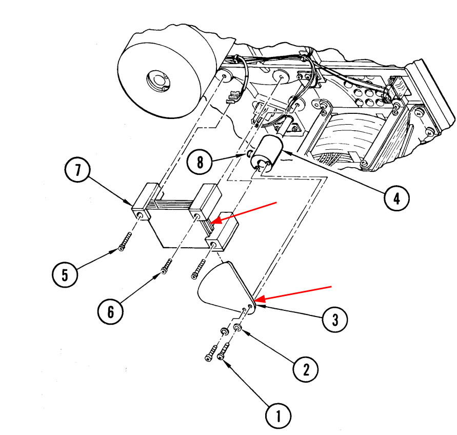

The relevant part of the schematic seems to be this:

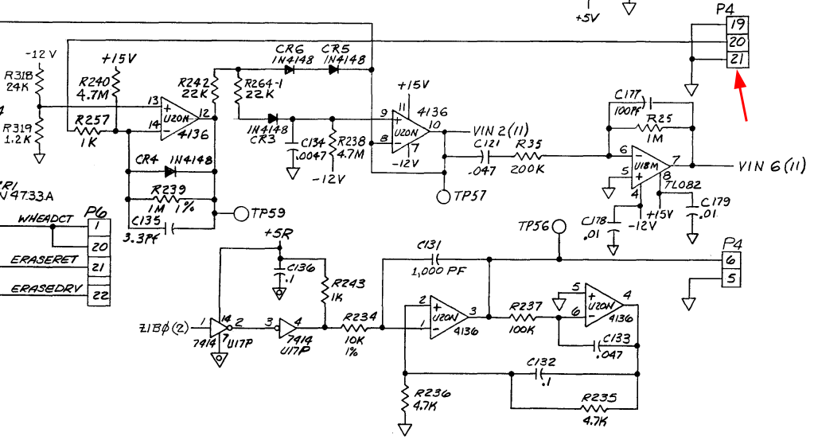

I'm not exactly certain because there seem to be errors in the annotations in the wire loom. But that P4 matches in part, and it has the expected 3 wires. The circuit produces two voltages (vin2 and vin6) which are actually measured by the circuit:

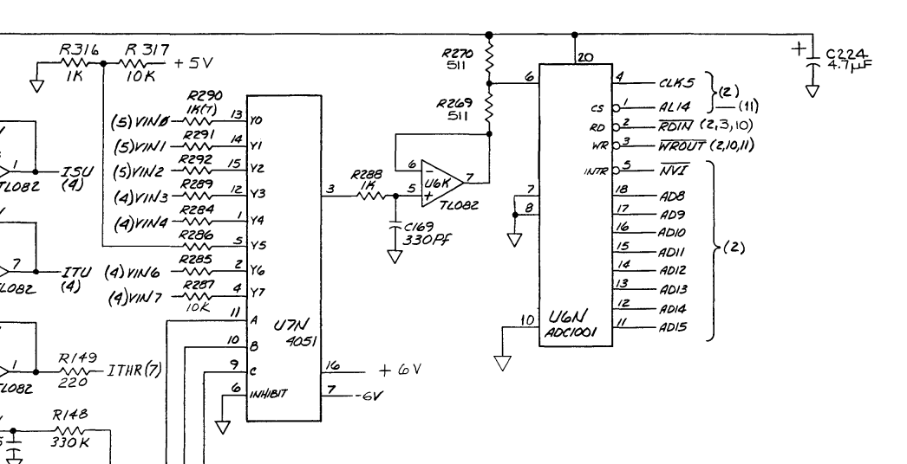

The service manual for the F880 is a lot better; it has annotations in the schematic that tell us the above circuit is indeed what we're looking for. The theory of operation for the 980 describes the operation of this circuit:

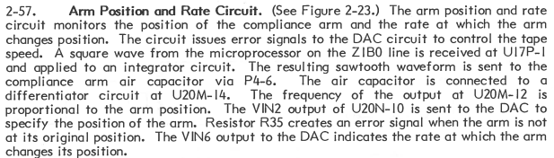

### Measuring the circuit
The version of the unit I have seems to be more close to what is described in 799816-006AA_Cipher_M890_M891_Cachetape_Operation_and_Maint_Vol1_Mar87. Measuring TP56 (which should show the sawtooth fed into the air capacitor) shows this:

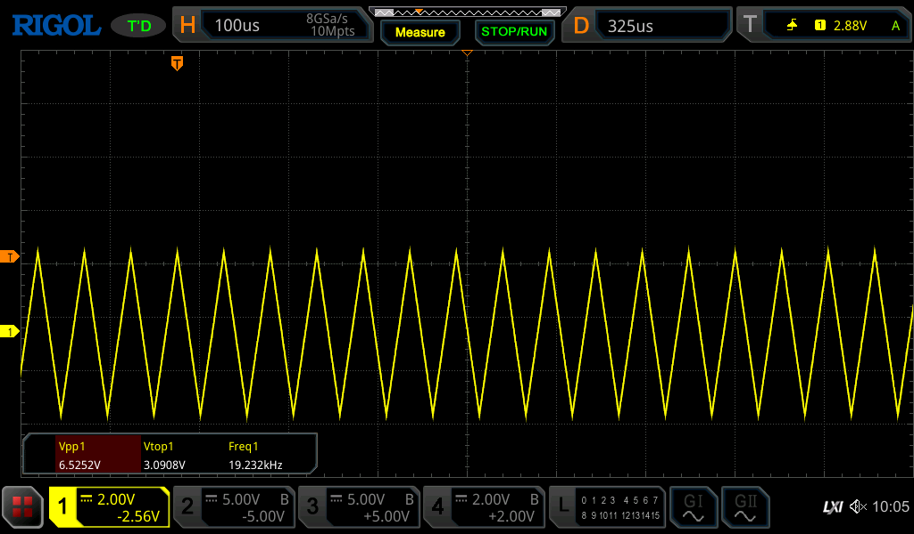

This shows a 6.5V p-p sawtooth at 19.2KHz which seems to be OK (although the 880 manual says it needs to be 12vPP, and 10.5KHz).

Measuring next TP59 shows the following:

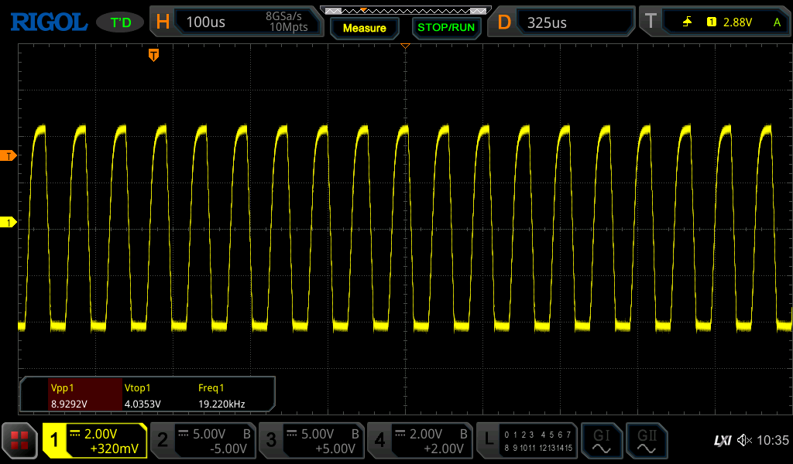

According to the manual this is high, so I am going to replace the 4136.

## After replacing the 4136

It took a week for replacements to arrive. After replacing the chip the tension arm voltages were a lot more as described, but we still had tape load issues.

I used test setting 33 to enable me to see the load process. This showed that the reel hub (the thing on which you place the spool) was not grabbing the tape: it slipped like mad. I then thought I needed to print the rubber pads a bit larger, but this did not help at all. Luckily my friend Marc arrived from the Netherlands and we looked at the issue together. We found out that that drive hub has a special mechanism to grab the tape: when the hub turns there is a ring inside that hub which controls the arms containing the rubber pads. When moving in the right direction this causes those arms to move the pads to the tape. But in fact the pads were too large, so the arms would not fully extend and because of that they did not apply pressure on the pads, causing the slippage.

I reprinted the pads a whole lot smaller in OnShape:

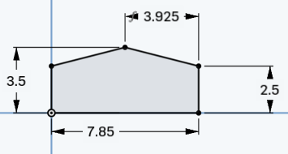

and that made the tape load work. I could see that the little arms inside the hub were now almost fully straight, and with that the tape was grabbed a lot more forcefully.

## But then we got a new problem, sigh

The tape load worked fine for a while. I then worked on the RL02 drive for a few weeks, and when I returned to the tape unit it would not fail the load, it would always report an error with the last three lamps flashing which is apparently error 28 "Servo failure or hub is jammed during manual load". Which is an odd error.

Looking at the load operation with the door open I saw the following: the hub starts with turning in reverse, and this will blow the start of the tape into the area that should detect it:

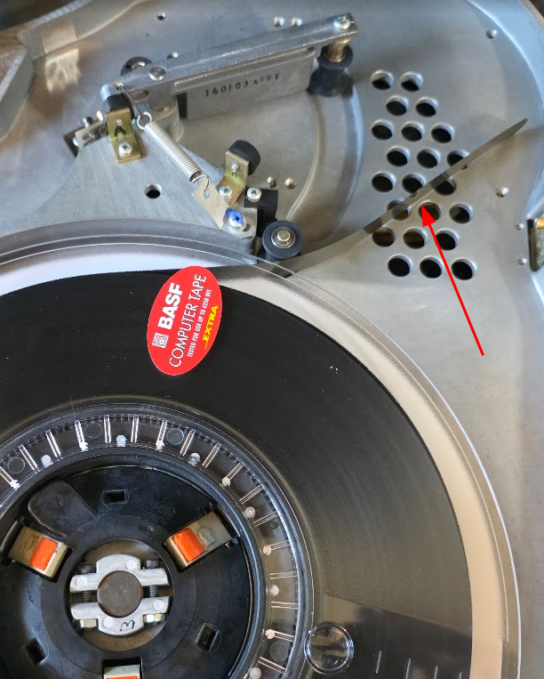

The tape would nicely blow in there every time, but it looks like it was not detected? This detection is done by the "TAPE IN PATH" circuits:

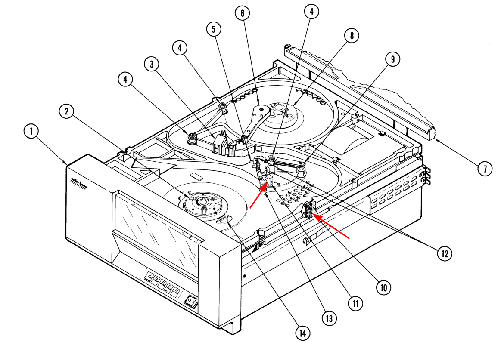

Number 10 is the transmitter, number 11 is the receiver according to the diagram. There is a test, #31, which tests this. Running that test makes the reel turn in reverse with the blower on and the LOAD light flickers every time the tape is detected. This works fine. I also tested the normal load sequence by putting a finger over the transmitter. This still fails the load, but when it does it starts to turn faster in reverse until you remove your finger. This is clearly meant to remove all of the tape from the path on failure, so clearly that detector works.

Looking in another manual it states that error 28 means "Tape reel prevented movement of the supply reel hub. Remove and reinsert tape to clear. Possible bell crank solenoid failure"... 

## Drive error messages
The drive shows error messages on the keys in binary. It The digits are reversed though: the lsb is LOAD, the MSB is HI-DEN, sigh.

We have the following list of error codes from the manual:

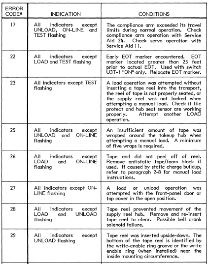
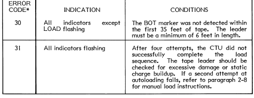

We also have another list which is less precise but with more codes:

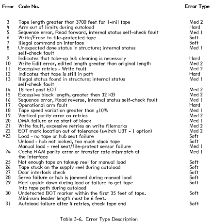

## Links

- [Youtube repair video](https://www.youtube.com/watch?v=9-UWP-Op278)
- [Repair description of a similar issue](https://microvax2.org/wp/2010/01/10/attempted-repair-cipher-880-or-891-tape-drive/)

