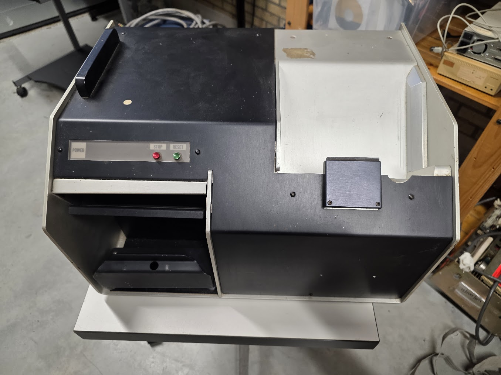
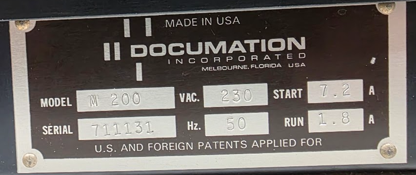

# The Documation M200 punched card reader

This is a punched card reader which can be used with a PDP-11, using a M8291 CR-11/CM-11 punched card reader interface. It can read 80 column cards at 300 cards/minute.

## Documentation

* [Technical manual](https://www.bitsavers.org/pdf/documation/M200_TechMan_Jan72.pdf)

