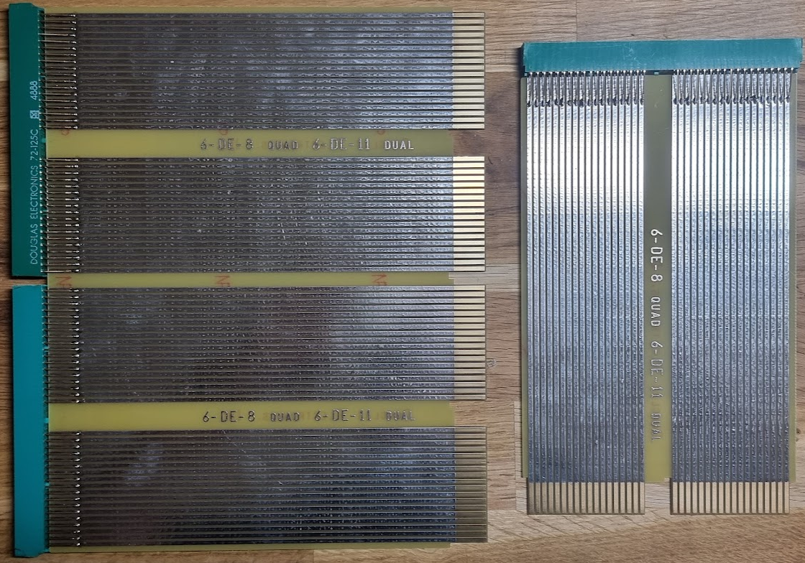

# Douglas board extenders

Repairing things inside the PDP-11 is quite hard without extenders. These are by itself very easy to make, except that the connectors are largely unobtainium... Luckily there is one company that still makes them: [Douglas Electronics Inc](https://www.douglaspcb.com). The website's domain changed recently, btw; they were douglas.com before.

The boards can be found under Breadboards -> By Function -> Board Extender.

I ordered two:
* The [6-DE-11](https://www.douglaspcb.com/index.php/6-de-11.html) which is a dual width, dual height DEC extender
* The [6-DE-8](https://www.douglaspcb.com/index.php/6-de-8.html) which is a quad width dual height DEC extender.

Both can be ordered with connectors. They are a bit expensive, but they are of good quality.

