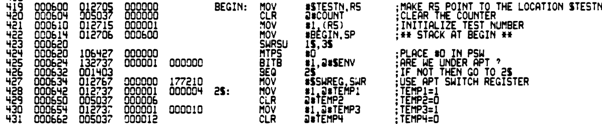
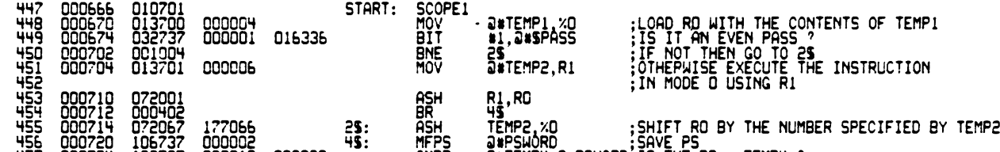
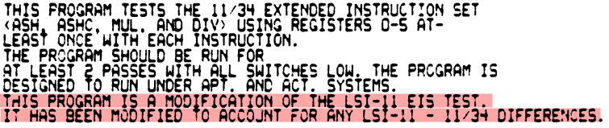

# Extending the Unibone CPU emulation

The Unibone emulates a PDP 11/20 CPU. This is the very first PDP-11 CPU, the KA11, and it lacks a lot of instructions that were present on later machines. This is a pity, because it limits what the Unibone can run: code that uses the later instructions will fail. This is particularly sad for a great use case for this wonderful thing which is to test hardware: some XXDP tests fail because they use these instructions. I had this happening while I wanted to test the DELUA adapter, and I decided to try to add the missing instructions to the Unibone.

> [!WARNING]
> Work in progress, incomplete

## Implementing the first set: the EIS instructions

The Extended Instruction set, implemented in part for the 11/20 by the KE11-A extension, added the following instructions in the 007x000 range: ASH, ASHC, MUL, DIV. Later CPUs added XOR to this list.

I implemented these by adding a parameter “extended\_inst” to the cpu20 device. When set the code now emulates these instructions. The following instructions will be emulated with this flag set:

- MUL
- DIV
- ASH
- ASHC
- XOR
- SOB

## Testing the EIS instructions: FKAC..

The 11/34 (KD11-B) implements these instructions, and there is a specific test for them, [details here](https://www.pdp-11.nl/pdp11-34a/cpu/diags/fkac.html). The FKAC test tests these EIS instructions, so, let’s run it. Sadly enough it halts “CPU Halt by instruction” at 000014. I enabled Trace level on the Unibone, and the log (dbg s) shows:

```
[22:02:01.655324 Dbg    cpu 02267@ka11.c:0412] EXEC [000620] MOV
[22:02:01.655328 Dbg    cpu 02267@ka11.c:0161] DATI [000622] => 000004
[22:02:01.655331 Dbg    cpu 02267@ka11.c:0161] DATI [000004] => 000006
[22:02:01.655335 Dbg    cpu 02267@ka11.c:0161] DATI [000576] => 000000
[22:02:01.655338 Dbg    cpu 02267@ka11.c:0174] DATO [000576] <= 000006
[22:02:01.655346 Dbg    cpu 02267@ka11.c:0161] DATI [000624] => 013746
[22:02:01.655350 Dbg    cpu 02267@ka11.c:0412] EXEC [000624] MOV
[22:02:01.655353 Dbg    cpu 02267@ka11.c:0161] DATI [000626] => 000006
[22:02:01.655357 Dbg    cpu 02267@ka11.c:0161] DATI [000006] => 000000
[22:02:01.655360 Dbg    cpu 02267@ka11.c:0161] DATI [000574] => 000576
[22:02:01.655363 Dbg    cpu 02267@ka11.c:0174] DATO [000574] <= 000000
[22:02:01.655370 Dbg    cpu 02267@ka11.c:0161] DATI [000630] => 012767
[22:02:01.655374 Dbg    cpu 02267@ka11.c:0412] EXEC [000630] MOV
[22:02:01.655377 Dbg    cpu 02267@ka11.c:0161] DATI [000632] => 000644
[22:02:01.655381 Dbg    cpu 02267@ka11.c:0161] DATI [000634] => 177146
[22:02:01.655385 Dbg    cpu 02267@ka11.c:0161] DATI [000004] => 000006
[22:02:01.655388 Dbg    cpu 02267@ka11.c:0174] DATO [000004] <= 000644
[22:02:01.655395 Dbg    cpu 02267@ka11.c:0161] DATI [000636] => 005777
[22:02:01.655399 Dbg    cpu 02267@ka11.c:0671] EXEC [000636] TST
[22:02:01.655402 Dbg    cpu 02267@ka11.c:0161] DATI [000640] => 177640
[22:02:01.655406 Dbg    cpu 02267@ka11.c:0161] DATI [000502] => 177570
[22:02:01.655409 Dbg    cpu 02267@ka11.c:0161] DATI [177570] => 000000
[22:02:01.655415 Dbg    cpu 02267@ka11.c:0161] DATI [000642] => 000407
[22:02:01.655419 Dbg    cpu 02267@ka11.c:0722] EXEC [000642] BR
[22:02:01.655425 Dbg    cpu 02267@ka11.c:0161] DATI [000662] => 012637
[22:02:01.655428 Dbg    cpu 02267@ka11.c:0412] EXEC [000662] MOV
[22:02:01.655432 Dbg    cpu 02267@ka11.c:0161] DATI [000574] => 000000
[22:02:01.655435 Dbg    cpu 02267@ka11.c:0161] DATI [000664] => 000006
[22:02:01.655439 Dbg    cpu 02267@ka11.c:0161] DATI [000006] => 000000
[22:02:01.655442 Dbg    cpu 02267@ka11.c:0174] DATO [000006] <= 000000
[22:02:01.655450 Dbg    cpu 02267@ka11.c:0161] DATI [000666] => 012637
[22:02:01.655453 Dbg    cpu 02267@ka11.c:0412] EXEC [000666] MOV
[22:02:01.655457 Dbg    cpu 02267@ka11.c:0161] DATI [000576] => 000006
[22:02:01.655460 Dbg    cpu 02267@ka11.c:0161] DATI [000670] => 000004
[22:02:01.655464 Dbg    cpu 02267@ka11.c:0161] DATI [000004] => 000644
[22:02:01.655467 Dbg    cpu 02267@ka11.c:0174] DATO [000004] <= 000006
[22:02:01.655474 Dbg    cpu 02267@ka11.c:0161] DATI [000672] => 106427
[22:02:01.655478 Dbg    cpu 02267@ka11.c:0800] TRAP 10
```

So, an illegal instruction.

Looking at the EXEC parts we can see the instructions being executed and their address. The last one that worked was a MOV at 000666, the DATI before the trap shows a read of 000672 with opcode 106427.

The fiche database only contains a fiche for “DFKACA”, and I cannot match the above execution with its content:





But there is an instruction there with the same opcode, at 000620: MTPS. Which is according to the docs a LSI11 only instruction which moves a word to the PSW. It has an accompanying read called MFPS. This is odd because the 11/34 is not a LSI11 CPU, but the test’s documentation says:



> [!INFO]
> It later appeared that this fiche (MD-11-DFKAC-A\_\_PDP11-34\_\_EIS\_INSTRUCTION\_TEST\_\_EP-DFKAC-A-DL-A\_\_OCT\_1977\_bw.pdf), which dates from 8-sep-76 and which is called DFACA is not the right one for FKACA0. There is a better PDF (MAINDEC-11-DFKAC-A-D\_1134-EIS-Instruction-Tests\_Dec75.pdf) in the Diagnostics database which stems from 4-AUG-77 and which matches the module.

## Implementing MTPS and MFPS

So, apparently the 11/34 implemented that MTPS instruction. Sigh. This [was confirmed here](https://www.conservapedia.com/PDP-11):

“The Micro/J-11 supported all of the possible PDP-11 instructions, except for those unique to the PDP-11/60, and the PDP-11/34 (MTPS and MFPS).“

I implemented the mtps (1064xx) and mfps (1067xx) instructions by adding yet another cpu20 parameter:

```
    parameter_bool_c allow_mxps = parameter_bool_c(this, "allow_mxps", "mxps",/*readonly*/
                             false, "Allow mtps and mfps instructions (1=11/34, LSI11, 0=standard 11/20 behavior)");
```

While mfps moves only the lower byte of the PSW it was not clear to me whether it would store it as a word. I did opt for that; we’ll have to see if that is true or not (it does seem to be; if I implement it as storing a byte the tests fail).

## Next FKAC runs

The next runs now ran without traps, but I had to fix a number of test failures. This was a bit messy. I found out the following things from those failures…

- The ASH and ASHC opcodes have a bit of a messy description of when the V flag is set. This flag can only be set when rotating left, and in that case it seems to get set if *any* of the 1 bit shifts causes the sign to change. I.e. it is not enough to shift the value immediately n bits and then check the sign of the result with the original. In the code this means that shift left and shift right are implemented differently: the right shift can be done quickly, but the left one is done bit by bit.
- I had major trouble with the “div” instruction. Test 255 does “-9 / 3” and expects the result to be -3. This consequently failed: the quotient was always a very large number (containing a lot of hex 5’s). The code in C was simple: just “a / b”, and the values, when printed before were really -9 and 3. The result was assigned to a variable on the stack, and printing this variable immediately after gave the large number. I moved the variable to static and then the code ran without problems. In the end I decided to use ldiv() instead. I cannot explain what happened and it seems a bit worrysome.

The FKACA0 test now runs to completion without errors:

```
Serial port ttyS2 opened by UniBone


MEMORY MANAGEMENT UNIT NOT FOUND


BOOTING UP XXDP-SM SMALL MONITOR


XXDP-SM SMALL MONITOR - XXDP V2.4
REVISION: D0
BOOTED FROM DL0
28KW OF MEMORY
UNIBUS SYSTEM

RESTART ADDRESS: 152010
TYPE "H" FOR HELP 

.R FKAC??
FKACA0.BIC

END PASS��
END PASS��
END PASS��
END PASS��
END PASS��
END PASS��
END PASS��
END PASS��
END PASS��
END PASS��
END PASS��
END PASS��
END PASS��
END PASS��
END PASS��
END PASS��
END PASS��
END PASS��
END PASS��
END PASS��
END PASS��
```

## The FKAC test

Reading the fiche to understand the ASH part of it..

The test tests the ASH instruction for the registers R0..R5, where those registers are the ones to be shifted. On even passes, when we test Rn, the shift count (coming from temp2) is moved to R(n+1) and that register is used as the count. On odd passes it uses test2 directly.

The test loops 30x (36oct) though the same sets of code. After that every test number will be checked and used to change things like the shift value and the initial value. Once all ASH tests are done it switches to ASHC tests which are very similar. These are then followed by mul and div. Xor and Sob are not tested.

Variables:

- temp1: current value to be shifted.
- temp2: shift count. On even passes this gets moved to a register, and the register is used as the count source. On odd passes the ash instruction addresses temp2 directly (mode 67).
- temp3 : the expected result of the shift operation expected in the shifted register
- temp4: the expected PSW result

## Debugging tests using Unibone

### Speed up emulation

By default the emulation will fully control the Unibus. This means that when it runs all data is sent to it. This is necessary when testing real hardware, of course, but for my use case, testing the emulation, I do not need the Unibus to be controlled. And disabling that greatly speeds up the emulation!

Set the parameter “pmi” to 1 to disable Unibus control.

### Use Unibone breakpoints

Invaluable is the “bp” parameter in the Unibone which can be used to set a single breakpoint. As the fiche I had of FKAC was a lot different from the actual code I converted the BIC file to a binary and then used pdp11dasm to disassemble that binary. With that I could at least match pieces of actual code with the fiche.

In my version of FKAC the $HLT routing which gets called at error is at location 16440oct, and this routine’s return statement is at 16622oct, so I added a breakpoint at the last address causing the test to stop as soon as an error has been found- and has been printed.

### Use printf while developing

These appear on the UB console and can help a lot.

## Use Unibone statement logging

Set the CPU debug level to 5, and use “dbg s” to dump a log of statements executed. The log is verbose in volume but terse in information, but it often allows you to at least follow flow just before a breakpoint.
