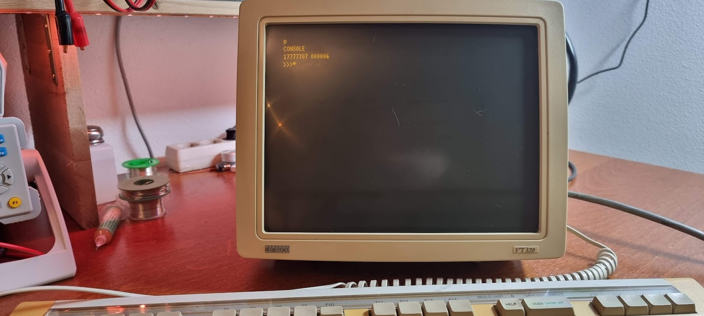

# PDP-11/44

I got this beauty from Geert Rolf, thanks Geert!!

This is now a dump of things I learn and need to keep; it should be organized later.

- [Inventory](pdp-11-inventory/index.md)
- [Boards list / boards to look for](unibus-board-list/index.md)
- [Unibus, Uniprobe, Unibone](unibus-uniprobe-and-unibone-tales/index.md)…
- [The Unibone I2C panel](unibone-i2c-panel/index.md)
- [List of Unibus machines and their details](pdp-11-unibus-processors/index.md)
- [List of boot PROMs](pdp11-boot-proms/index.md)

## Related devices

- [The RL02 disk drive](rl02/index.md)
- [Using the RL02 as an USB device](rl02-usb/index.md)
- [The Cipher F880](cipherf890/index.md)
- [Board extenders](douglas-extenders/index.md)
- [The TU58 tape drive](the-tu58-tape-unit/index.md)
- [The RX02 floppy drive](the-rx02-floppy-drive-and-the-m8256-rv211-controller/index.md)
- [The DELUA ethernet controller (M7521)](the-delua-ethernet-controller-m7521/index.md)
- [Unibus backplanes](the-dd11-dk-backplane/index.md)

## Unibone tutorials and details

- [Unibone articles](unibone/index.md)

## Problems and fixes

- [zmspc0 test failure](zmspc0-test-failure/index.md)

## Operating systems

- [rsx-11](rsx-11/index.md)
- [Trying simh with Ethernet](getting-simh-to-run-with-an-ethernet-connection/index.md)

## Running diagnostics

- [Creating a tu58 (or console) serial cable](pdp11-m7090-console-cable-tu58-cable/index.md)
- [Using tu58 emulation to run the xxdp tests from tape images](running-the-xxdp-tests-using-tu58/index.md)
- [The XXDP Diagnostics](xxdp-diagnostics-information/index.md)
- [Investigating and testing the H7140 PSU](investigating-and-testing-the-psu-h7140/index.md)

First powerup with only 5 cards (M7094..M7098):

Useful tools:

- xxdpdir.pl: read DEC disk image files
  [xxdpdir.pl](http://xxdpdir.pl) --image=xxdp25.rl02 --directory to get a directory from that file
- [Convert BIC files to straight binary](convert-bic-files-to-straight-binary-files/index.md)

## DEC related mailing lists and groups

- [The Unibone mailing list](https://groups.google.com/g/unibone)
- [The Vintage Computer Federation forii](https://forum.vcfed.org/index.php?forums/dec/)

## Useful links

- [DEC Alphabet BERG to IDC connector numbering](decalphabet/index.md)
- [DEC related 3D models](https://so-much-stuff.com/pdp8/cad/3d.php)
- Instruction set details
-   [Stackosaurus](http://stackosaurus.com/pdp11.html)
- [Vt320 Power supply repair](https://forum.vcfed.org/index.php?threads/vt320-modern-replacement-power-supply.1238917/#post-1260807)
- [https://www.pdp-11.de/index.php/2018/06/09/dec-pdp-11-34-m9312-with-new-bootproms/](https://www.pdp-11.de/index.php/2018/06/09/dec-pdp-11-34-m9312-with-new-bootproms/)
- [https://ak6dn.github.io/PDP-11/M9312/](https://ak6dn.github.io/PDP-11/M9312/) Boot PROM files (also for the M7098 Unibus Interface)
- [http://www.bluefeathertech.com/technoid/promfiles.html](http://www.bluefeathertech.com/technoid/promfiles.html) But with the PROM types noted too
