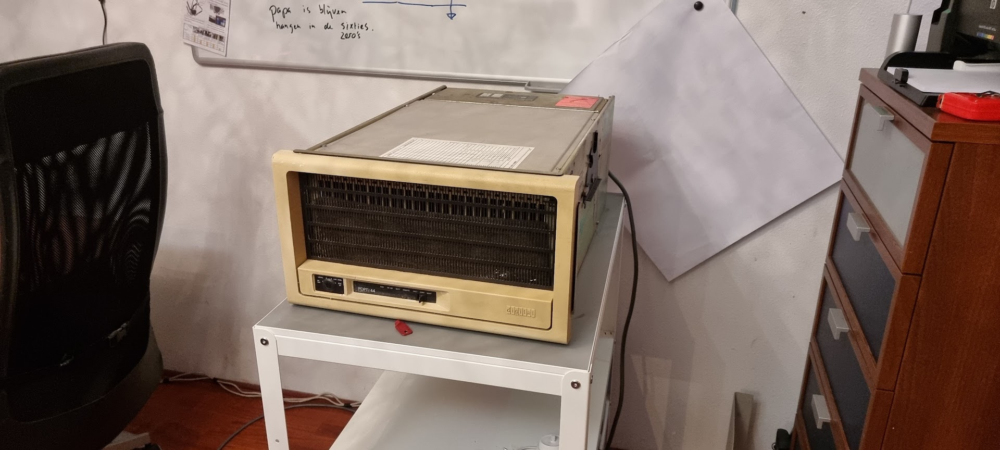
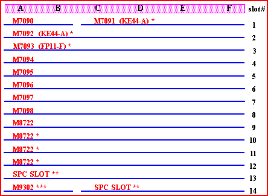

# PDP-11 Inventory

DEC card slots:

- M7090 Console interface module
- Open slot
- M7093 Floating Point (FP11-F)
- M7094 Data Path (CPU)
- M7095 Control (CPU)
- M7096 Multi-Function Module
- M7097 Cache (CPU)
- [M7098 UNIBUS Interface](m7098-unibus-interface/index.md) w/ boot? PROM “446F1” (I cannot find that number).
- [M8743 1MB Memory](m8743-ms11-p-mos-memory/index.md)
- M8743 1MB Memory

Actual placement should be (pd[p-11.nl):](http://pdp-11.nl)

I do not have the KE44-A (2 boards, the M7091 and M7092) hence the open slot.

Spare cards and parts I have.

- M7521 DELUA LSI Ethernet Adapter
-   [Info](https://gunkies.org/wiki/Digital_Ethernet_Large-scale-integration_UNIBUS_Adapter)
- M7098 KD11-Z CPU card
-   [Info](https://gunkies.org/wiki/KD11-Z_CPU)
- [M8743 MS11-P MOS memory](m8743-ms11-p-mos-memory/index.md) (1MB) (4x)
-   [Info](https://gunkies.org/wiki/MS11-P_MOS_memory)
- M7094 Data Path (part of CPU)
-   [Info](https://gunkies.org/wiki/KD11-Z_CPU)
- M7095 Control (CPU)
- M7097 Cache (CPU)
- M7096 MFM
- DD11-DK Backplane
- 3x bridge card
- 3x NPR Continuity card
- Several grant cards
- [Digital Vt320 terminal (1988)](dec-vt320-terminal/index.md)

Power supply is a H7140.
