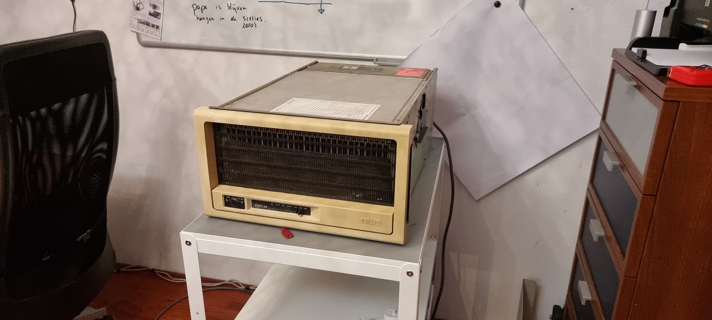
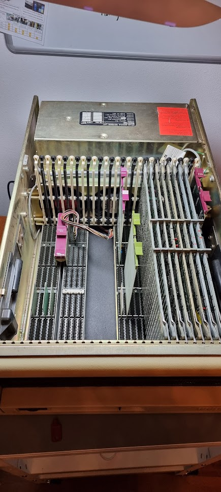
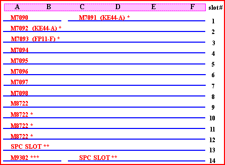

# PDP-11 Backplane layout



## Backplane layout

The backplane is a 14-row backplane specific for the 11/44. Its layout is fixed, you cannot swap cards to different positions!! The first slots in the backplane are for the optional CIS and FPU board, followed by the actual processor boards in strict order.
There are 4 Extended Unibus (EUB) slots. These are slots that are different from Unibus and Modified Unibus (MUD) slots because they have 22 address lines. These can only contain EUB memory boards.

- AB: M7090 Console interface module, CDEF: Optional CIS M7091
- Optional: CIS M7092
- Optional: [M7093 Floating Point processor](m7093-floating-point/index.md) (FP11-F)
- [M7094 Data Path (CPU)](m7094-data-path/index.md)
- [M7095 Control (CPU)](m7095-control/index.md)
- [M7096 Multi-Function Module](m7096-multifunction/index.md)
- [M7097 Cache (CPU)](m7097-cache/index.md)
- [M7098 UNIBUS Interface](m7098-unibus-interface/index.md)
- [M8743 EUB 1MB Memory](m8743-ms11-p-mos-memory/index.md)
- Optional EUB memory slot
- Optional EUB Memory slot
- Optional EUB memory slot
- Free MUD Unibus slot. This one has the NPG line cut, so it needs a G7273 NPG + BG continuation card if unoccupied!
- AB: M9302 Terminator, **D: G727A Grant Continuation REQUIRED!**

What is REALLY IMPORTANT is what is in the last two slots! The last slot must contain the M9302 terminator but **also** a G727A Grant continuation card! This is not really written anywhere, but not having that card causes one of the following errors on the console:

```
CP Hung?
? CP Didn't start
```
These are caused by the grant chain not being continued proper.



The but-last slot has the NPG wire cut so it either requires a G7273 card or some extension card that does handle NPG proper, like the Unibone.

The Power supply is a H7140. Be very careful fixing this one: it is immensely dangerous because it contains a high current high voltage (400+ V DC) rail that can be easily touched, **and which remains dangerous for days after the PSU has been disconnected due to some very large capacitors**!! Always bleed off the tension with a resistor before working on that thing!

## Card information

### M7094 Data Path module

This card contains the registers and the ALU, and the PAR and PDR memory management registers.

- [KD11-Z CP Info from Gunkies](https://gunkies.org/wiki/KD11-Z_CPU)

### M7095 Control

This card handles the decoding of instructions, and the microcode store and microcode sequencer.


### M7096 Multi-function module

This card contains a 8085 processor which handles the "console", the replacement for the "blinkenlights" of earlier machines.


### M7097 Cache

This is an 8KB fast associative cache.

### M7098 Unibus interface

This contains all logic to control the Unibus. It also contains part of the memory management logic: the Unibus Map, which maps the 18 bit Unibus addresses generated by devices into the 22 bit main memory space.

It also hosts a number of optional boot PROMs which contain the bootstrap code for different devices. My card contains a boot PROM "446F1" which I cannot find.


### M8743 1MB MS11 Memory module

The first slot must be filled, the other three slots are optional.

- [Gunkies info](https://gunkies.org/wiki/MS11-P_MOS_memory)


## Links

Actual placement should be [(pdp-11.nl)](http://pdp-11.nl):



I do not have the KE44-A (2 boards, the M7091 and M7092) hence the open slot.

Terminals:

- [Digital Vt320 terminal (1988)](dec-vt320-terminal/index.md)

