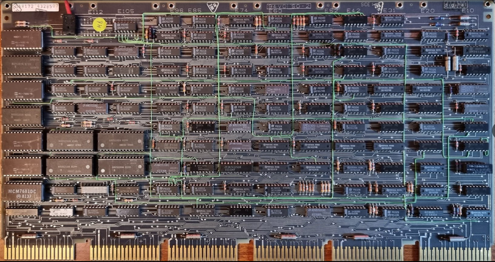

# The M7095 Control module

This contains the instruction decoder and the microcode engine. It has a lot of proms which contain both mappings for the instruction set decoder but also the microprograms to execute the instructions.

