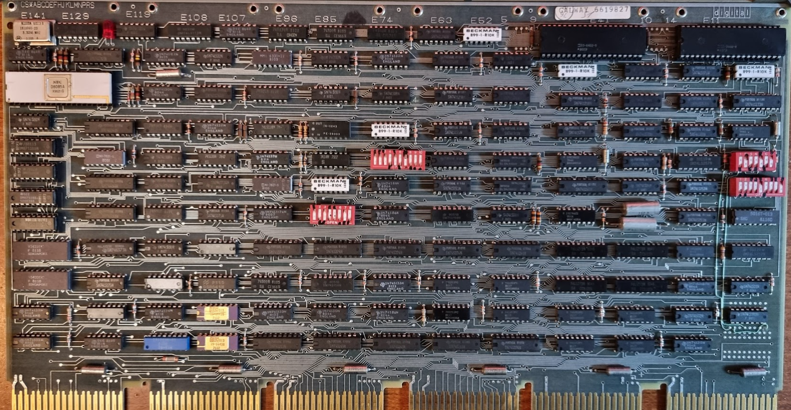

# The M7096 Multi-function module

This forms the console interface, replacing the blinkenlight consoles of yesteryear. It uses a 8085 processor (the white chip top left) which talks with a terminal through one of two UARTs (the other is the TU58 interface). The 8085 is able to control the 11/44 main processor to implement things like the Examine and Deposit commands, and it can microstep the processor.

