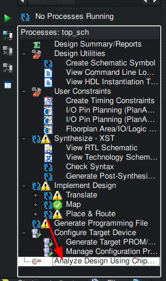
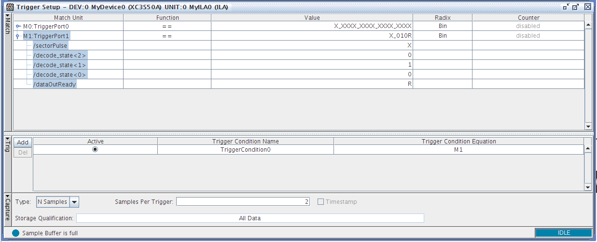
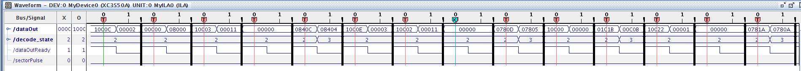
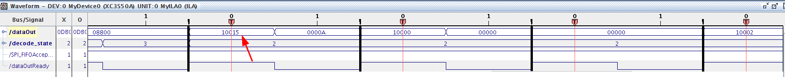
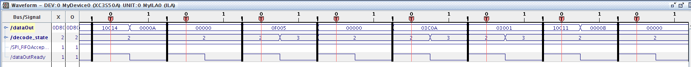

# Debugging the FPGA

To debug we need to add the integrated logic analyzer into our design. Install that by following [this tutorial](https://docs.amd.com/v/u/en-US/ug750) which describes the process quite well.

The first debug config chosen looks like this:

TODO

After installation run a debug session by selecting "top_sch" in ISE, then in the "Processes" run:



This will start ChipScope. In ChipScope we set the triggers so that we can capture header related data. I set up the triggers as follows:



We only want the decode_state = 010 which is the header decode. In that state the decodeFSM part reads 48 bits of header information as three 16 bit words, and pushes each of them to the FIFO by asserting dataOutReady. The very first word contains the disk location (sector, head, track), and this word gets identified by setting bit 16 of the FIFO to 1. We trigger on that by requesting trigger on RISING.

We collect 2 samples after every trigger. This should collect only the data when the data is actually latched, not data after. A result looks like this:



I see odd things already. The start looks OK, the first word has bit 16 set indicating it is a header word, and it has a reasonable value (sector 12d on track 0 head 0). Second word is all zeroes, as expected. But the third word (checksum) is missing as the next sample starts with bit 16 set indicating a first header word. That is wrong.

Fixing a small part of the FPGA code:
```
if(headerbitCounter == 6'b001111) begin
    wordOut <= {1'b1, currentRealBit, wordOut[15:1]};		// jal shift in the new bit at the left, and also set the SPI_HEADER bit
end else begin
    wordOut <= {1'b0, currentRealBit, wordOut[15:1]};		// Shift in bit,
end
```

and measuring again shows the same problem: intermediary words are missing from the trace. Most of the correct traces seem to be OK though: as soon as there are three words then the checksum corresponds to the data read.

Looking for sector 21 in the data shows this:



It is found, but it is one of the cases where no other words follow.

Something else that really does not seem correct:



This starts with a proper header word (with bit16=1) followed by a zero word and a checksum word (f005) which is correct. But after that we see three other words without the 1st one having the 16th bit set, and the two last words seem to be checksums as we also see the decode_state changing from 2 to 3. That should not be possible!?
