# Using the RL02 as an USB drive

!WARNING Incomplete, in progress.

There is a project on the Internet where someone created a board which allows the RL02 to be used as an USB drive. The project is quite old (10 years in 2025) and not well described; there is just a Github repo without instructions. I got a board for this project from Ed, and am trying to get the code on that board - and the result to work. This document is the log of things done so far..

## The project

The project [can be found here](https://github.com/ChrisPVille/RL02/).

The repo contains the KiCAD board design, the gerbers and everything else to get the board constructed. The board consists of:

* A microcontroller [(a Texas Instruments Tiva TM4C1232D5PM)](https://www.ti.com/product/TM4C1232C3PM)
* A Xilinx FPGA [(a XC3S50A-4VQ100)](https://www.xilinxsemi.com/?search=XC3S50A-4VQG100I). 

The FPGA does all of the heavy work; the uC is used to implement the USB mass storage part only.

## Building and installing the uC code

### Installing the TI software

To build the code you need to install TI's Code Composer Studio. This helpfully exists in two completely incompatible versions: an older version based on Eclipse, and a newer one based on VS Code. The latter does not seem to be very complete and it did not recognize the project at all, so I used the Eclipse version (I used 12.8.1.00005).

DO NOT USE 2.x, it will not work as the Tiva family appears to be unsupported there.

Before we can install the software we need to install some dependencies.

#### Installing python2.7

```
sudo apt update
wget http://security.ubuntu.com/ubuntu/pool/universe/p/python2.7/python2.7_2.7.18-13ubuntu1.5_amd64.deb http://security.ubuntu.com/ubuntu/pool/universe/p/python2.7/libpython2.7-stdlib_2.7.18-13ubuntu1.5_amd64.deb http://security.ubuntu.com/ubuntu/pool/universe/p/python2.7/python2.7-minimal_2.7.18-13ubuntu1.5_amd64.deb http://security.ubuntu.com/ubuntu/pool/universe/p/python2.7/libpython2.7-minimal_2.7.18-13ubuntu1.5_amd64.deb http://security.ubuntu.com/ubuntu/pool/universe/p/python2.7/libpython2.7_2.7.18-13ubuntu1.5_amd64.deb

sudo apt install ./libpython2.7-minimal_2.7.18-13ubuntu1.5_amd64.deb ./libpython2.7-stdlib_2.7.18-13ubuntu1.5_amd64.deb ./python2.7-minimal_2.7.18-13ubuntu1.5_amd64.deb ./python2.7_2.7.18-13ubuntu1.5_amd64.deb
```

#### Fixing missing libtinfo.so.5

Do the following:
```
sudo ln -s /usr/lib/x86_64-linux-gnu/libtinfo.so /usr/lib/x86_64-linux-gnu/libtinfo.so.5
```

#### libusb-0.1.so.4

```
sudo apt-get install libusb-0.1-4
```

#### libgconf-2

```
wget http://kr.archive.ubuntu.com/ubuntu/pool/universe/g/gconf/libgconf-2-4_3.2.6-6ubuntu1_amd64.deb
wget http://kr.archive.ubuntu.com/ubuntu/pool/universe/g/gconf/gconf2-common_3.2.6-6ubuntu1_all.deb
apt install ./libgconf-2-4_3.2.6-6ubuntu1_amd64.deb ./gconf2-common_3.2.6-6ubuntu1_all.deb
```

#### Installing Code Studio, finally

Untar the tar in a temp dir, cd into the directory and execute the .run file to install. It should say that all dependencies are OK. If not, fix them!
When asked what to install I installed all packages.

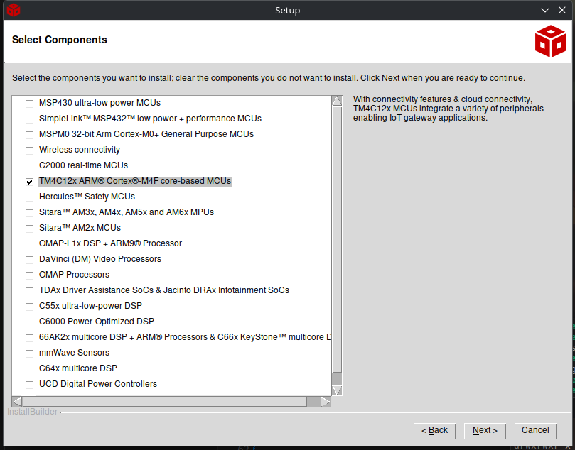

Install all debug probes

I got this error:

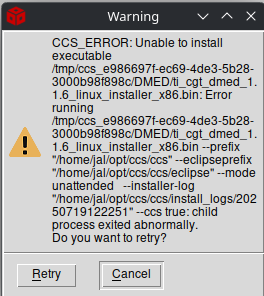

This does not want to get fixed. Leave the error on the screen and open a console, then do this:

* Go to the /tmp folder and find a folder name starting with ccs_ and some hex numbers.
* In that folder is a folder called DMED. Go there.
* The failing installation is ti_cgt_dmed_1.1.6_linux_installer_x86.bin. Move that file to a new name (install.bin), then create a NEW file ti_cgt_dmed_1.1.6_linux_installer_x86.bin with the content:

```
#!/bin/sh
exit 0
```
and make it executable

After that go back to the installer and retry. It should now finish successfully.

After that run the driver installer as told by the installer:

```
sudo ~/opt/ccs/ccs/install_scripts/install_drivers.sh
```

#### After installation...

After installation the IDE might fail to start with an executable stack error:
```
libMiniDump.so: cannot enable executable stack as shared object requires
```
This can be fixed by installing execstack (apt install execstack) followed by:
```
execstack -c /home/jal/opt/ccs1281/ccs/eclipse/../ccs_base/common/bin/libMiniDump.so
```

After this you should be able to start ccstudio, and open the uC project. It will not yet build though because we should be:

#### Installing the required SDKs

Download the USB Driver library and the peripheral driver libraries described in the project from the TI website. This should result in two files:

* SW-TM4C-DRL-2.2.0.295-peripheral-drivers.exe
* SW-TM4C-USBL-2.2.0.295-USB-drivers.exe

These are executables that we cannot use under Linux, but they can be unpacked using "Ark". Extract these into the directory where you installed ccs, for instance ~/opt/ccs. The directories can then be renamed to driverlib and usb to get rid of the terrible names.

After that start ccstudio, open the project, go to the RL02 controller project, use the right mouse and select Properties and change the include paths:

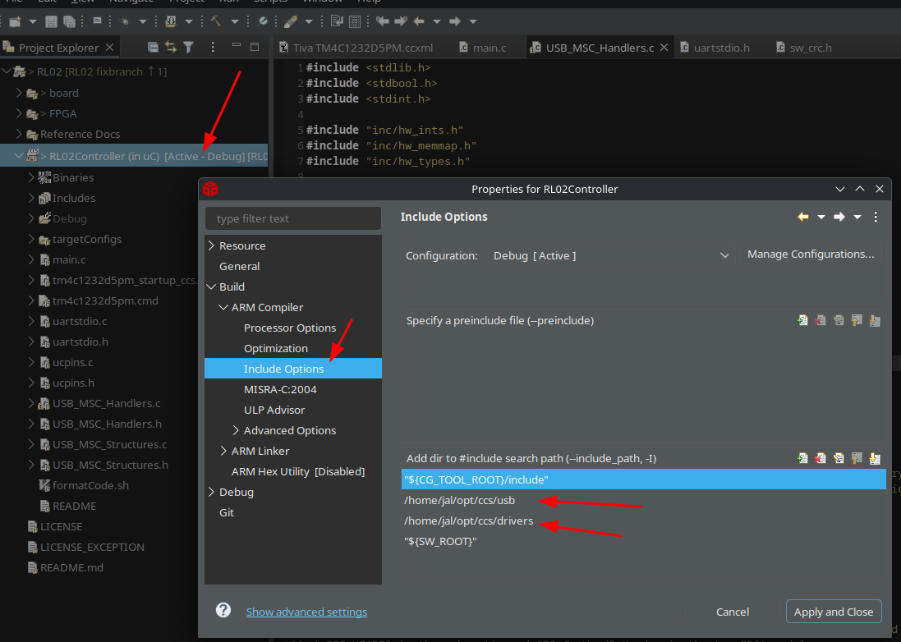

After that add the paths also to the linker settings:

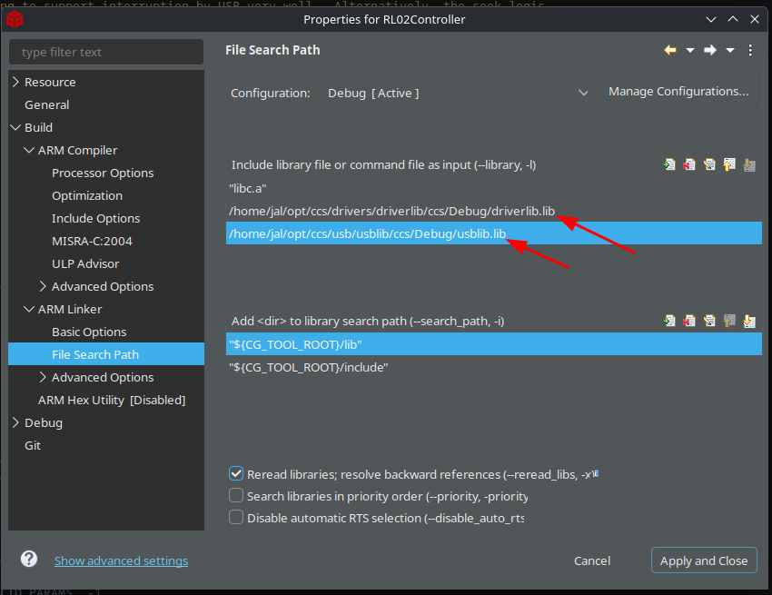


### Building the code

Before you build the code we need to add missing configuration to the build, because the build as it is outputs a "RL02Controller.out" file which is an ELF file, but we need a flashable .bin file.

To add this to the build do the following:

* Open the RL02Controller project properties
* Select the "Build" tab at the left
* Select the "Steps" tab in the tab panel
* Enter the following in the Post-Build steps:

```
${CCE_INSTALL_ROOT}/utils/tiobj2bin/tiobj2bin ${BuildArtifactFileName} ${BuildArtifactFileBaseName}.bin ${CG_TOOL_ROOT}/bin/armofd ${CG_TOOL_ROOT}/bin/armhex ${CCE_INSTALL_ROOT}/utils/tiobj2bin/mkhex4bin
```
(That is all one line; you will need to surround the paths with quotes if you are infected with Windows).

Once set do a "Rebuild all", which will take forever (about 8 minutes on my 48CPU Threadripper), and that should result in a RL02Controller.bin file in the Debug directory.

### Flashing the uC

To flash the uC you need a tool that will let you. I used the Blackhawk xds100v2 tool. This needs to be connected to the board as follows:

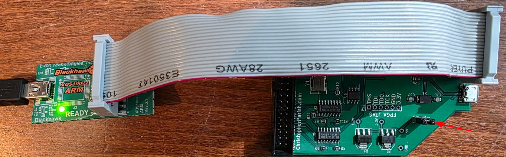

To program you need to power both the flasher and the board. To power the board make sure to place a strap on jp1, otherwise the 5V USB power will not reach the board, see the arrow in the above picture.

[Download the flash tool (Uniflash) from here](https://www.ti.com/tool/UNIFLASH) and install it.

Run the Uniflash tool, select the correct controller and device (TM4C1232C3PM):

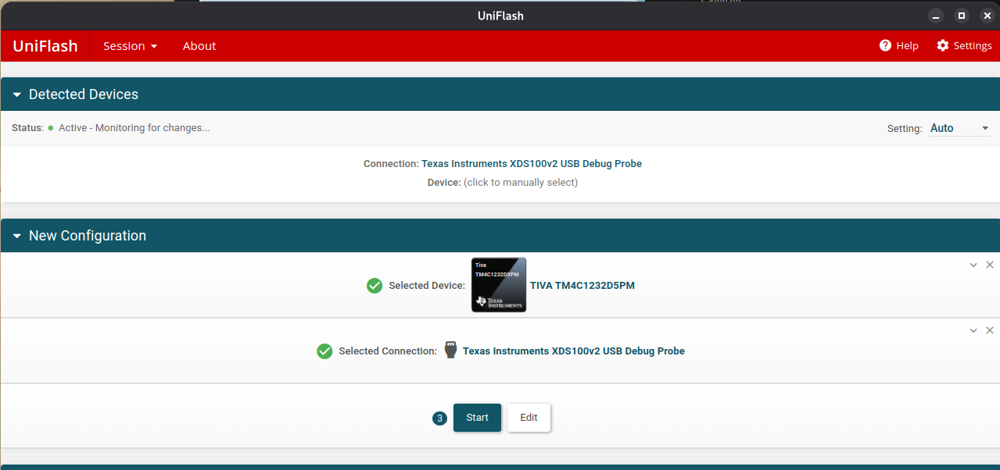

After that press "Next", then select the compiled file:

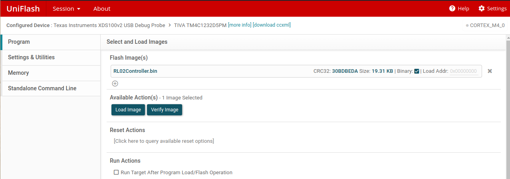

Make sure the board has its own USB connection powered too otherwise you will get a "powerloss" warning when programming.
Now press the "Load Image" button, and if successful press the "Verify image" button.

Round 1: the tool said flashing was successful; the verify worked too, but after flashing I did not have USB response when connecting the board. I would have expected it to register the mass storage device..

## Installing the FPGA code

The FPGA used is a Spartan 3a level FPGA from Xilinx. This company has been bought by AMD.

### Finding and installing the required software on Ubuntu 25.04

The Spartan 3a FPGA's are not supported by Vivado, the modern IDE from Xilinx. Instead we will need a tool called ISE, which is quite old software. The last version is 14.7, from 2015. Google for it and download the .tar.gz file, after that untar the archive and run the setup using "sudo ./xsetup".

You might have a failure because it cannot find libncurses.so.5. If so then do the following:
```
$ cd /usr/lib/x86_64-linux-gnu
$ sudo ln -s libncurses.so.6 libncurses.so.5
```
After that the installer should work. Install the full edition including cable drivers. The cable driver install will fail, but ignore that.

After installing you will need to get a license. The license manager that is supposed to start does not, so [go here to get one](https://account.amd.com/en/forms/license/license-form.html). You will need to apply for the free "WebPack" license. This will email you a license file. Place this license file in "/opt/Xilinx/14.7/ISE_DS/ISE/coregen/core_licenses".

After that do the following to start ISE:

```bash
cd /opt/Xilinx/14.7/ISE_DS
. settings64.sh
cd ISE/bin/lin64
./ise
```

### Problem since 2025-07-19

Since this date ISE dies with a segmentation fault. Reinstalling does it help, it does the same. There is this [page that describes possible fixes](https://gist.github.com/aliemo/ce58ea570ee6ffa6dedfa569f87f1c1e). I did the following which at least cancelled the segmentation fault (copied from the above page):

#### Dynamic library fix (libstdc++.so)

The ISE tools supply an outdated version of the libstdc++.so library, which may cause segfaults when using the Xilinx Microprocessor Debugger and prevents the usage of the oxygen-gtk theme. This outdated version is located in two directories within the installation tree: <installation-path>/ISE_DS/ISE/lib/lin64/ and <installation-path>/ISE_DS/common/lib/lin64

To use newer version of libstdc++, rename or delete the original files and replace them with symlinks:

```
cd <installation-path->ISE_DS/ISE/lib/lin64/
mv libstdc++.so libstdc++.so.orig
mv libstdc++.so.6 libstdc++.so.6.orig
mv libstdc++.so.6.0.8 libstdc++.so.6.0.8.orig
ln -s /usr/lib/libstdc++.so
ln -s libstdc++.so libstdc++.so.6
ln -s libstdc++.so libstdc++.so.6.0.8
```

Repeat this process in the <installation-path>/ISE_DS/common/lib/lin64

This did not stop the SEGFAULT.

#### Remove the NOTO fonts and playing with qtconfig

The next tip was to remove the NOTO fonts. I did:

```
sudo apt remove fonts-noto-cjk fonts-noto-color-emoji fonts-noto-core fonts-noto-hinted fonts-noto-mono fonts-noto-ui-core fonts-noto-unhinted python3-monotonic
```
I also edited the file ~/.config/Trolltech.conf and removed the reference to the Noto font. You can then try to start the qtconfig program (in the same shell where you tried to start ise) and change the font there to Ubuntu Sans.

This made the IDE work again.


### Opening the FPGA code in ISE

Start ISE, then select "Open Project" and select the project file in the FPGA directory. This should open the project without too much trouble. After that do the build steps by selecting the top module, then with the right mouse button select "run":

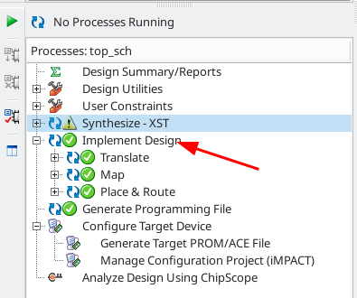

The next step is to generate the programming file using the same right mouse -> run step, followed by "Configure target device". This should open a tool called "iMPACT", which should be able to program the FPGA.

### Configuring iMPACT

Use "Open Project", and load the impact file from the FPGA directory. This should show the basic configuration:

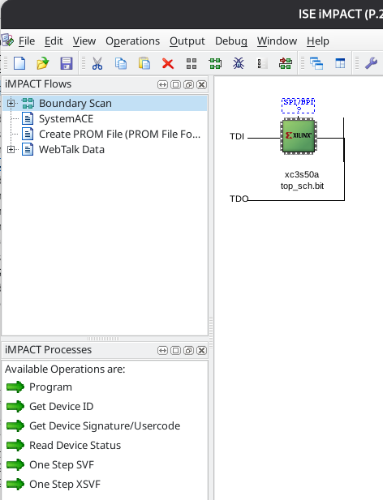

Next step is to try "program". That failed on my machine because the Xilinx USB Platform cable was not recognized. To make this work (Ubuntu Linux 25.04) do the following.

Disconnect the platform cable, then:
```
$ sudo apt install libusb-dev fxload
$ cd /opt/Xilinx/
$ sudo git clone git://git.zerfleddert.de/usb-driver
$ cd usb-driver/
$ sudo make
$ ./setup_pcusb /opt/Xilinx/14.7/ISE_DS/ISE
$ sudo udevadm control --reload-rules
```
(Shamelessly stolen from https://askubuntu.com/questions/838260/install-xilinx-platform-usb-in-ubuntu-16-04-x64/1128841#1128841, with thanks!)

After this, reconnect the platform cable and try again; the thing should now be recognized.

This should now make the cable work.

### Programming the FPGA's FLASH

Programming the FPGA only does that once; as soon as power disappears the FPGA is empty again. This is why we have the M25P10 flash aboard. It can be programmed with the bitstream for the FPGA, and at reset the FPGA will read the bitstream from that flash.
The flash chip is only connected to the FPGA, so to program it we need to use a trick: we need to send something to the FPGA that will let _it_ program the flash. This can be done fully automagically by iMPACT, [The process is very well described here](https://docs.amd.com/r/en-US/xapp586-spi-flash/Programming-the-SPI-Flash-In-System).

Use PROGRAM on the FLASH chip in the image, and make sure to also VERIFY.

### What is in the FPGA?

The FPGA has a state machine which reads header and data bytes as they pass under the heads of the drive. Whenever a word (16 bits) is read it is put in a FIFO queue in the FPGA. This FIFO queue consists of 514 (512) entries of a 17-bit word. Bit 0..15 is the actual data, bit 16 is an indicator that the word is the first word of a header, called SPI_HEADER in the schematic and SPI_CurWordIsHeader in the top FPGA module.

Subsequent header words will not have that bit set!

The FPGA exposes the following things on GPIO port A:
 * pin6: the SPI_HEADER bit as read from the FIFO.
 * pin7: the data ready indicator from the SPI code.

The uC code checks the header bit when it needs to know the current sector. It waits for the word with that bit set and uses it to read the 3 words of the header. From that it can then decode the current sector number.


## Initial test of the device

After flashing I connected the pcb to the RL02 by opening up the RL02, removing the flat cable from the two connectors at the back and inserting that flat cable into the PCB:

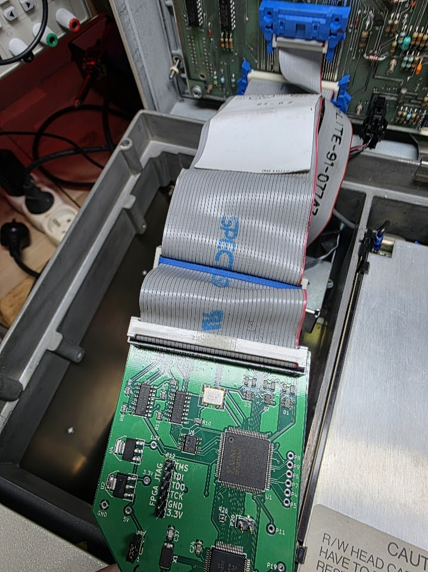

Connecting the USB cable to the PC initially does nothing. This is as expected because the code inside the uC first waits for the FPGA to signal that it has found the drive AND that it has a drive ready signal. Only then will the uC register the USB mass storage device. Switching on the drive does show that:

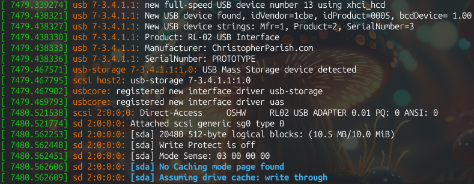

Sadly enough no I/O could be done to the device. I tried an fdisk but that hung, so something is wrong.

### Extending the code with debug info

Using the [TivaWare Peripheral Driver Library](https://www.ti.com/lit/ug/spmu298e/spmu298e.pdf?ts=1751638667554&ref_url=https%253A%252F%252Fwww.ti.com%252Ftool%252FEK-TM4C123GXL) document I added code to configure the serial UART connected to P20 on the PCB (PA0/U0Rx, PA1/U0Tx).

I downloaded the files "uartstdio.h" and "uartstdio.c" by searching for them on Google, and copied them into the uC project. I then added the following lines to initialize the UART in main.c, just after the SPI interface initialization:

```
    // Set up the UART for debugging
    SysCtlPeripheralEnable(SYSCTL_PERIPH_GPIOA);
    SysCtlPeripheralEnable(SYSCTL_PERIPH_UART0);
    GPIOPinConfigure(GPIO_PA0_U0RX);
    GPIOPinConfigure(GPIO_PA1_U0TX);
    GPIOPinTypeUART(GPIO_PORTA_BASE, GPIO_PIN_0 | GPIO_PIN_1);

    UARTClockSourceSet(UART0_BASE, UART_CLOCK_PIOSC);
    UARTStdioConfig(0, 38400, 16000000);

    UARTprintf("Initialized\n");
```
This nicely outputs "Initialized" to the UART, which can be seen by attaching an TTY-to-USB serial adapter on P20 pin 1 (the pin more to the "inner" side of the board):

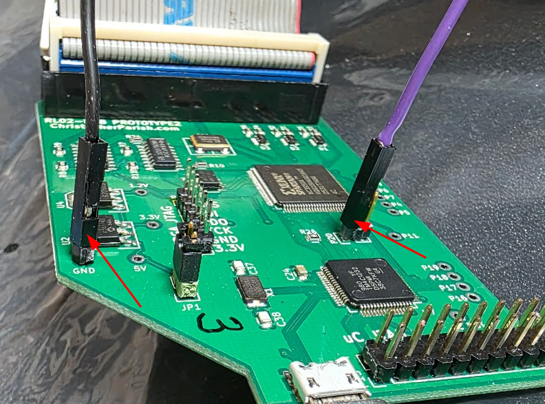

With that we can insert a lot more debugging info into the code, hopefully enough to get an idea about the issue.

### Adding debugging inside the usb handlers

I added debugging info into the USB handlers. These have a few places where unexpected things happen, and the code then enters an infinite loop, which might be what we see. I added code at the entry of main methods and code for all errors that I see there. This produces the following when switching on the drive:

```
Initialized
MassStorage registered
read: sector 0 count 1
read: sector 0 count 1
read: sector 0 count 1
read: sector 1 count 1
read: sector 2 count 1
read: sector 3 count 1
read: sector 4 count 1
read: sector 5 count 1
read: sector 6 count 1
read: sector 7 count 1
read: sector 8 count 1
read: sector 9 count 1
read: sector 10 count 1
```
These sector and count numbers are in usb units of 512 bytes; the RL02 reads in sectors of 256 bytes so internally in the code these numbers double.

After that last read I tried to fdisk the drive but this hung again without any messages. Let's also add info on whether it exits read. This shows that the read for sector 10 does not finish:

```
read: sector 8 count 1
read: exit ok
read: sector 9 count 1
read: at track
read: exit ok
read: sector 10 count 1
```
and there it hangs.

### First round of discovery results

I added a lot of extra debugging to see which sectors are being found and read, and this showed the following:

* The hang is caused by the code not finding a sector it needs on the drive. It loops infinitely trying to find it. In the case of that usb sector 10 it is RL02 sector 21 that cannot be found. This could of course be a problem on the disk pack I used (even though that pack did finish the RL02 XXDP tests), but changing the pack reported the error at the exact same track.

I wrote something that can quickly show the sectors that ARE found. For the 1st platter this shows (after letting the drive run for 15 minutes):

```
000000000011111111112222222222333333333344444444445
012345678901234567890123456789012345678901234567890
********************* **************            ***

Total sectors encountered: 2999
Number of sectors >= 40: 123
Missing are: 21, 36, 37, 38, 39

```
It gets worse when I add 40 to the USB sector number (in the code) so that it tries to read track 2. That does not finish at all because of CRC errors, and the cyl/head/sector from those errors show lots of issues:
```
seek: crc fail, 124/1/3,7679 f00/b1f5
seek: crc fail, 0/0/48,0 c005/f
seek: crc fail, 0/0/20,0 407/f005
seek: crc fail, 0/0/1,0 fc00/fc01
seek: crc fail, 0/0/3,0 3801/4400
seek: crc fail, 6/0/24,0 43/a0f6
seek: crc fail, 0/1/31,0 7cc/1412
seek: crc fail, 1/0/2,0 381f/7828
seek: crc fail, 511/1/63,65535 3f7/9401
```
I.e. we have bad track numbers in the header word all over the place, and impossible sector numbers too. Btw: Both of the above tests were repeated with two different platters with the same results!

Either my drive is bad, or the FPGA is doing something wrong.

TO BE CONTINUED.


## RL01/RL02 details

| What            | RL02 | RL01 |
| ----            | ---- | ---- |
| Capacity        | 10MB | 5MB  |
| Cylinders       | 512  | 256  | 
| Sectors/track   | 40   | 40   |
| Heads           | 2    | 2    |
| Bytes/sector    | 256  | 256  |
| Rotation speed  | 2400rpm     |

## Links to documentation used

* [Getting a flashable output file](https://kitflix.com/getting-started-with-tiva-launchpad-tm4c123/)
* [Errors during the conversion to .bin](https://software-dl.ti.com/ccs/esd/documents/sdto_cgt_tiobj2bin_failed.html)
* [Getting the USB Platform cable to be recognized](https://askubuntu.com/questions/838260/install-xilinx-platform-usb-in-ubuntu-16-04-x64/1128841#1128841)


