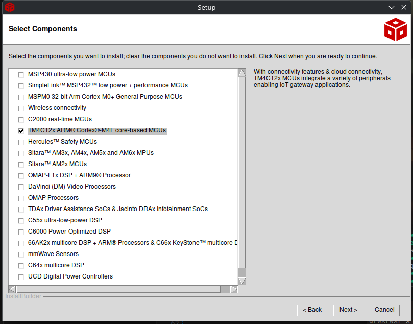
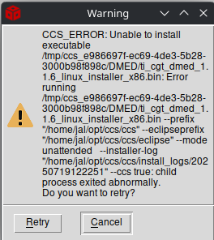

# Install TI Code Composer Studio

To build the code you need to install TI's Code Composer Studio. This helpfully exists in two completely incompatible versions: an older version based on Eclipse, and a newer one based on VS Code. The latter does not seem to be very complete and it did not recognize the project at all, so I used the Eclipse version (I used 12.8.1.00005).

DO NOT USE 2.x, it will not work as the Tiva family appears to be unsupported there.

Before we can install the software we need to install some dependencies.

## Installing python2.7

```
sudo apt update
wget http://security.ubuntu.com/ubuntu/pool/universe/p/python2.7/python2.7_2.7.18-13ubuntu1.5_amd64.deb http://security.ubuntu.com/ubuntu/pool/universe/p/python2.7/libpython2.7-stdlib_2.7.18-13ubuntu1.5_amd64.deb http://security.ubuntu.com/ubuntu/pool/universe/p/python2.7/python2.7-minimal_2.7.18-13ubuntu1.5_amd64.deb http://security.ubuntu.com/ubuntu/pool/universe/p/python2.7/libpython2.7-minimal_2.7.18-13ubuntu1.5_amd64.deb http://security.ubuntu.com/ubuntu/pool/universe/p/python2.7/libpython2.7_2.7.18-13ubuntu1.5_amd64.deb

sudo apt install ./libpython2.7-minimal_2.7.18-13ubuntu1.5_amd64.deb ./libpython2.7-stdlib_2.7.18-13ubuntu1.5_amd64.deb ./python2.7-minimal_2.7.18-13ubuntu1.5_amd64.deb ./python2.7_2.7.18-13ubuntu1.5_amd64.deb
```

## Fixing missing libtinfo.so.5

Do the following:
```
sudo ln -s /usr/lib/x86_64-linux-gnu/libtinfo.so /usr/lib/x86_64-linux-gnu/libtinfo.so.5
```

## libusb-0.1.so.4

```
sudo apt-get install libusb-0.1-4
```

## libgconf-2

```
wget http://kr.archive.ubuntu.com/ubuntu/pool/universe/g/gconf/libgconf-2-4_3.2.6-6ubuntu1_amd64.deb
wget http://kr.archive.ubuntu.com/ubuntu/pool/universe/g/gconf/gconf2-common_3.2.6-6ubuntu1_all.deb
apt install ./libgconf-2-4_3.2.6-6ubuntu1_amd64.deb ./gconf2-common_3.2.6-6ubuntu1_all.deb
```

## Installing Code Studio, finally

Untar the tar in a temp dir, cd into the directory and execute the .run file to install. It should say that all dependencies are OK. If not, fix them!
When asked what to install I installed all packages.



Install all debug probes

I got this error:



This does not want to get fixed. Leave the error on the screen and open a console, then do this:

* Go to the /tmp folder and find a folder name starting with ccs_ and some hex numbers.
* In that folder is a folder called DMED. Go there.
* The failing installation is ti_cgt_dmed_1.1.6_linux_installer_x86.bin. Move that file to a new name (install.bin), then create a NEW file ti_cgt_dmed_1.1.6_linux_installer_x86.bin with the content:

```
#!/bin/sh
exit 0
```
and make it executable

After that go back to the installer and retry. It should now finish successfully.

After that run the driver installer as told by the installer:

```
sudo ~/opt/ccs/ccs/install_scripts/install_drivers.sh
```

## After installation...

After installation the IDE might fail to start with an executable stack error:
```
libMiniDump.so: cannot enable executable stack as shared object requires
```
This can be fixed by installing execstack (apt install execstack) followed by:
```
execstack -c /home/jal/opt/ccs1281/ccs/eclipse/../ccs_base/common/bin/libMiniDump.so
```

After this you should be able to start ccstudio, and open the uC project. It will not yet build though because we should be:
