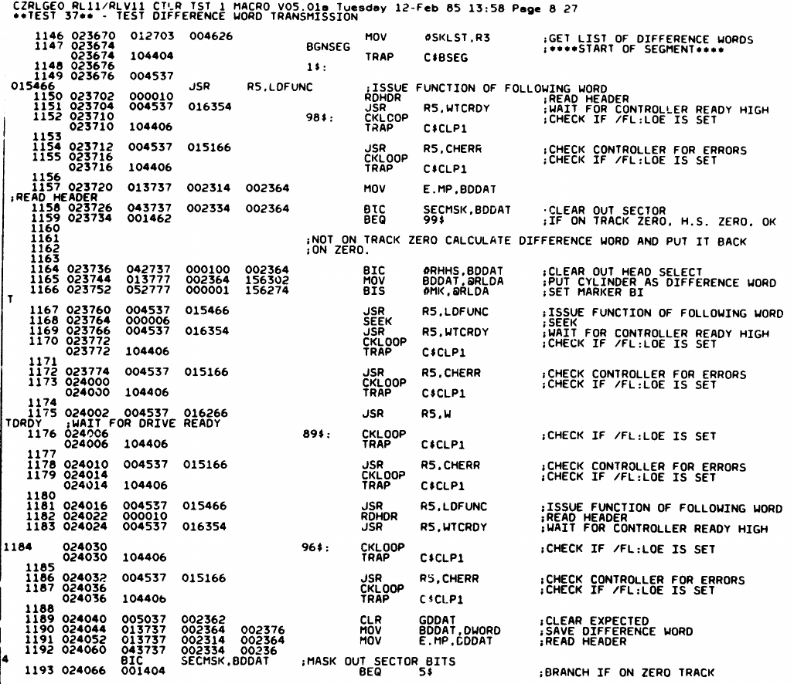
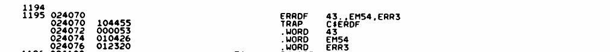

# Controller 1 - second round

The ZRLG test started failing on this controller:

```
CZRLG DVC FTL ERR  00044 ON UNIT 00 TST 037 SUB 000 PC: 024232
BAD SEEK-TEST OF DIFFENCE WORD
CONTROLLER: 174400  DRIVE: 0
BEFORE COMMAND: CS: 000211 BA: 002416 DA: 000405 MP: 050003
TIME OF ERROR:  CS: 000211 BA: 002416 DA: 000405 MP: 000001?
LAST: 000000 PRES: 000000 EXP'D: 000400
```

I moved the head beyond track 0 and retried; this failed with:

```
CZRLG DVC FTL ERR  00043 ON UNIT 00 TST 037 SUB 000 PC: 024070
BAD SEEK-TEST OF DIFFENCE WORD
CONTROLLER: 174400  DRIVE: 0
BEFORE COMMAND: CS: 000211 BA: 002416 DA: 056201 MP: 157355
TIME OF ERROR:  CS: 000211 BA: 002416 DA: 056201 MP: 001445?
LAST: 000000 PRES: 001400 EXP'D: 000000
```

I had the same type of failure on the 2nd controller. There might be an issue with the drive?

The second error, where the head is not on track#0, is informative. It comes from this piece of code:




It starts by reading the header word and then checks that it is on cylinder 0. In this case it isn't as I manually moved the head.
After that it uses the cylinder read from the header and puts that as the "difference" to move for the seek command, then it issues the seek. This should move the head back to cylinder 0. To test that it reads again the drive status and checks the cylinder.

This is the check that then fails; the head is not found to be at cyl 0 but at (1400 oct shr 7) = 6. I kept my hand on the head assembly as the test ran, and at the end the head DOES move very slightly a few times. So the head logic is controlling the head and its position, but either the correct track is never reached or the logic that reads the header does not work..

I checked the second controller too. It report exactly the same errors:

```
CZRLG DVC FTL ERR  00044 ON UNIT 00 TST 037 SUB 000 PC: 024232
BAD SEEK-TEST OF DIFFENCE WORD
CONTROLLER: 174400  DRIVE: 0
BEFORE COMMAND: CS: 000211 BA: 002416 DA: 000405 MP: 042000
TIME OF ERROR:  CS: 000211 BA: 002416 DA: 000405 MP: 000037?
LAST: 000000 PRES: 000000 EXP'D: 000400

CZRLG DVC FTL ERR  00044 ON UNIT 00 TST 037 SUB 000 PC: 024232
BAD SEEK-TEST OF DIFFENCE WORD
CONTROLLER: 174400  DRIVE: 0
BEFORE COMMAND: CS: 000211 BA: 002416 DA: 000405 MP: 146000
TIME OF ERROR:  CS: 000211 BA: 002416 DA: 000405 MP: 000000?
LAST: 000000 PRES: 000000 EXP'D: 000400
```

This does seem to indicate an issue with the drive itself..
We also know that manually moving the head and then starting the test fails at the very start. The head does seem to move back to track 0, very clearly when you move it all the way spindlewards. It then still fails the test. Running the test a second time however does not fail the initial track 0 test; it fails the next one..

