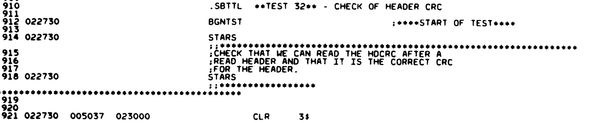
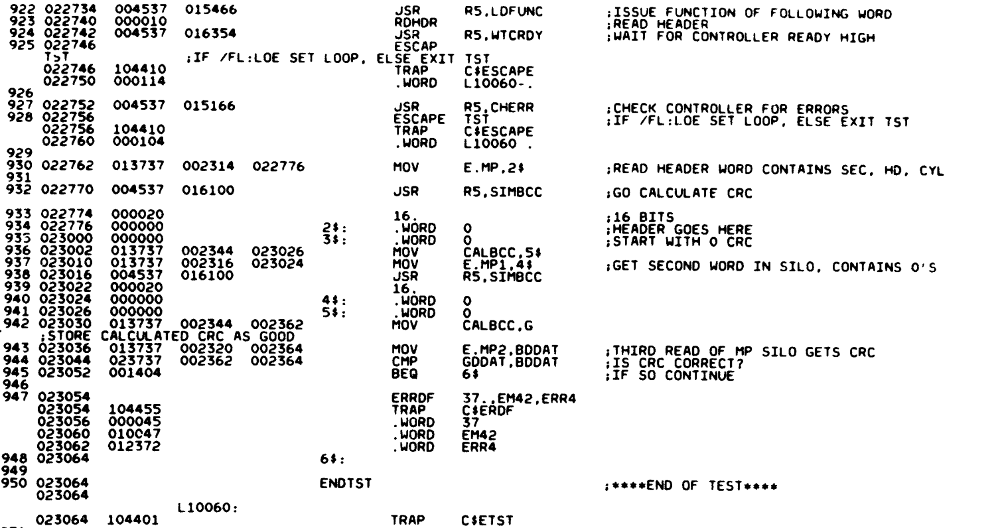
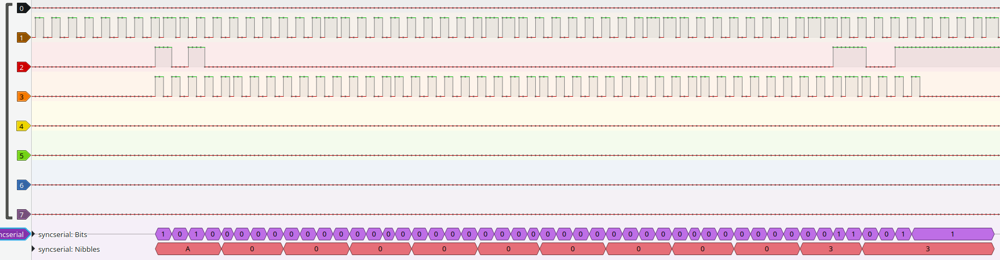

# RL11 controller #2 - initial tests

Connecting the drive to this controller makes the drive not become ready. testing the clock signal at the drive showed that it did not arrive there. There was just a small error in the band cable, so that was fixed. After that let's run ZRLG. This fails with:

```
CZRLG DVC FTL ERR  00037 ON UNIT 00 TST 032 SUB 000 PC: 023054
BAD HEADER CRC ON READ HEADER
CONTROLLER: 174400  DRIVE: 0
BEFORE COMMAND: CS: 000211 BA: 002416 DA: 000001 MP: 004012
TIME OF ERROR:  CS: 000211 BA: 002416 DA: 000001 MP: 000007?
EXP'D: 072001 REC'D: 002001

ERR HLT
```
The fiche for the test is:




The test executes a READ HEADER command. It then reads the 1st two words from the MP register (the cylinder/track count in the first word and the second word is all zeroes). It calculates a checksum from these two words (in code) and the reads the 3rd word and compares it with the checksum. These should be equal but clearly are not.

This is hard to debug from just the LA trace, so I made a protocol decoder for Sigrok: [syncserial](../../../tools/saleae-decoders/index.md). This decoder decodes the data from the serial data stream so that we can more easily understand what we see. One such trace looks like this:



We can see that the first word (sector/track) is 0xA000, the second word is all zeroes (which is according to spec) and the third word, the CRC, is 0x0033. This should translate to sector 320, head 0, sector 0.


