# rl02: checking the controller's cmd signal

Time to take out the scope and logic analyzer. First check the drive inputs, which will be SYSCLK and DRIVE COMMAND (on the RL02):

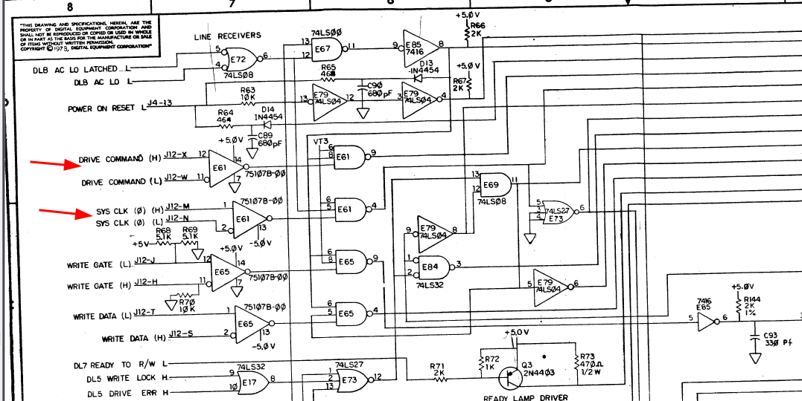

Putting the oscilloscope on pins 1, 2 and 4 of E61 shows no clock signal. I checked the RV11 and the cable and clock DID come out (check the HH and JJ pins on the connector, use the translation to IDC numbering [which you can find here](../../decalphabet/index.md)). I cleaned the connectors on the drive side, after that clock did appear - but still the same error.

Next round is the logic analyzer. I added a Saleae thingy to both pin4 (SYSCLK) and pin9 (CMD) of E61 and got a nice clock- but no activity at all on the CMD line..

## Check some more basics

As we are with the LA let's check the sector pulses and drive ready.

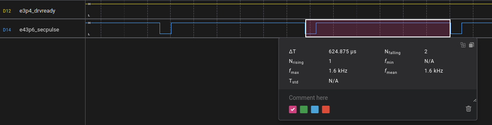

The sector pulse seems ok, manual says 625us +/- 6us.

## Checking the rv11 for cmd data

Next round is to check the same on the RV11. The failing test is trying to send an incorrect GET STATUS command to the drive. This uses function code 2, and there is a good summary of how this works in the rv11 technical guide:

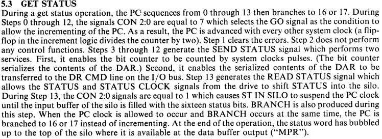

We also need the schematics there:

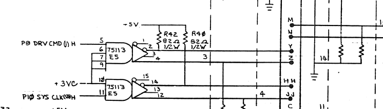

Clock and CMD are both leaving from E5. Putting the LA there shows the same symptom: no CMD data.

Next round: logic analyzer, connected as follows:

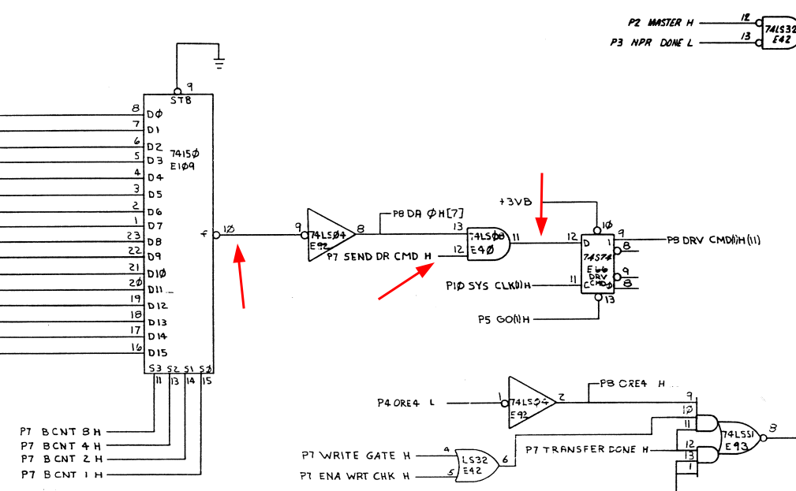

* sysclk from E5 pin 11
* cmd from E5 pin 5
* cmdsrc from E109 pin 10 (the 74150 shift register)
* p13 on E40 (cmd in from inverted 74150)
* p12 on E40 (P7 send dr cmd H)

which shows:

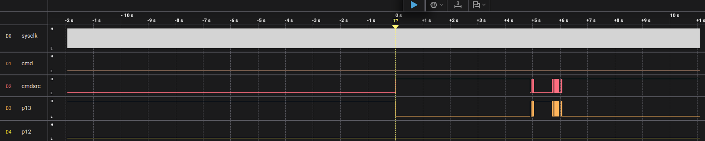

While the 74150 sends output p12 stays low, and that causes the output of E40 to remain low too, and hence no data is sent. The signal p7 send dr cmd H comes from an xor gate (p6, E83). Adding pins 4 and 5 to the LA shows that both input stay low too. Both of these come from a set of PROMs:

* p4 = p6 send status H (E114 pin 15)
* p5 = p7 ena diff clk H (E112 pin 8)

Checking whether we see a function code on E114 is next (pins 2,4,5,6). For this we also need the clock for its addresses, which comes from E104, a 74161 counter, pin 2.

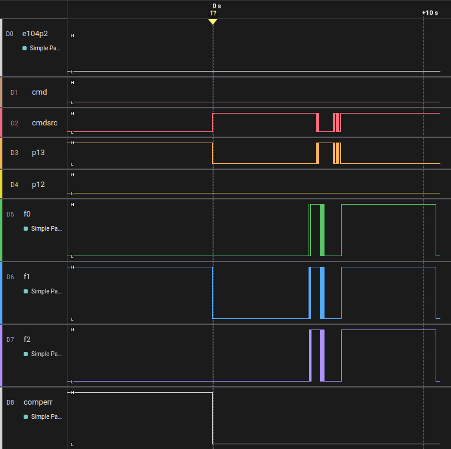

This shows something odd imo: no clock on E104p2, the counter. This comes from a set of flipflops ultimately controlled by E102, a 74151 8-to-1 multiplexer. This has a number of inputs; the input that should control the "PC" (the 74161) gets selected by that thing. Next step: do we get pulses from it? I add LA connections to E102 pin6 (the output) and to pins 9..11, the input selector inputs. This produces:

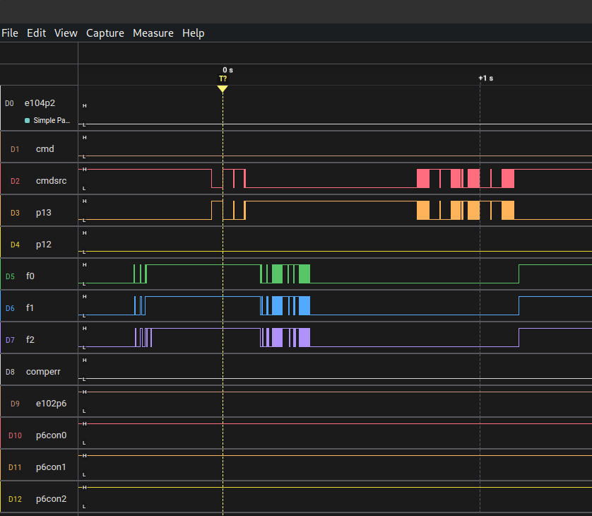

which shows that the input selected seems to be #7 (which is correct according to the tech explanation) p5 go 1 (H) which apparently is low all the time (p6 of 74151 is the inverse of the input. It is low, checked). Next is to look at the source of this signal. It comes from page 5 E101, a 74S74:

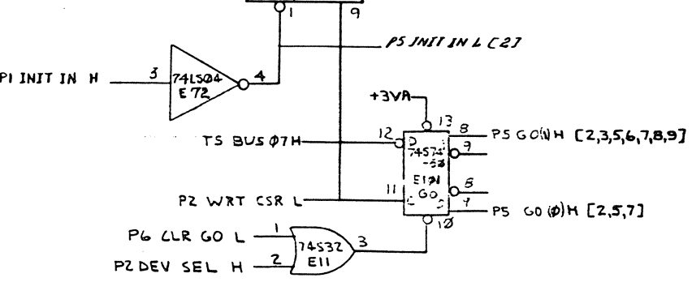

Attaching the LA there shows activity:

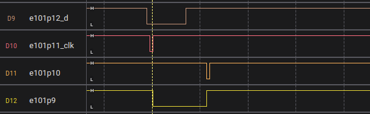

We see that the flipflop seems to do its work: D gets low, shortly after CLK goes down and up, and p9 (q) gets low too. A us later comes a low on p10 (PRE) which sets the q output back to 1 again.

There appears to be an error in the schematic; E101 on the drawing has 2x pin 8 and 9 with inverted meaning. p8 is Q-bar, p9 is Q. E102 p12+p13 is connected to p8 (Q-bar).

Checking again the LA, now with E102 p6 (inverted output) and p12 (output from e101) shows that I messed up before:

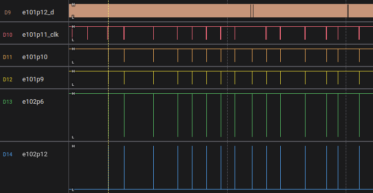

We nicely see pulses leaving it. That SHOULD mean that our PC advances, and at least now I see pulses at e104p2 (CLK).

## Cluestick....

I fear that what went wrong is that I forgot to switch on the drive in some of the initial measurements and did not notice, and that sent me on a wild goose chase. Being stupid never helps, sigh.

## We have cmd output...

Well, we now do seem to have cmd output on e5p5. According to the test it sends the get status command with only the marker bit set (so a single bit). This single bit should be the width of a single clock period, as far as I understand, and that does not seem to be the case here:

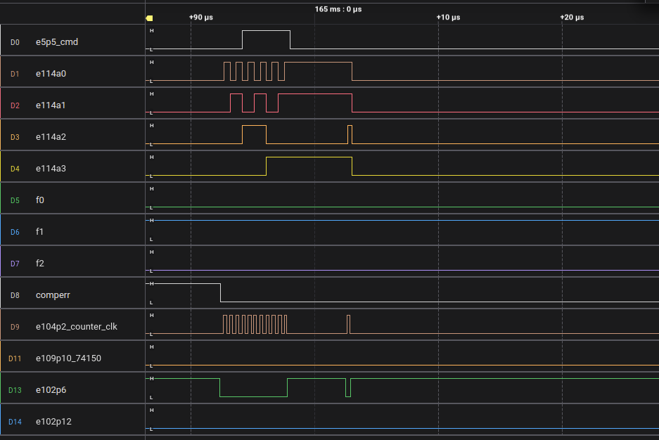

Perhaps that is why OPI is not being set? If the thing is sending a lot of ones then the drive will see it as the proper GS bit, and it will just work....

