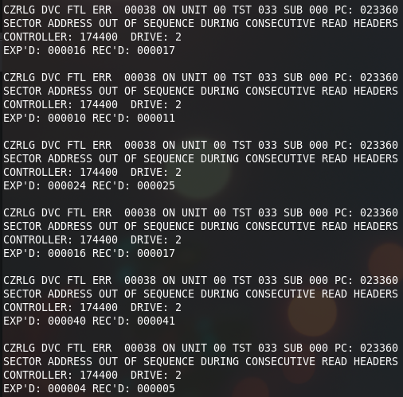
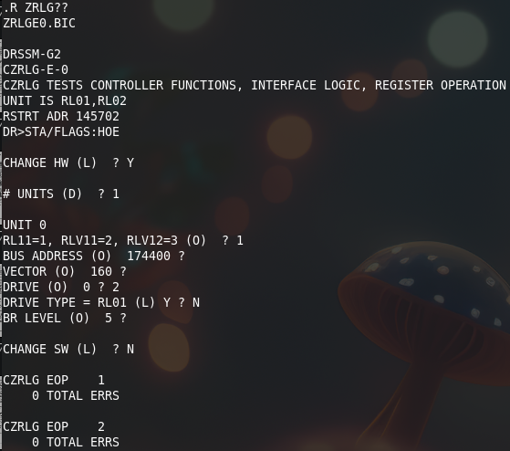

# Fixing test 33

The next round is to fix ZRLGE0 test 33. This reports:

The test does the following:

* It loops 40 times. Every loop it sends a "read header" command, waits for the command to complete, and then reads 3 words from the MP register (the header data).
* Once all 40 are read it gets the sector # of the first sector read. It then checks that every sector following is one more than the first one. It of course wraps to sector 0 once sector 39 has been read.

In our failed test we often get a sector that is one more than the sector expected. I am wondering whether that could be because the CPU emulation of the Unibone is 10x slower than a real CPU.. To check I enabled "direct memory access" on the Unibone. This lets the Unibone, when running standalone, read and write memory directly, not over the Unibus. It will only use the Unibus for the I/O area. This speeds up the emulation a lot, to about half the speed of a real PDP-11.

With this the test works:

The drive makes a bit of noise doing the seek tests so even those parts seem to be fine!

Wheehaw ;)
