# The RL02 disk drive and the RL11 (M7762) controller

## How I got my unit..

I "met" Ed Groenenberg on vcfed.org where he wrote something on a tape unit that I was interested in. We started talking which ended with me visiting him. Ed has a very nice collection of ancient computing related material: a lot of teletypes, a PDP11/70 and a lot of other peripherals. And he had several RL02 drives - and gave me one! That was unexpected and I'm really happy with it, thanks Ed!

After a while I also got the RL11 (M7762) controller and cables that go with it, so now it's time to go and play with it..

## Pictures

The RL02 drive is an impressive beast:

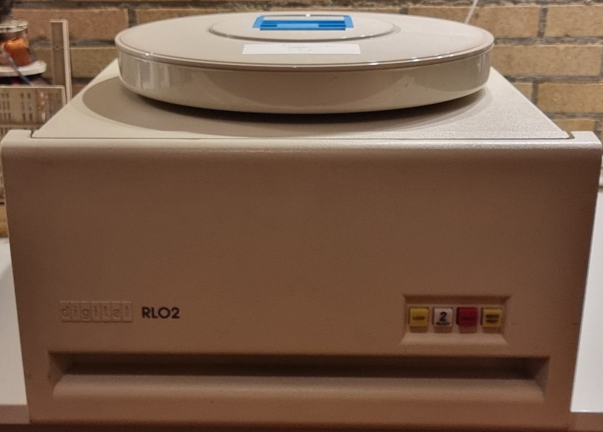

## Initial tests

First thing is to run some tests. I used the [Unibone test setup](../using-the-unibone-as-a-stand-alone-machine/index.md). As most Unibone xxdp scripts actually use an emulated RL02 I had to use another thing to boot from. I chose to use the rx02 emulation, and one of the rx02 images from [here](https://ak6dn.github.io/PDP-11/RX02/). More details [see here](../unibone/cpu20-booting-rx02/index.md).


## RLV


The results of the 1st run:
```
CPU NOT SUPPORTED BY XXDP-XM

BOOTING UP XXDP-SM SMALL MONITOR

XXDP-SM SMALL MONITOR - XXDP V2.6
REVISION: E0
BOOTED FROM DY0
28KW OF MEMORY
UNIBUS SYSTEM

RESTART ADDRESS: 152010
TYPE "H" FOR HELP 

.R ZRLG??
ZRLGE0.BIC

DRSSM-G2
CZRLG-E-0
CZRLG TESTS CONTROLLER FUNCTIONS, INTERFACE LOGIC, REGISTER OPERATION
UNIT IS RL01,RL02
RSTRT ADR 145702
DR>STA/FLAGS:HOE

CHANGE HW (L)  ? 

NO DEFAULT
CHANGE HW (L)  ? Y

# UNITS (D)  ? 1

UNIT 0
RL11=1, RLV11=2, RLV12=3 (O)  ? 1
BUS ADDRESS (O)  174400 ? 
VECTOR (O)  160 ? 
DRIVE (O)  0 ? 
DRIVE TYPE = RL01 (L) Y ? N
BR LEVEL (O)  5 ? 

CHANGE SW (L)  ? 

NO DEFAULT
CHANGE SW (L)  ? Y

DROP ON ERROR LIMIT (L) N ? 

CZRLG DVC FTL ERR  00300 ON UNIT 00 TST 025 SUB 000 PC: 015454

CONTROLLER: 174400  DRIVE: 0
RLCS CONTAINED FOLLOWING ERROR(S):  
 COMP OPI
GET STATUS OPERATION-FLAG MODE
BEFORE COMMAND: CS: 000204 BA: 002416 DA: 000013 MP: 005100
TIME OF ERROR:  CS: 102204 BA: 002416 DA: 000013 MP: 005100?

ERR HLT
DR>

```
Apparently this is error 300 of subtest 025 at pc=015454. Looking up the fiche in the fiche database on retrocmp.com:

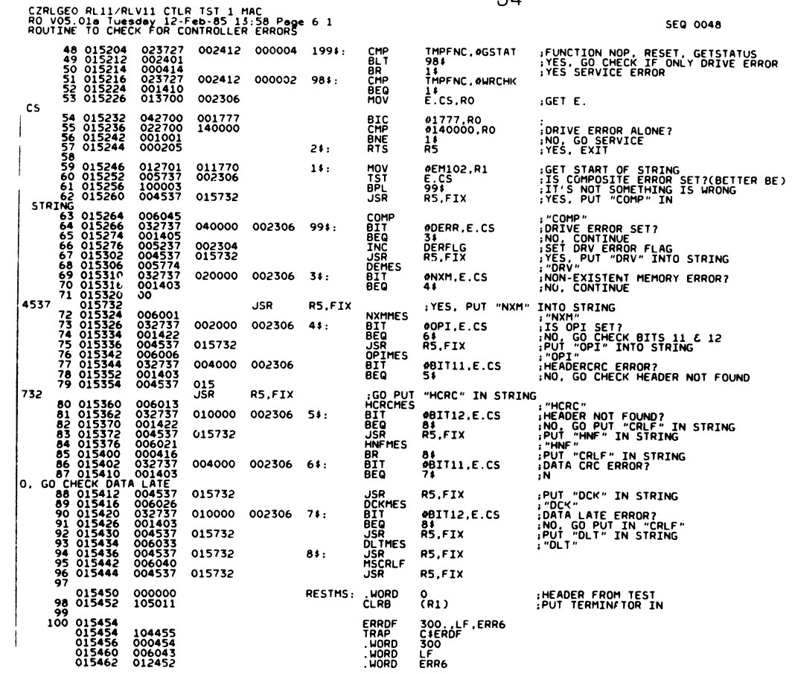

From that we learn that we have a "composite error", and "OPI" is set. OPI means:

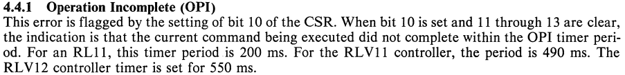

The failing test is test#25. That reads as follows:

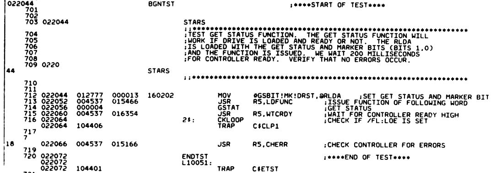

## Second try

I found out that something was off with supplying power to the RL11 controller so I fixed that and restarted the tests with a drive running. This resulted in:

```
.R ZRLG??
ZRLGE0.BIC

DRSSM-G2
CZRLG-E-0
CZRLG TESTS CONTROLLER FUNCTIONS, INTERFACE LOGIC, REGISTER OPERATION
UNIT IS RL01,RL02
RSTRT ADR 145702
DR>STA/FLAGS:HOE

CHANGE HW (L)  ? Y

# UNITS (D)  ? 1

UNIT 0
RL11=1, RLV11=2, RLV12=3 (O)  ? 1
BUS ADDRESS (O)  174400 ? 
VECTOR (O)  160 ? 
DRIVE (O)  0 ? 
DRIVE TYPE = RL01 (L) Y ? N
BR LEVEL (O)  5 ? 

CHANGE SW (L)  ? N

CZRLG DVC FTL ERR  00029 ON UNIT 00 TST 027 SUB 000 PC: 022322
OPI DID NOT SET-GSTAT WITHOUT GS BIT
CONTROLLER: 174400  DRIVE: 0
BEFORE COMMAND: CS: 000205 BA: 002416 DA: 000001 MP: 000235
TIME OF ERROR:  CS: 000205 BA: 002416 DA: 000001 MP: 000235?
ERR HLT
DR>
```

Looking at test 27:

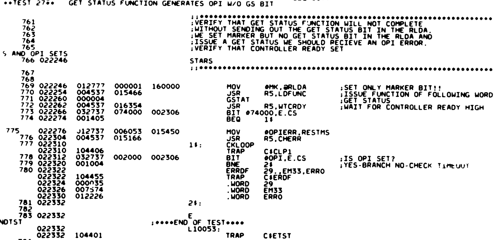

This seems to be the first test that actually talks with the disk drive- and it is not anwering..

Time to take out the scope and logic analyzer. First check the drive inputs, which will be SYSCLK and DRIVE COMMAND (on the RL02):

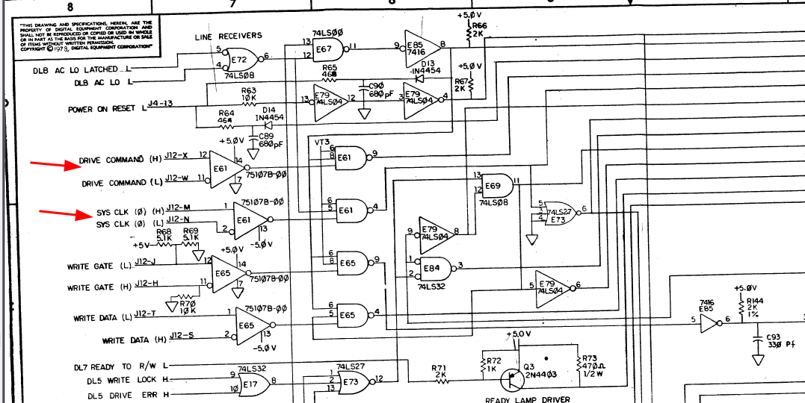

Putting the oscilloscope on pins 1, 2 and 4 of E61 shows no clock signal. I checked the RV11 and the cable and clock DID come out (check the HH and JJ pins on the connector, use the translation to IDC numbering [found here](../decalphabet/index.md)). I cleaned the connectors on the drive side, after that clock did appear - but still the same error.

Next round is the logic analyzer. I added a Saleae thingy to both pin4 (SYSCLK) and pin9 (CMD) of E61 and got a nice clock- but no activity at all on the CMD line..

Next round is to check the same on the RV11. For that we need the schematics there:

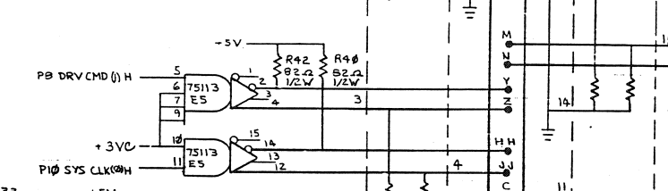

Clock and CMD are both leaving from E5. Putting the LA there shows the same symptom: no CMD data.

Next round: logic analyzer, connected as follows:

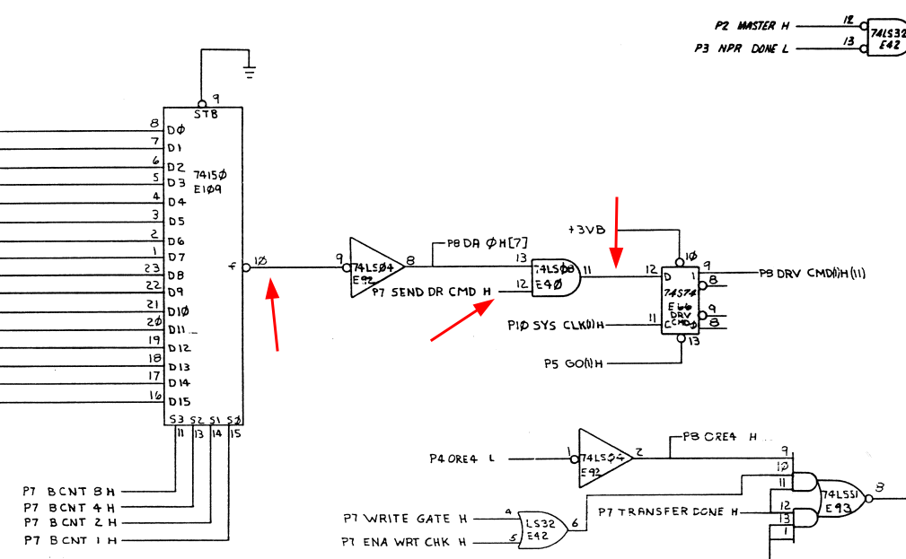

* sysclk from E5 pin 11
* cmd from E5 pin 5
* cmdsrc from E109 pin 10 (the 74150 shift register)
* p13 on E40 (cmd in from inverted 74150)
* p12 on E40 (P7 send dr cmd H)

which shows:

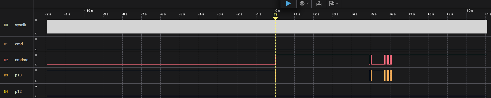

While the 74150 sends output p12 stays low, and that causes the output of E40 to remain low too, and hence no data is sent. The signal p7 send dr cmd H comes from an xor gate (p6, E83). Adding pins 4 and 5 to the LA shows that both input stay low too. Both of these come from a set of PROMs:

* p4 = p6 send status H (E114 pin 15)
* p5 = p7 ena diff clk H (E112 pin 8)

Checking whether we see a function code on E114 is next (pins 2,4,5,6). For this we also need the clock for its addresses, which comes from E104, a 74161 counter, pin 2.

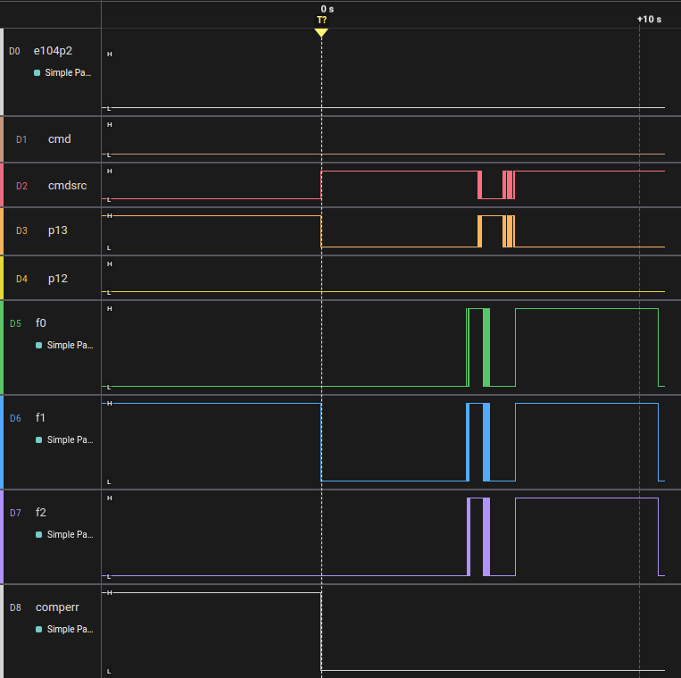

This shows something odd imo: no clock on E104p2, the counter. This comes from a set of flipflops ultimately controlled by E102, a 74151 8-to-1 multiplexer. This has a number of inputs; the input that should control the "PC" (the 74161) gets selected by that thing. Next step: do we get pulses from it?

TO BE CONTINUED.


## More photos

It opens at the top to insert the cartridges:

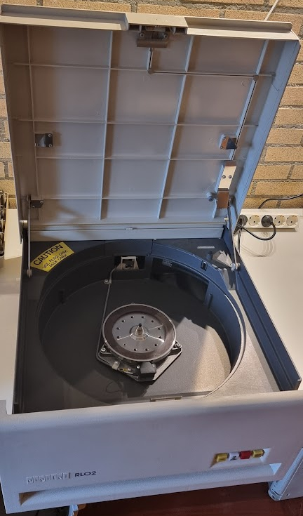

The heads were protected during the trip by this little plate:

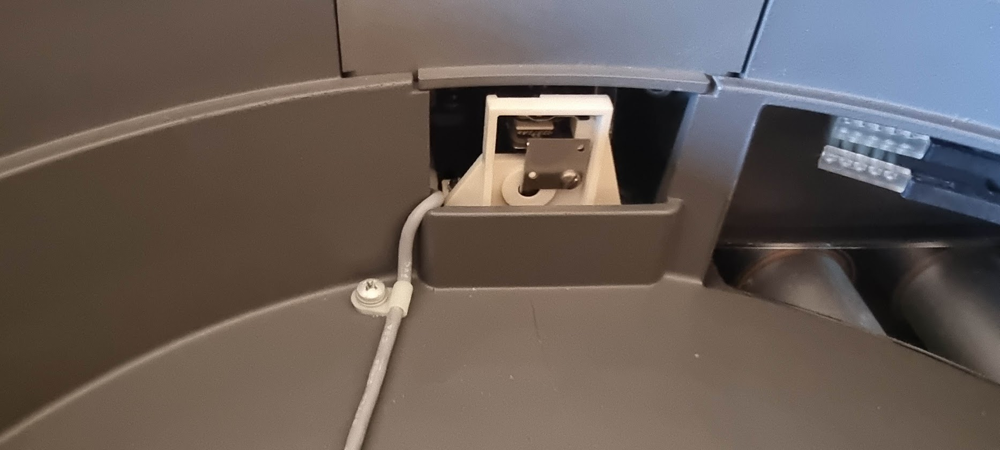

Opening the back panel exposes the motor and the power supply:

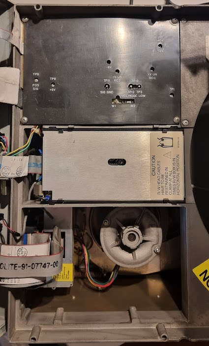

And the back panel itself holds the controller PCB:

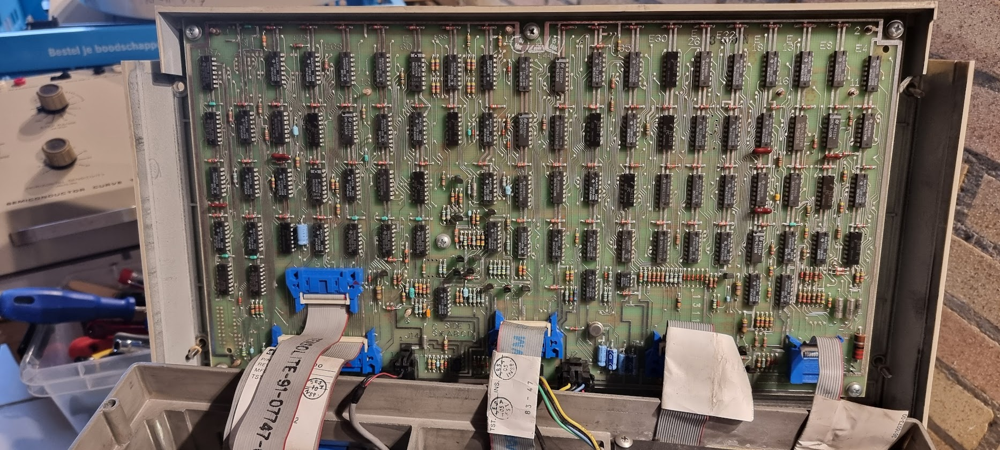