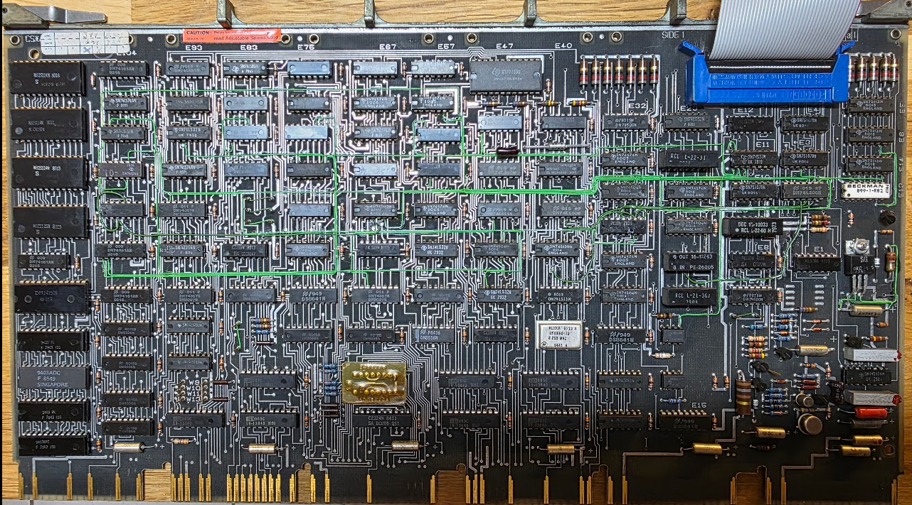
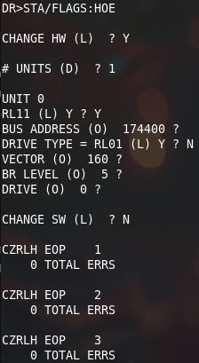
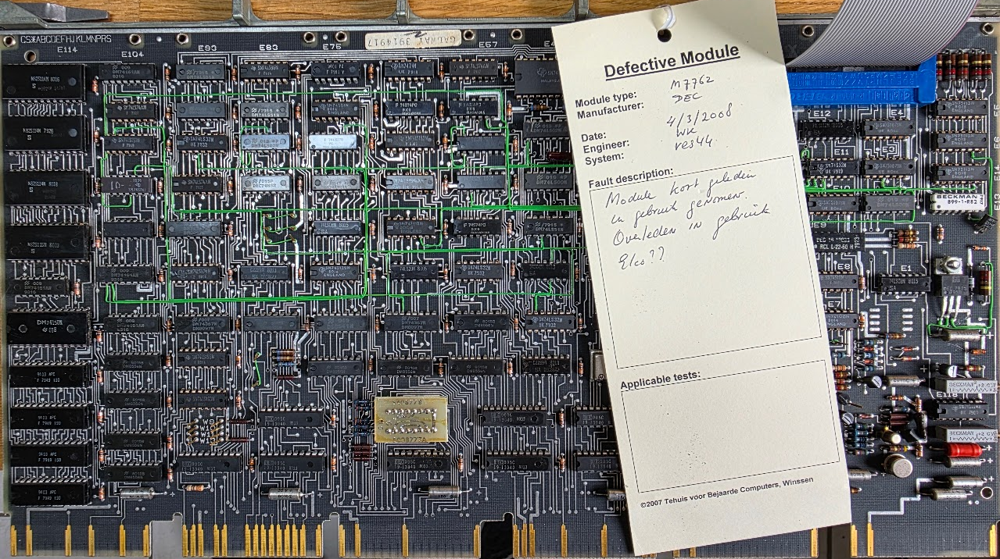

# The RL02 disk drive and the RL11 (M7762) controller

## How I got my unit..

I "met" Ed Groenenberg on vcfed.org where he wrote something on a tape unit that I was interested in. We started talking which ended with me visiting him. Ed has a very nice collection of ancient computing related material: a lot of teletypes, a PDP11/70 and a lot of other peripherals. And he had several RL02 drives - and gave me one! That was unexpected and I'm really happy with it, thanks Ed!

After a while I also got the RL11 (M7762) controller and cables that go with it, so now it's time to go and play with it..

## Pictures

The RL02 drive is an impressive beast:

## The Drive number button

You can have max. 4 RL02 drives connected to a controller. Each drive has a drive number to identify it, from 0 to 3. The way the drive number is selected is quite special! The second "button" on the drive shows the drive number. This button can be removed! By simply replacing the button with a button that shows a different number you change the drive number.
This works because the button holder has a number of microswitches that "sense" the cams at the end of the button.
I only had a drive button 2, and many tools require a drive 0. Luckily someone created [a 3D model for those drive buttons](https://so-much-stuff.com/pdp8/cad/3d.php)! Thanks a lot Vince Slyngstad!

A copy of these files can be found here: [0](0.stl), [1](1.stl), [2](2.stl), [3](3.stl).

## The controller

The controller for this device is the RL11 (M7762):

I have two of these, one marked as defective and one without any markers.

## Getting it to work (controller 1)

Let's start with the RL11 that is not marked defective.

* [Initial tests](initial-tests/index.md)
* [Hunting for the rl11 CMD signal](checking-rv11-cmd/index.md)
* [Fixing ZRLG test 33](fixing-test-33/index.md)

The final test is ZRLH, this one runs without problems:

This controller - and the drive - seem to be OK now ;)

## Controller number 2

The second controller came with a label:

The drive does not show "ready" when connected to this controller. So let's go to work on it..

* [Fixing the second rl11](c2-initial-tests/index.md)

## More photos

It opens at the top to insert the cartridges:

The heads were protected during the trip by this little plate:

Opening the back panel exposes the motor and the power supply:

And the back panel itself holds the controller PCB:

