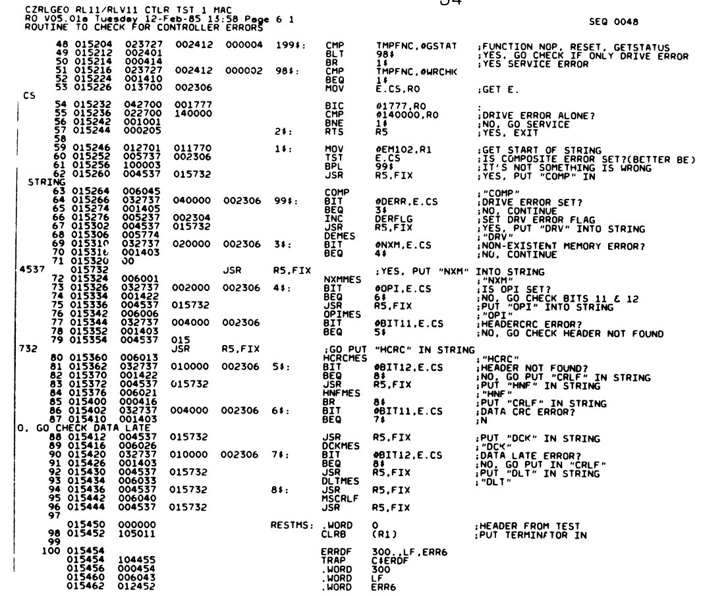
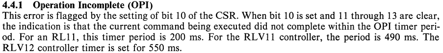
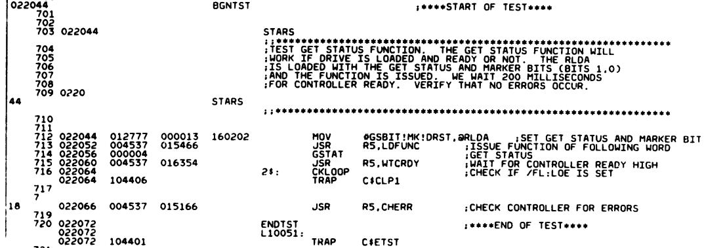
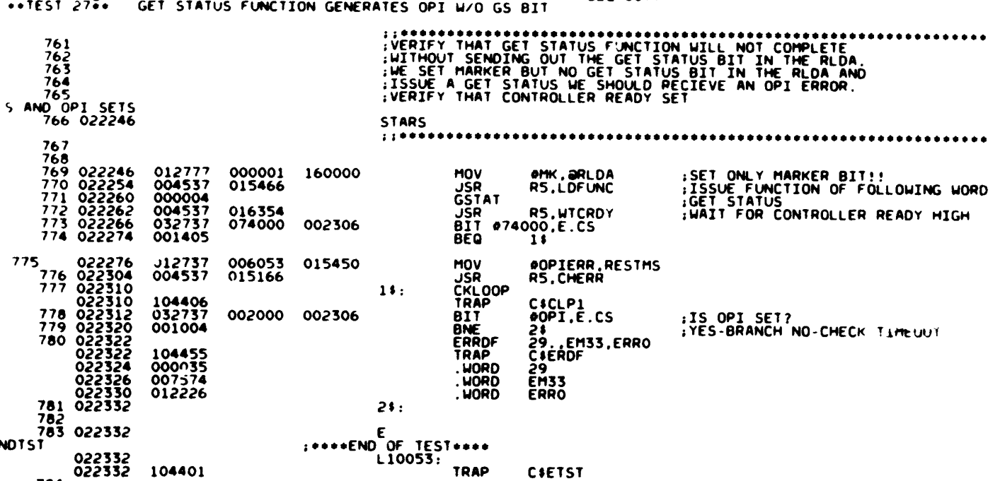

# rl02 Initial tests

First thing is to run some tests. I used the [Unibone test setup](../../using-the-unibone-as-a-stand-alone-machine/index.md). As most Unibone xxdp scripts actually use an emulated RL02 I had to use another thing to boot from. I chose to use the rx02 emulation, and one of the rx02 images from [here](https://ak6dn.github.io/PDP-11/RX02/). More details [see here](../../unibone/cpu20-booting-rx02/index.md).

The results of the 1st run:
```
CPU NOT SUPPORTED BY XXDP-XM

BOOTING UP XXDP-SM SMALL MONITOR

XXDP-SM SMALL MONITOR - XXDP V2.6
REVISION: E0
BOOTED FROM DY0
28KW OF MEMORY
UNIBUS SYSTEM

RESTART ADDRESS: 152010
TYPE "H" FOR HELP 

.R ZRLG??
ZRLGE0.BIC

DRSSM-G2
CZRLG-E-0
CZRLG TESTS CONTROLLER FUNCTIONS, INTERFACE LOGIC, REGISTER OPERATION
UNIT IS RL01,RL02
RSTRT ADR 145702
DR>STA/FLAGS:HOE

CHANGE HW (L)  ? 

NO DEFAULT
CHANGE HW (L)  ? Y

# UNITS (D)  ? 1

UNIT 0
RL11=1, RLV11=2, RLV12=3 (O)  ? 1
BUS ADDRESS (O)  174400 ? 
VECTOR (O)  160 ? 
DRIVE (O)  0 ? 
DRIVE TYPE = RL01 (L) Y ? N
BR LEVEL (O)  5 ? 

CHANGE SW (L)  ? 

NO DEFAULT
CHANGE SW (L)  ? Y

DROP ON ERROR LIMIT (L) N ? 

CZRLG DVC FTL ERR  00300 ON UNIT 00 TST 025 SUB 000 PC: 015454

CONTROLLER: 174400  DRIVE: 0
RLCS CONTAINED FOLLOWING ERROR(S):  
 COMP OPI
GET STATUS OPERATION-FLAG MODE
BEFORE COMMAND: CS: 000204 BA: 002416 DA: 000013 MP: 005100
TIME OF ERROR:  CS: 102204 BA: 002416 DA: 000013 MP: 005100?

ERR HLT
DR>

```
Apparently this is error 300 of subtest 025 at pc=015454. Looking up the fiche in the fiche database on retrocmp.com:



From that we learn that we have a "composite error", and "OPI" is set. OPI means:



The failing test is test#25. That reads as follows:



## Second try

I found out that something was off with supplying power to the RL11 controller so I fixed that and restarted the tests with a drive running. This resulted in:

```
.R ZRLG??
ZRLGE0.BIC

DRSSM-G2
CZRLG-E-0
CZRLG TESTS CONTROLLER FUNCTIONS, INTERFACE LOGIC, REGISTER OPERATION
UNIT IS RL01,RL02
RSTRT ADR 145702
DR>STA/FLAGS:HOE

CHANGE HW (L)  ? Y

# UNITS (D)  ? 1

UNIT 0
RL11=1, RLV11=2, RLV12=3 (O)  ? 1
BUS ADDRESS (O)  174400 ? 
VECTOR (O)  160 ? 
DRIVE (O)  0 ? 
DRIVE TYPE = RL01 (L) Y ? N
BR LEVEL (O)  5 ? 

CHANGE SW (L)  ? N

CZRLG DVC FTL ERR  00029 ON UNIT 00 TST 027 SUB 000 PC: 022322
OPI DID NOT SET-GSTAT WITHOUT GS BIT
CONTROLLER: 174400  DRIVE: 0
BEFORE COMMAND: CS: 000205 BA: 002416 DA: 000001 MP: 000235
TIME OF ERROR:  CS: 000205 BA: 002416 DA: 000001 MP: 000235?
ERR HLT
DR>
```

Looking at test 27:



This seems to be the first test that actually talks with the disk drive- and it is not answering..
