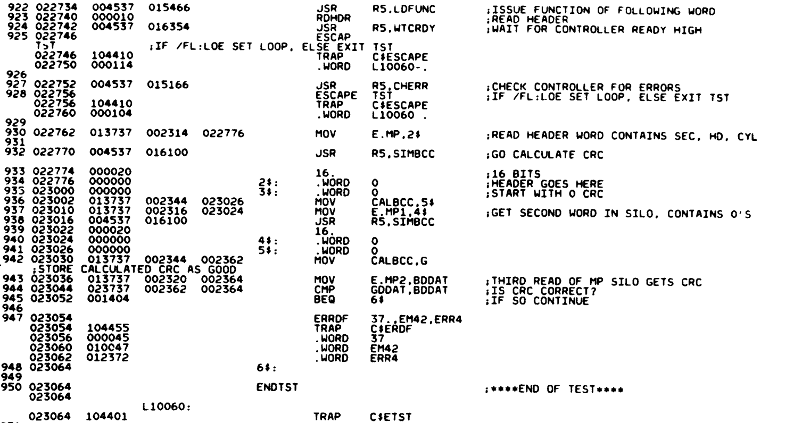
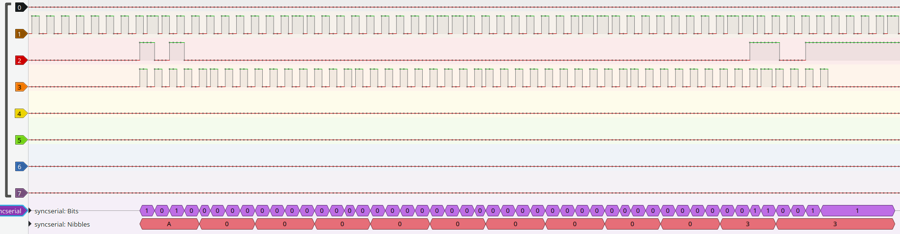
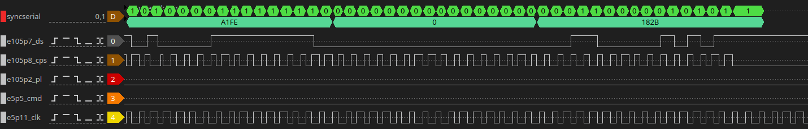
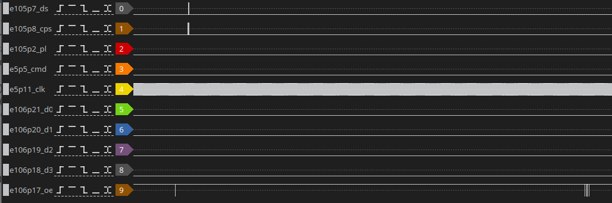
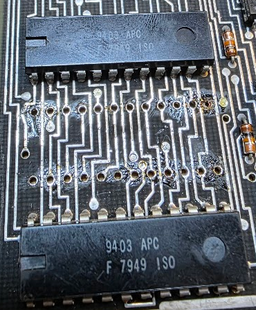
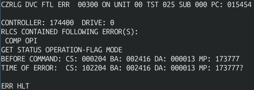

# RL11 controller #2 - initial tests

Connecting the drive to this controller makes the drive not become ready. testing the clock signal at the drive showed that it did not arrive there. There was just a small error in the band cable, so that was fixed. After that let's run ZRLG. This fails with:

```
CZRLG DVC FTL ERR  00037 ON UNIT 00 TST 032 SUB 000 PC: 023054
BAD HEADER CRC ON READ HEADER
CONTROLLER: 174400  DRIVE: 0
BEFORE COMMAND: CS: 000211 BA: 002416 DA: 000001 MP: 004012
TIME OF ERROR:  CS: 000211 BA: 002416 DA: 000001 MP: 000007?
EXP'D: 072001 REC'D: 002001

ERR HLT
```
The fiche for the test is:




The test executes a READ HEADER command. It then reads the 1st two words from the MP register (the cylinder/track count in the first word and the second word is all zeroes). It calculates a checksum from these two words (in code) and the reads the 3rd word and compares it with the checksum. These should be equal but clearly are not.

This is hard to debug from just the LA trace, so I made a protocol decoder for Sigrok: [syncserial](../../../tools/saleae-decoders/index.md). This decoder decodes the data from the serial data stream so that we can more easily understand what we see. One such trace looks like this:



We can see that the first word (sector/track) is 0xA000, the second word is all zeroes (which is according to spec) and the third word, the CRC, is 0x0033. This should translate to sector 320, head 0, sector 0.


## The CRC calculation

The CRC for the header gets calculated by the routine SIMBCC. This method gets called through r5, and expects 3 words after the call:

* The number of bits to sum (usually 16)
* The actual data word to add to the crc (i.e. one of the words read from the header)
* The previous value calculated for the crc, starting with 0 for the 1st word.

I created the following macro11 source file to be able to run the actual code for the crc check:

```
.title	CRC calc
.enable	ama
.enable	abs
	.asect

.=2000

	jsr	r5,simbcc
	.word	16.
	.word	120000
	.word	0
	mov	temp4,5$
	jsr	r5,simbcc
	.word	16.
	.word	0
5$:	.word	0
	halt

simbcc:	mov	(r5)+,temp2
	mov	(r5)+,temp3
	mov	(r5)+,temp4
1$:	clr	bccfbk
	mov	temp4,r0
	ror	temp3
	adc	r0
	bit	#1,r0
	beq	2$
	com	bccfbk
2$:	mov	xpoly,r0
	com	r0
	bic	r0,bccfbk
	clc
	ror	temp4
	mov	bccfbk,r0
	mov	temp4,r1
	mov	r1,r2
	bic	r1,r0
	bic	bccfbk,r2
	bis	r2,r0
	bic	xpoly,temp4
	bis	r0,temp4
	dec	temp2
	bne	1$
	mov	temp4,r0
	rts	r5

XPOLY:	.word	120001
TEMP2:	.word	0
TEMP3:	.word	0
TEMP4:	.word	0
BCCFBK:	.word	0
```
This should be a direct copy of the code from the fiche. There were some nice discoveries made along the way:

* The macro11 assembler I used (https://github.com/j-hoppe/MACRO11) really does not give a f about errors. It more or less accepts anything. I entered the text "My mother wears yellow socks" just in the middle of the code and no error occurred at all. Absolutely terrible.
* As I need code that I can load nicely I need it to assemble at an absolute address. For that we use the stanza ".=2000", i.e. set the pc to 2000(octal). This DOES give a very uninformative error (bad ORG). After a lot of reading I found out that you need to add ".asect" before the org statement to make the section absolute.
* The xxdp module contained ".enable abs" at the top. I had not noticed the dot before the enable. This led to all code being made PC relative. Which is not that bad, but the listing does NOT show the actual words generated but the target addresses with a single quote behind them. The Unibone did not mind that ', and loaded the words as the actual words. This led to wildly misbehaving code. Only after manually verifying everything that was deposited in memory it became apparent what horrors had occurred. Not Fun.

Anyway. The start of the program contains the actual crc calculation for the data we read from the sector: first word 0xa000 (120000 oct), second word zeroes.

We can run this program on the Unibone by first compiling it with macro11 and copying it to the Unibone:

```
macro11 -l crc.lst crc.mac
scp crc.lst root@ubex:10.03_app_demo/5_applications/cpu/
```
(ubex is the host name of my Unibone).

We then create a boot script like this:
```
#!/root/10.03_app_demo/4_deploy/demo

# Inputfile for demo to execute "Hello world"
# Uses emulated CPU and (physical or emulated) DL11
# Read in with command line option  "demo --cmdfile ..."

dc                      # "device with cpu" menu

m i                     # emulate missing memory
sd dl11

p p ttyS2               # use "UART2 connector, see FAQ

# p b 300               # reduced baudrate

en dl11                 # switch on emulated DL11

en cpu20                # switch on emulated 11/20 CPU
sd cpu20                # select

m ll crc.lst            # load test program

p

init
p pc 2000

.print Enter p s 1 to run the program
```

This loads the listing in memory, ready to be executed. Entering p s 1 will start the CPU, it will halt after the code finishes and show the crc in r0:

```
DC>>> R0 021000 R1 021000 R2 021000 R3 000000 R4 000000 R5 000000 R6 000000 R7 002034
10 021000 11 021000 12 000000 13 000000 14 000000 15 000000 16 000000 17 000000
BA 002032 IR 000000 PSW 000
``` 

i.e. the sum is 21000, or 0x2200. I validated it with a Java program that implemented the same algorithm. This is a lot different from the value received (0x33).

## Tracing the working controller (#1)

To make sure that I understand what's happening I decided to trace the now working controller too. As this passes the tests it should show us traces where we can check the checksum. This is one:



But if we calculate the checksum with the code we still have a mismatch: calculating the sum for A1FE 0000 returns 0a60... I'm lost now..

Let's try another trick. You can set a breakpoint on the Unibone. Let's put that in the test routine, at 23044 ~(oct)~. That should do two things:
* It should immediately stop the trace so we can see the last pulse train
* It should show the data seen by the code

The results from the code:
* 22776 (1st header word) = 000044 (24H)
* 23024 (2nd header word) = 0
* 23026 (crc from 1st word) = 000033 (1B)
* 02344 (calbcc) = 170012 (f00a)

When we plug these words in the calculation tools those indeed match.. So where the f are those numbers coming from!?

In the end that was easy: the syncserial decoder was reading the bits in the opposite order from what is expected.. The 9403 FIFO registers will move the very first bit in the bit train to D0 of their output, the second one becomes D1, etc. The 9403's in the controller are put in series; when the first 9403 has 4 bits read the next 4 bits go to the second one.. And the first 9403 is connected to D0..D3 of the data bus, so the first bits are the LSB bits.

Adding an option to revert the interpreted bit order shows that the last trace is actually correct:


One mystery solved.

## Going back to the bad controller (#2)

Let's try the bad controller again. This is the new trace:


The error message from the test read:
```
CZRLG DVC FTL ERR  00037 ON UNIT 00 TST 032 SUB 000 PC: 023054
BAD HEADER CRC ON READ HEADER
CONTROLLER: 174400  DRIVE: 0
BEFORE COMMAND: CS: 000211 BA: 002416 DA: 000001 MP: 002001
TIME OF ERROR:  CS: 000211 BA: 002416 DA: 000001 MP: 000024?
EXP'D: 170005 REC'D: 000005
```
The CRC that we actually see on the serial bus is 0xf005 which is 170005 ~oct~, so the correct checksum.. This means something must go wrong reading that value from the 9403. Yay.

Next step: does the 9403 that holds the upper values actually report that value to the bus when queried? This is the highest nibble which comes from E106. We need to probe that one. This shows the following when the test runs:



This is zoomed out; we see the drive sector response on channel 0 and 1, and a lot later we see OE going down a few times - but all that time the data lines remain at zero. Conclusion: that 9403 is dead..

## Replacement with 74F403

I could not find a 9403 on Ebay (it turned out I made an error searching for it, and apparently the real code is N9403). But there is a replacement: the 74F403 is the same chip. I found two of those on Ebay, in Germany, and ordered those. I removed the dead one and added a handcrafted socket because I had none for the odd form factor of this chip:




Running the test however returned this:



This is a test of the GET STATUS command, and it caused a timeout. I checked the chip again with the logic analyzer (but forgot to make the proper trace) and found out that the command was sent correctly, and the drive answered, but the CPSI clock signal on the 9403's never stopped pulsing. This was because the IRF output (pin 1) of the new 74F403 never signaled that the data was received. Actually, that output was flapping around in the breeze at high speed. Clearly this chip was bad. Sadly enough the same happened with the second one...
Back to Ebay, and now to order a real 9403 from the States, a 4 week wait, sigh.

## Second try with a real N9403

After a few weeks of waiting I got a few real N9403's. These looked like the Real Deal, so I had high hopes. But when I replaced the 74F403 with them I saw the exact same thing..
So, back to the logic analyzer for apparently a new fault.. The trace showed this:


I added the IRF signals of the other 9403's starting at pin 6 (the lsb) and going on to the higher nibbles. We can see the following:

* We see that the 4 chips are reset properly just before the CMD line starts to send the GET STATUS command. This command also looks proper.

* The last IRF never gets low. This means that the state machine will never see that the whole word has been read, and consequently we see the input clock continuing endlessly.

* The first and second 7403's do clock data in and make IRF low after 4 bits, but apparently the 3rd nibble (e107) is now dead also.

After replacing that third chip in the fifo chain we still had IRF of the last chip (e106) low. I then decided to check the IES signal on that chip, and lo and behold: it stayed high.. Even though e107 has been replaced and now works properly.. I did a continuation check between e107p1 and e106p9 and this was open, so the signal never reached e106; I must have broken a trace during my repair, sadly enough.
Adding a wire fix on the PCB fixed that, and retesting finally shows a happy result:

```
DR>STA/FLAGS:HOE

CHANGE HW (L)  ? N

CHANGE SW (L)  ? N

CZRLG EOP    1
    0 TOTAL ERRS

CZRLG EOP    2
    0 TOTAL ERRS
```

## About the 74F403 we tried earlier

These proved to be just fine too, so I'm now the proud owner of a stock of these, sigh. It does not always pay to be lazy and assume the EBay chips are bad; had I measured inputs again proper I would have seen that.

## The second test

Running ZRLH on the same controller:

```
.R ZRLH??
ZRLHB1.BIC

DRSSM-G2
CZRLH-B-0
CZRLH TESTS WRITE DATA, READ DATA, AND WRITE CHECK OPERATIONS
UNIT IS RL01,RL02
RSTRT ADR 145702
DR>STA/FLAGS:HOE

CHANGE HW (L)  ? Y

# UNITS (D)  ? 1

UNIT 0
RL11 (L) Y ? 
BUS ADDRESS (O)  174400 ? 
DRIVE TYPE = RL01 (L) Y ? N
VECTOR (O)  160 ? 
BR LEVEL (O)  5 ? 
DRIVE (O)  0 ? 

CHANGE SW (L)  ? N

CZRLH EOP    1
    0 TOTAL ERRS

CZRLH EOP    2
    0 TOTAL ERRS
```

Fine as well. Controller repaired ;)

