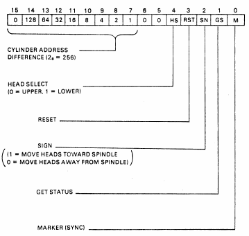
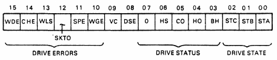

# The second RL11 controller

The second controller came with a label:


The drive does not show "ready" when connected to this controller. So let's go to work on it..

* [First round of tests and fixes](c2-initial-tests/index.md)


## RLZID1 test failures

The next test is RLZI. 

This test fails with:
```
CZRLI HRD ERR  00101 ON UNIT 00 TST 015 SUB 002 PC: 037702

DIFF OF 1 SEEK TEST
OPER: SEEK 
           FROM 002 DIFF 002 SGN 0 HD 0
RESULT:        DRV STATE IS 5 SB 4
BUS ADD=174400 DRV=0
           RLCS    RLDA    RLBA    RLMP    CYL   HD 
OP INIT = 000106  000401  000000  000000
OP DONE = 000304  000003  000000  000235   002  0

ERR HLT
```
A second try also failed:

```
CZRLI HRD ERR  00101 ON UNIT 00 TST 015 SUB 003 PC: 037702

DIFF OF 1 SEEK TEST
OPER: SEEK 
           FROM 000 DIFF 002 SGN 1 HD 1
RESULT:        DRV STATE IS 5 SB 4
BUS ADD=174400 DRV=0
           RLCS    RLDA    RLBA    RLMP    CYL   HD 
OP INIT = 000106  000425  000000  000000
OP DONE = 000304  000003  000000  000335   000  1

ERR HLT
```
And a third:
```
CZRLI HRD ERR  00101 ON UNIT 00 TST 015 SUB 002 PC: 037702

DIFF OF 1 SEEK TEST
OPER: SEEK 
           FROM 002 DIFF 002 SGN 0 HD 0
RESULT:        DRV STATE IS 5 SB 4
BUS ADD=174400 DRV=0
           RLCS    RLDA    RLBA    RLMP    CYL   HD 
OP INIT = 000106  000401  000000  000000
OP DONE = 000304  000003  000000  000235   002  0

ERR HLT
```

The description for test15 reads:


For this test it is useful to look at the RL02 command word which has the following format:



As can be seen the seek operation works on deltas; a seek is done by sending a delta cylinder address and a sign (upwards, downwards) to the drive. 
Looking at the first and third error I think we see that the test expects the drive to be on cyl 2, and it sends a command with a delta of +2. This should make the drive arrive at cyl 4, and it appears that it doesn't.

The RESULT line shows that we got drive status 5 while we expected drive status 4. The drive status register looks like this:



The message apparently talks about state, not status, so those bits have the following values:


So, state 5 would be "Seek-linear mode (lock on)", and state 4 would be "Seek-Track Counting". Reading time..


