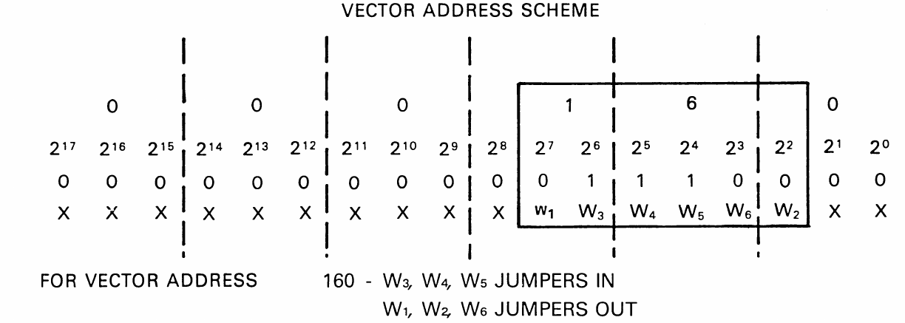
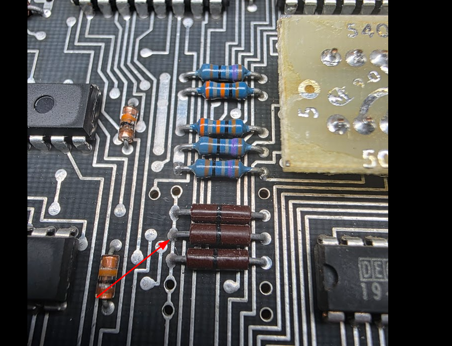
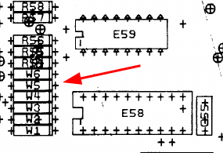
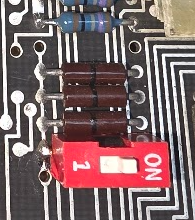
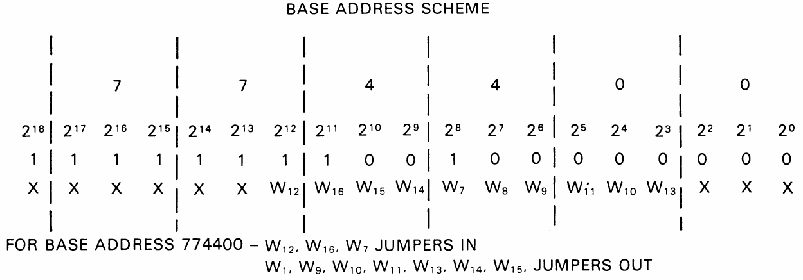
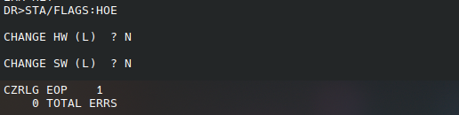
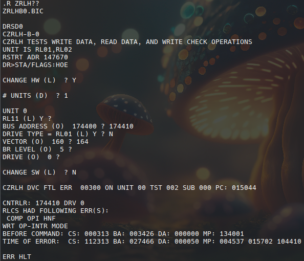
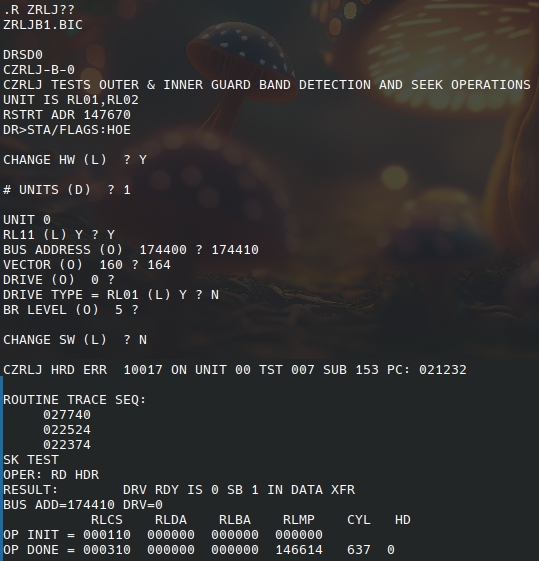

# Installing and testing the drive on the PDP11/44 w/Unibone

To test I need to run xxdp on the PDP11/44. This is done the easiest using the Unibone as I have no other working hardware at the moment. The Unibone emulates a set of RL02 drives by itself on the first RL11 controller. This means that we will have to set the controller we want to test to be the second controller in the system, or we need to boot from some other (emulated) device on the Unibone.

## Controller 2

The first test was done with controller 2.

### Setting the controller as the second one

The first RL11 controller has the following settings:

* Base address 774400
* Vector address 160

The RL11 takes 10 (oct) bytes of I/O window (4 registers of 2 bytes each). The vector address increments by 4. So the second controller should be set to:

* Base address 774410
* Vector address 164

For this we need to change the dip switches. First the vector address which is encoded as follows:

This shows that we need to switch W2 to jumpers IN. These are not DIP switches but actually 0ohm resistors soldered to the board:

The tech drawings show that the jumpers are from W6 at the top downwards to W1 at the bottom:

So we need a jumper on the 2nd thingy from the bottom. I decided to add a small switch for that so that we can easily revert without soldering on these fragile board too much:

The CSR address needs to be set using the following schema:

We will need to toggle W13 ON. I added the same switch there after removing the wire wrap posts from that location.

### Running the tests - controller 2

### ZRLG

### ZRLH

This test fails:

cs 112313 (94cb h):
- composite error (15)
- header not found (12, bit 10 is set)
- operation incomplete (10)
- controller ready (7)
- interrupt enable
- function code: 101 (write data)
- drive ready

### ZRLJ

## Controller 1

That was depressing.

I swapped the controller. Controller 1 still uses its original addresses, so I ran the xxdp software through the Unibone using RX02 emulation. This caused some trouble: for some reason the 11/44 would start running immediately after a "pwr" command, and it would not boot from the Unibone provided files.

After some investigation I think this was because my 11/44 was set to boot automatically after powerup using settings on the M7098 Unibus module. I switched autoboot off, and that made the start from rx02 emulation work. For details see [Boot proms](../../pdp11-boot-proms/index.md).

The following tests work on this controller (2 passes each):

* zrlg e0
* zrlh b0
* zrli d1
* zrlj c0

