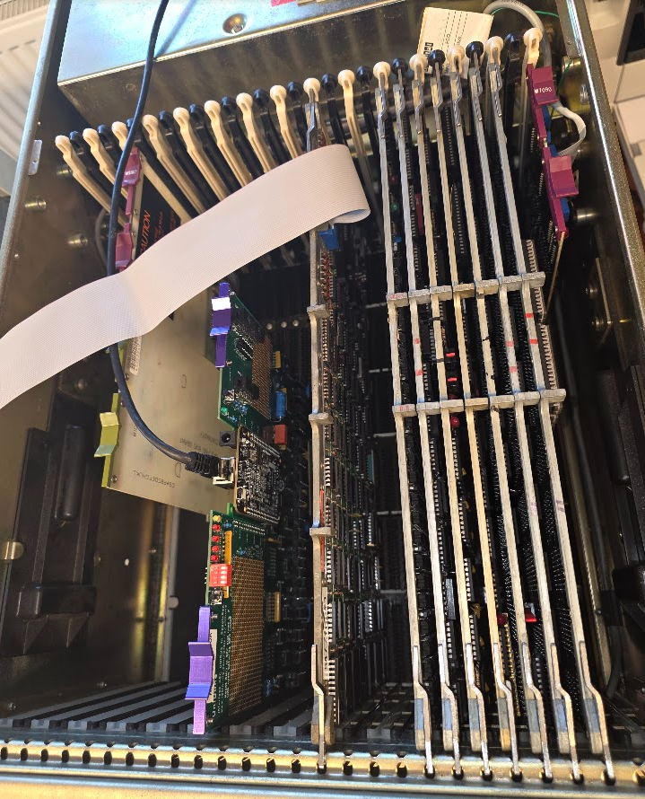
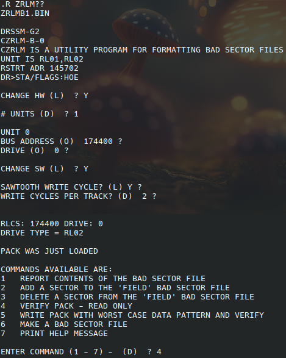
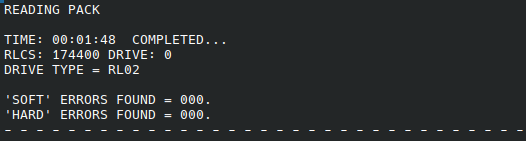
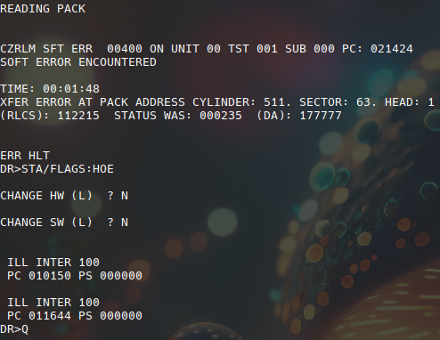
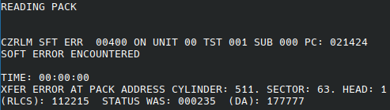
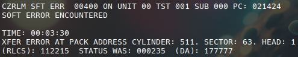
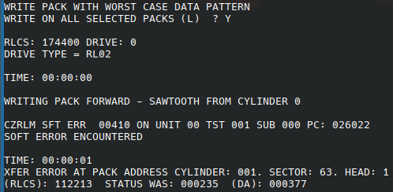
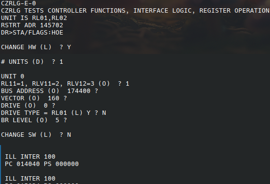
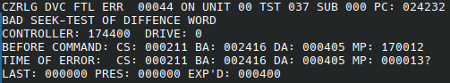

# Installing and testing the drive on the PDP11/44 w/Unibone

To test I need to run xxdp on the PDP11/44. This is done the easiest using the Unibone as I have no other working hardware at the moment.

It seems important to place the Unibone __after__ the RL11 controller, because this makes the NPR and grant lines go directly to the controller without the Unibone in between which would introduce a delay. The disk tests are often quite time-critical.



## Controller 2

The first test was done with controller 2.

The xxdp2.2 Unibone script emulates a set of RL02 drives by itself on the first RL11 controller. This means that we will have to set the controller we want to test to be the second controller in the system, or we need to boot from some other (emulated) device on the Unibone.

### Setting the controller as the second one

The first RL11 controller has the following settings:

* Base address 774400
* Vector address 160

The RL11 takes 10 (oct) bytes of I/O window (4 registers of 2 bytes each). The vector address increments by 4. So the second controller should be set to:

* Base address 774410
* Vector address 164

For this we need to change the dip switches. First the vector address which is encoded as follows:


This shows that we need to switch W2 to jumpers IN. These are not DIP switches but actually 0ohm resistors soldered to the board:


The tech drawings show that the jumpers are from W6 at the top downwards to W1 at the bottom:


So we need a jumper on the 2nd thingy from the bottom. I decided to add a small switch for that so that we can easily revert without soldering on these fragile board too much:


The CSR address needs to be set using the following schema:


We will need to toggle W13 ON. I added the same switch there after removing the wire wrap posts from that location.

### Running the tests - controller 2

### ZRLG


### ZRLH

This test fails:


cs 112313 (94cb h):
- composite error (15)
- header not found (12, bit 10 is set)
- operation incomplete (10)
- controller ready (7)
- interrupt enable
- function code: 101 (write data)
- drive ready

### ZRLJ


## Controller 1

That was depressing.

I swapped the controller. Controller 1 still uses its original addresses, so I ran the xxdp software through the Unibone using RX02 emulation. This caused some trouble: for some reason the 11/44 would start running immediately after a "pwr" command, and it would not boot from the Unibone provided files.

After some investigation I think this was because my 11/44 was set to boot automatically after powerup using settings on the M7098 Unibus module. I switched autoboot off, and that made the start from rx02 emulation work. For details see [Boot proms](../../pdp11-boot-proms/index.md).

The following tests work on this controller (2 passes each):

* zrlg e0
* zrlh b0
* zrli d1
* zrlj c0

## Testing the drive with RT11

Next step was to try to use the drive under RT11. I booted RT-11SB V05.07 from the Unibone (/rt11v54_ry0.sh) and checked that it has the RL02 driver:

```
RT-11SB  V05.07  

.R MSCPCK

.show
TT  (Resident) 
DY  (Resident) 
    DY0 = DK , SY 
LD   
SL   
DL   <-- rl02
VM   
SP   
LS   
NL   
13 free slots
```

Then tried to access the disk:

```
.dir dl0:
 
?DIR-F-Invalid directory
```

Not RT-11 format, obviously, so trying to format:

```
.init
Device? dl0:
DL0:/Initialize; Are you sure? Y
?DUP-W-Replacement table overflow DL0:
Type <RET>, 0, or nnnnnn (<RET>)
Replace block # 
?DUP-W-Replacement table overflow DL0:
Type <RET>, 0, or nnnnnn (<RET>)
Replace block # 0

.dir dl0:
 
FILE  .BAD     1                 
 1 Files, 1 Blocks
 20381 Free blocks
```

Apparently some bad block? Copying data however failed with I/O errors. I tried to init the disk again:

```
.init dl0:
DL0:/Initialize; Are you sure? Y
?DUP-F-Error reading bad block replacement table DL0:

.init/REPLACE:RETAIN dl0:
DL0:/Initialize; Are you sure? Y
?DUP-F-Bad block in system area DL0:
```

I tried several other packs, but they all failed in the same way (I have only 2 without a marking that says they have a read error at the start).

## Testing with ZRLM..

A tip from vfced was to try ZRLM, this contains a full disk scan:



Running option 4 delivered first:



After that retrying causes an odd error:



Restarting the machine and re-running reports an error now:



Completely switching off and retrying made the read run successfully twice, after that there was another error:



Trying option 5, "Write pack with worst case data pattern" failed with:



What is also odd: running ZRLGE0 after all this also aborts immediately:



Restarting the whole bunch and running zrlg:



Something is rotten in the state of Denmark..
