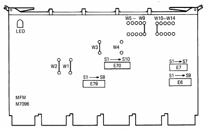
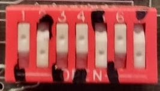
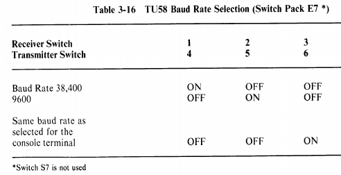
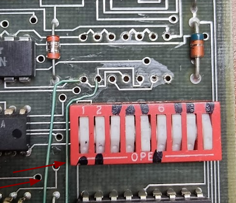
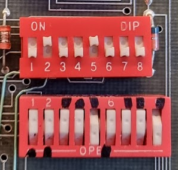
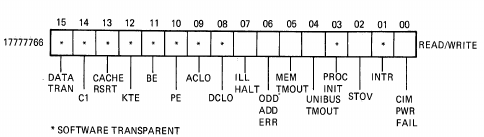
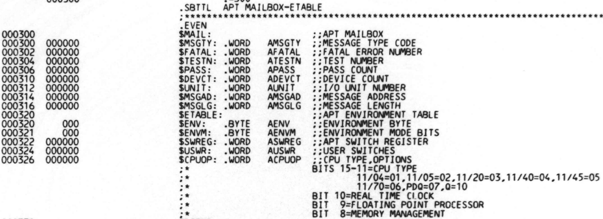
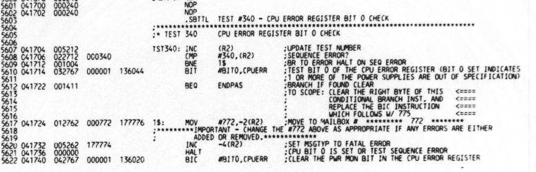
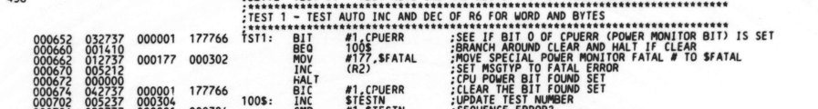

# Running the XXDP tests using TU58

To make sure that the machine works we’d run the xxdp tests. These can easily be ran from the Unibone, but since the Unibone is new and untested too we cannot be sure that a problem comes from the machine itself- or is caused by the Unibone.

# How to do TU58 emulation

The tu58 drive was connected to the M7090 card using a serial connection, usually at 38400 bps 8n1. To do emulation we need to run a TU58 emulator. This emulator will connect to that serial port and receive tape handling commands and provide the data back to the 11/44. There are many emulations for the tu58; the one I decided to use is Jorg’s version called tu58fs. This emulation can be found here:

- [https://github.com/j-hoppe/tu58fs](https://github.com/j-hoppe/tu58fs) (Github repo)
- [http://retrocmp.com/tools/tu58fs](http://retrocmp.com/tools/tu58fs) (Description)

Once the emulator is running you need to make the PDP-11/44 boot from the tape “inside” the emulator. To do that you need either a boot PROM or you need to key in the boot program using the console.

The latter is a bit of work, and the tu58fs program actually has help for this: it has a way to enter that boot program by connecting to the PDP-11’s serial console and issuing deposit commands to enter the boot loader. This does require a *second* serial connection of course, to the console serial port.

To enter the boot loader the tu58fs program needs to know the actual console type that is being used, because the prompts and the syntax for the commands that are needed are different between types. The original did not support the PDP-11/44’s console commands, so I have updated the code so that it does now; this code can be found here:

- [https://github.com/fjalvingh/tu58fs](https://github.com/fjalvingh/tu58fs) - branch 1144. A pull request has been added to Jorg’s repo; I need to see if he is willing to accept it.

# Checking/setting the TU58 interface’s speed

The speed for the TU58 interface is set on the MFM board (M7096) on switch E7:



On my machine they were set as follows:



which according to the following table:



means it was set to 9600bps. Setting it to 38400 did not work, and switching it back to 9600bps now also failed.. Measuring the switch showed that several of the switches failed to make contact, so I decided to replace the switch. Desoldering the thing showed something special:



clearly some rework has been done on the board at some time.

I did not have a 7 switch DIP switch so I had to use an 8 switch one and cut of the legs of the 8th switch:



I could now switch to 38400bps for the TU58 which helps a lot with load speed of these diagnostics :wink:

# Preparing for running the emulation

You need two serial ports to do this. First check which serial port connects to the console and which one connects to the tu58 serial port. To connect the tu58 port you might need to create a cable; an example of how that can be done [can be found here](../pdp11-m7090-console-cable-tu58-cable/index.md).

You can do that using minicom and see which of the ports shows the actual console.

In my case the mapping was:

- /dev/ttyUSB0 → tu58 serial port
- /dev/ttyUSB1 → Console serial port

A second thing to check is the actual bitrate set for the tu58 serial interface on the pdp-11. It should be set to 38400bps but this speed can be changed, and you need the actual speed. One way to test this is as follows (explained by Geert Rolf):

Assume a given speed, and connect to the serial port using Minicom with that speed.

Now enter the following on the PDP-11’s console (using *another* serial connection or a terminal):

```
D 17776506 101
```

This puts the code for the letter ‘A' in the transmit register for the tu58 UART. The result should be that an 'A’ is shown on the minicom window. If not, or if the display is scrambled try the process again with a different bitrate until successful.

Once a candidate bitrate is found you can do one more test.

In the tu58 minicom window press the letter uppercase B.

Then enter the following on the PDP-11’s console:

```
E 17776502
```

This reads the value in the tu58 UART’s receive register, and this should be 102 (the octal for B).

# Running and booting from TU58 disk images

You will need tu58 disk image files; these can be found on several places on the Internet. For my case here I needed the XXDP image files. One set can be found here:

- [https://ak6dn.github.io/PDP-11/TU58/](https://ak6dn.github.io/PDP-11/TU58/) (AK6DN, Donald North)

To start work the first step is to start the emulator:

```
sudo ./tu58fs -V -v -p /dev/ttyUSB0 -b 9600 --xxdp \
-d 0 r /home/jal/hobby/MiniMainframes/pdp/geert/tu58xxdp/TU58-15.DSK \
-sd 1 c /home/jal/t/tu58-2
```

This starts the emulator using ttyUSB0 at 9600bps, and uses the TU58-15.DSK disk image as the tape source. The last path in the command assigns a work directory to expand the disk image into; it should probably change whenever you swap disks.

Next step is to use tu58fs to enter the boot loader and start it:

```
sudo ./tu58fs -p /dev/ttyUSB1 -b 9600 -f 8n1 --boot 1144
```

This should produce the following output:

```
sudo ./tu58fs -p /dev/ttyUSB1 -b 9600 -f 8n1 --boot 1144
[19:20:26 info]  Using serial port /dev/ttyUSB1 at 9600 baud with 8N1 format.
[19:20:26 info]  No simulated drives were specified, emulator not started.

?01 SYN?
>>>D 7000 261
>>>D 7002 12700
>>>D 7004 0
>>>D 7006 12701
>>>D 7010 176500
>>>D 7012 12706
>>>D 7014 2000
>>>D 7016 5004
>>>D 7020 5261
>>>D 7022 4
>>>D 7024 5003
>>>D 7026 4767
>>>D 7030 50
>>>D 7032 5061
>>>D 7034 4
>>>D 7036 5761
>>>D 7040 2
>>>D 7042 12703
>>>D 7044 4004
>>>D 7046 4767
>>>D 7050 34
>>>D 7052 10003
>>>D 7054 4767
>>>D 7056 30
>>>D 7060 5003
>>>D 7062 105711
>>>D 7064 100376
>>>D 7066 116123
>>>D 7070 2
>>>D 7072 22703
>>>D 7074 1000
>>>D 7076 101371
>>>D 7100 5007
>>>D 7102 4717
>>>D 7104 4717
>>>D 7106 4717
>>>D 7110 105761
>>>D 7112 4
>>>D 7114 100375
>>>D 7116 110361
>>>D 7120 6
>>>D 7122 303
>>>D 7124 207
>>>
?01 SYN?
>>>S 7000
```

Once this has been done the next step is to connect again to the console using minicom so that you can interact again with the system that is booting.

# Running the tests

When the boot finishes you are greeted by the following:

```
BOOTING UP XXDP-XM EXTENDED MONITOR                                                                                                                         
                                                                                                                                                            
                                                                                                                                                            
XXDP-XM EXTENDED MONITOR - XXDP V2.5                                                                                                                        
REVISION: F0                                                                                                                                                
BOOTED FROM DD0                                                                                                                                             
124KW OF MEMORY                                                                                                                                             
UNIBUS SYSTEM                                                                                                                                               
                                                                                                                                                            
RESTART ADDRESS: 152000                                                                                                                                     
TYPE "H" FOR HELP !                                                                                                                                         
                                                                                                                                                            
.              
```

You can now enter commands at the . prompt. One command is D, which shows a directory of the content of the tape:

```
.D

ENTRY# FILNAM.EXT        DATE          LENGTH  START   VERSION

    1  XXDPSM.SYS       1-MAR-89         29    000050   E.0
    2  XXDPXM.SYS       1-MAR-89         39    000105   F.0
    3  DRSSM .SYS       1-MAR-89         24    000154   G.2
    4  DRSXM .SYS       1-MAR-89         48    000204   C.0
    5  DATE  .SYS       1-MAR-89          2    000264   B.0
    6  DB    .SYS       1-MAR-89          2    000266   C.0
    7  DD    .SYS       1-MAR-89          3    000270   D.0
    8  DIR   .SYS       1-MAR-89          7    000273   D.0
    9  DL    .SYS       1-MAR-89          4    000302   D.0
   10  DM    .SYS       1-MAR-89          4    000306   C.0
   11  DR    .SYS       1-MAR-89          3    000312   C.0
   12  DU    .SYS       1-MAR-89          4    000315   E.0
   13  DUSZ  .SYS       1-MAR-89          2    000321   C.0
   14  DY    .SYS       1-MAR-89          3    000323   D.0
   15  LP    .SYS       1-MAR-89          1    000326   B.0
   16  MM    .SYS       1-MAR-89          3    000327   C.0                                
   17  MS    .SYS       1-MAR-89          4    000332   C.0                                
   18  MU    .SYS       1-MAR-89          4    000336   E.0                                
   19  KKAAB0.BIC       1-MAR-89         36    000342                                      
   20  KKABD1.BIC       1-MAR-89         21    000406
   21  KKKAC0.BIC       1-MAR-89         42    000433
   22  KKTAB1.BIC       1-MAR-89         27    000505
   23  KKTBD0.BIN       1-MAR-89         30    000540
   24  KKUAE0.BIN       1-MAR-89         28    000576
   25  ZMSPC0.BIC       1-MAR-89         65    000632
   26  KKAAB0.CCC      31-DEC-99          1    000733
   27  KKABD1.CCC      31-DEC-99          1    000734
   28  KKKAC0.CCC      31-DEC-99          1    000735
   29  KKTAB1.CCC      31-DEC-99          1    000736
   30  ZMSPC0.CCC      31-DEC-99          1    000737
   31  TEST  .CCC      31-DEC-99          1    000740

FREE BLOCKS:    30
```

For this XXDP image this shows the tests that are available.

Next step is to actually run them which is done with the 'R' command:

```
.R KKAAB0.BIC
KKAAB0.BIC

CONSOLE
17777707 041740
>>>
```

This shows a failing test, sigh.

# Initial test results

## The CPU error register

Enter the following to show the CPU error register:

```
>>>e/m 6
00000006 100101
```

The format of the error register is this:



which means we have the following bits set:

| **Bit** | **Description** |
| --- | --- |
| CIM PWR FAIL | This bit, when set to 1, indicates that the power to the machine has exceeded voltage tolerance limits for a period of 1.5 us or greater. |
| ODD ADDR ERR | This bit is set when the program attempts to reference a word at an odd address. |
| DATA TRAN | This bit monitors the DATA TRAN line of the CPU. When clear it signals that the processing is initiating a data transfer on the UNIBUS. |

This is a clear indication the power supply has a problem. As I measured the +5V lines and they were OK I assume for now that this will be related to the bad voltages on the other rails.

This error *appears* to cause the POWER MONITOR BIT FOUND SET error during the ZMSP memory test, but I need to validate that.

# XXDP test result interpretation

> [!INFO]
> Work in progress while I learn.

The tests usually abort to console if something serious happens. This will show the program counter at the error at the console. But the tests will also leave information in memory at given addresses:



This data can be used together with the test listing to find out what was really wrong. These test listings were available on microfiche, and a DEC engineer had a suitcase with a reader and those fiches. The listings, of course, depend on the exact version of the test used, so you need the correct set of fiches for the test you are executing.

The amazing people at RETROCMP (Jörg Hoppe) have built a fiche scanning device ([see here](http://www.retrocmp.com/tools/pdp11gui?catid=0&id=62)) and scanned an enormous amount of these fiches. And that was not enough: they built a searchable database where you can find the scanned fiches. Amazing.

[This database can be found here](http://www.retrocmp.com/tools/pdp-11-diagnostic-database/202-pdp-11-diagnostics-database).

## KKAAB0 (CPU and EIS)

This test got back to the console with the following:

```
17777707 041740
```

The 17.777.707 address is the PC register and the 041740 value is the actual program counter location of the fault. This must be looked up in the fiche library. That shows the following:



It is clearly $DEITY 's wish to fix that power supply…

> [!INFO]
> Pro tip: if you examine the listing it shows that the “normal” flow of the test continues after the “halt” instruction. The halt leaves the PC at the address of that next instruction, so doing a “continue” (C) on the console continues the test. And for me that then shows:
> END OF  CKKAAB0 11/44 CPU/EIS
> which seems to indicate that at least the rest of this test passes :wink:

## KKABD1 (Traps)

Also failed with this:

```
17777707 000674
```

Exact version of the fiche not found, but the KKABD0 version reads:



so I’m going to assume it’s the same issue (power monitor bit set).

# Second round of tests (after switching the PSU)

## KKAAB0 (CPU + EIS)

```
END OF  CKKAAB0 11/44 CPU/EIS                                                                                          
END OF  CKKAAB0 11/44 CPU/EIS                                                                                          
END OF  CKKAAB0 11/44 CPU/EIS                                                                                          
END OF  CKKAAB0 11/44 CPU/EIS                                                                                          
END OF  CKKAAB0 11/44 CPU/EIS                                                                                          
END OF  CKKAAB0 11/44 CPU/EIS   
```

## KKABD1 (Traps)

```
CKKABD0 11/44 TRAPS                                                                                                    
                                                                                                                       
NO FLOATING POINT OPTION PRESENT                                                                                       
NO CIS OPTION PRESENT                                                                                                  
END OF CKKABD0 11/44 TRAPS                                                                                             
END OF CKKABD0 11/44 TRAPS
```

## KKTAB1 (mmu)

```
CKKTAB 11/44 MEM MGMT PRT A                                                                                            
                                                                                                                       
END PASS #     1  TOTAL ERRORS SINCE LAST REPORT      0                                                                
                                                                                                                       
END PASS #     2  TOTAL ERRORS SINCE LAST REPORT      0                                                                
                                                                                                                       
END PASS #     3  TOTAL ERRORS SINCE LAST REPORT      0                                                                
                                                                                                                       
END PASS #     4  TOTAL ERRORS SINCE LAST REPORT      0                                                                
                                                                                                                       
END PASS #     5  TOTAL ERRORS SINCE LAST REPORT      0                                                                
                                                                                                                       
END PASS #     6  TOTAL ERRORS SINCE LAST REPORT      0                                                                
                                                                                                                       
END PASS #     7  TOTAL ERRORS SINCE LAST REPORT      0  
```

## KKTBD0 (mmu)

```
CKKTBD0 11/44 MEM MGMT PRT B                                                                                                                 
EOP MESSAGES WILL PRINT EVERY 64 PASSES OR ABOUT 11 SECONDS                                                                                  
END PASS #    64                                                                                                                             
END PASS #   128                                                                                                                             
END PASS #   192
```

## KKUAE0 (ubi, map)

```
CKKUAE 11/24/44 UBI MAP                                                                                                                      
DIAGNOSTIC HAS DETERMINED THAT CPU IS AN 11/44                                                                                               
                                                                                                                                             
END PASS #     1                                                                                                                             
                                                                                                                                             
END PASS #     2                                                                                                                             
                                                                                                                                             
END PASS #     3                                                                                                                             
                                                                                                                                             
END PASS #     4                                                                                                                             
                                                                                                                                             
END PASS #     5                                                                                                                             
                                                                                                                                             
END PASS #     6     
```

## KKKA (Cache)

```
CKKKAC0 11-44 KK11B CACHE
RMI REGISTER (G5179) NOT USED-SKIP HI ORDER BIT ADDRESS TEST


UNIBUS  EXERCISER NOT USED- DMA TESTS NOT PERFORMED


END OF PASS #      1
END OF PASS #      2
END OF PASS #      3                    
```

## ZMSP (Memory)

```
 CZMSPC  MS11-L/M/P MEMORY DIAGNOSTIC
   11/44 CACHE AVAILABLE

               CSR MAP

CSR     0 1 2 3 4 5 6 7 8 9 A B C D E F 
MEMTYPE P                               


   512K OF MS11-P
   512K WORDS OF MEMORY TOTAL

                        MEMORY CONFIGURATION MAP
                             16K WORD BANKS
                1       2       3       4       5       6       7  
        012345670123456701234567012345670123456701234567012345670123
ERRORS                                                              
INTRLV  --------------------------------                            
MEMTYPE PPPPPPPPPPPPPPPPPPPPPPPPPPPPPPPP                            
CSR     00000000000000000000000000000000                            
PROTECT PP                                                          
END PASS #QV     1
```

## ZM9BE0 (Ubi, bootproms)

```
CZM9BE0 M9312/1144 UBI BOOT

DIAG. ROM (E20) (FOR 11-44 UBI: E58)C0

BOOTSTRAP ROM ENTRY POINTS AND DEVICE CODES
LOC.             NO DIAG.       RUN DIAG.       DEVICE CODE

ROM 1(E48)      173004          173006          MS

ROM 2(E49)      173204          173206          DL


PSEUDO POWER-FAIL VECTOR ADR./NEW PC    173024  173052


ROM SEQUENCE IS INCORRECT AS PER INSTALLATION PROCEDURE.

SEQUENCE SHOULD BE:

ROM 1(E48)      DL
ROM 2(E49)      MS

END PASS
END PASS
END PASS
END PASS
END PASS
END PASS
```

DL = RL01 / RL02 disk

MS = TS04/TU80/TSU05 tape

## ZDLDI0 (mfm, slu)

```
CZDLDI0 DL11-W 11/44 MFM SLU
02 DEVICES UNDER TEST  
TRAP CATCHER
TEST#   ERR PC  RCSR    OLDPC   TRAP ADR
000024  014540  176500  007472  000424


CONSOLE
17777707 014544
```

Second run fails too:

```
CZDLDI0 DL11-W 11/44 MFM SLU
02 DEVICES UNDER TEST  
TRAP CATCHER
TEST#   ERR PC  RCSR    OLDPC   TRAP ADR
000024  014540  176500  007474  000424


CONSOLE
17777707 014544
```

## KFPCD0 (fpu11)

```
CKFPCD0 FP11F FLTG PNT PRT C
EOP MESSAGE WILL PRINT EVERY 1000 PASSES (15 SECONDS)
HIT ANY KEY TO ENABLE/DISABLE EOP MESSAGES

STEXP AUTO INCREMENTED/DECREMENTED R0 INCORRECTLY
M7095 ECO # 10 MIGHT NOT BE INSTALLED
  TEST  PC OF CALL      STEXP OP CODE   EXPCTD  RECVED  PC OF ERROR
74      040232          175020          040362  040364  040200  


STEXP AUTO INCREMENTED/DECREMENTED R0 INCORRECTLY
M7095 ECO # 10 MIGHT NOT BE INSTALLED
  TEST  PC OF CALL      STEXP OP CODE   EXPCTD  RECVED  PC OF ERROR
74      040232          175040          040360  040356  040200  


STEXP A,(R) FAILED.
  TEST. PC OF CALL.     PC OF ERROR.    GOT FPS.        EXPECTED FPS.
74      040300          040200          040010          040010  
AC OPERAND:             123456  076543  177777  177777          
GOT RESULT:             123456  
EXPECTED RESULT:        177700  


STEXP AUTO INCREMENTED/DECREMENTED R0 INCORRECTLY
M7095 ECO # 10 MIGHT NOT BE INSTALLED
  TEST  PC OF CALL      STEXP OP CODE   EXPCTD  RECVED  PC OF ERROR
74      040232          175020          040362  040364  040200  


STEXP AUTO INCREMENTED/DECREMENTED R0 INCORRECTLY
M7095 ECO # 10 MIGHT NOT BE INSTALLED
  TEST  PC OF CALL      STEXP OP CODE   EXPCTD  RECVED  PC OF ERROR
74      040232          175040          040360  040356  040200  


STEXP A,(R) FAILED.
  TEST. PC OF CALL.     PC OF ERROR.    GOT FPS.        EXPECTED FPS.
74      040300          040200          040004          040004  
AC OPERAND:             123456  076543  177777  177777          
GOT RESULT:             123456  
EXPECTED RESULT:        000000  


STEXP AUTO INCREMENTED/DECREMENTED R0 INCORRECTLY
M7095 ECO # 10 MIGHT NOT BE INSTALLED
  TEST  PC OF CALL      STEXP OP CODE   EXPCTD  RECVED  PC OF ERROR
74      040232          175020          040362  040364  040200  


STEXP AUTO INCREMENTED/DECREMENTED R0 INCORRECTLY
M7095 ECO # 10 MIGHT NOT BE INSTALLED
  TEST  PC OF CALL      STEXP OP CODE   EXPCTD  RECVED  PC OF ERROR
74      040232          175040          040360  040356  040200  


STEXP A,(R) FAILED.
  TEST. PC OF CALL.     PC OF ERROR.    GOT FPS.        EXPECTED FPS.
74      040300          040200          040000          040000  
AC OPERAND:             123456  076543  177777  177777          
GOT RESULT:             123456  
EXPECTED RESULT:        000001  


STEXP AUTO INCREMENTED/DECREMENTED R0 INCORRECTLY
M7095 ECO # 10 MIGHT NOT BE INSTALLED
  TEST  PC OF CALL      STEXP OP CODE   EXPCTD  RECVED  PC OF ERROR
74      040232          175020          040362  040364  040200  


STEXP AUTO INCREMENTED/DECREMENTED R0 INCORRECTLY
M7095 ECO # 10 MIGHT NOT BE INSTALLED
  TEST  PC OF CALL      STEXP OP CODE   EXPCTD  RECVED  PC OF ERROR
74      040232          175040          040360  040356  040200  


STEXP A,(R) FAILED.
  TEST. PC OF CALL.     PC OF ERROR.    GOT FPS.        EXPECTED FPS.
74      040300          040200          040000          040000  
AC OPERAND:             123456  076543  177777  177777          
GOT RESULT:             123456  
EXPECTED RESULT:        000175  


STEXP AUTO INCREMENTED/DECREMENTED R0 INCORRECTLY
M7095 ECO # 10 MIGHT NOT BE INSTALLED
  TEST  PC OF CALL      STEXP OP CODE   EXPCTD  RECVED  PC OF ERROR
74      040232          175020          040362  040364  040200  


STEXP AUTO INCREMENTED/DECREMENTED R0 INCORRECTLY
M7095 ECO # 10 MIGHT NOT BE INSTALLED
  TEST  PC OF CALL      STEXP OP CODE   EXPCTD  RECVED  PC OF ERROR
74      040232          175040          040360  040356  040200  


STEXP A,(R) FAILED.
  TEST. PC OF CALL.     PC OF ERROR.    GOT FPS.        EXPECTED FPS.
74      040300          040200          040010          040010  
AC OPERAND:             123456  076543  177777  177777          
GOT RESULT:             123456  
EXPECTED RESULT:        177601  


STEXP AUTO INCREMENTED/DECREMENTED R0 INCORRECTLY
M7095 ECO # 10 MIGHT NOT BE INSTALLED
  TEST  PC OF CALL      STEXP OP CODE   EXPCTD  RECVED  PC OF ERROR
74      040232          175020          040362  040370  040200  


STEXP AUTO INCREMENTED/DECREMENTED R0 INCORRECTLY
M7095 ECO # 10 MIGHT NOT BE INSTALLED
  TEST  PC OF CALL      STEXP OP CODE   EXPCTD  RECVED  PC OF ERROR
74      040232          175040          040360  040352  040200  


STEXP A,(R) FAILED.
  TEST. PC OF CALL.     PC OF ERROR.    GOT FPS.        EXPECTED FPS.
74      040300          040200          047710          047710  
AC OPERAND:             123456  076543  177777  177777          
GOT RESULT:             123456  
EXPECTED RESULT:        177756  


END PASS # 1  TOTAL ERRORS THIS PASS 22

STEXP AUTO INCREMENTED/DECREMENTED R0 INCORRECTLY
M7095 ECO # 10 MIGHT NOT BE INSTALLED
  TEST  PC OF CALL      STEXP OP CODE   EXPCTD  RECVED  PC OF ERROR
74      040232          175020          040362  040364  040200  


STEXP AUTO INCREMENTED/DECREMENTED R0 INCORRECTLY
M7095 ECO # 10 MIGHT NOT BE INSTALLED
  TEST  PC OF CALL      STEXP OP CODE   EXPCTD  RECVED  PC OF ERROR
74      040232          175040          040360  040356  040200  


STEXP A,(R) FAILED.
  TEST. PC OF CALL.     PC OF ERROR.    GOT FPS.        EXPECTED FPS.
74      040300          040200          040010          040010  
AC OPERAND:             123456  076543  177777  177777          
GOT RESULT:             123456  
EXPECTED RESULT:        177700  


STEXP AUTO INCREMENTED/DECREMENTED R0 INCORRECTLY
M7095 ECO # 10 MIGHT NOT BE INSTALLED
  TEST  PC OF CALL      STEXP OP CODE   EXPCTD  RECVED  PC OF ERROR
74      040232          175020          040362  040364  040200  


STEXP AUTO INCREMENTED/DECREMENTED R0 INCORRECTLY
M7095 ECO # 10 MIGHT NOT BE INSTALLED
  TEST  PC OF CALL      STEXP OP CODE   EXPCTD  RECVED  PC OF ERROR
74      040232          175040          040360  040356  040200  


STEXP A,(R) FAILED.
  TEST. PC OF CALL.     PC OF ERROR.    GOT FPS.        EXPECTED FPS.
74      040300          040200          040004          040004  
AC OPERAND:             123456  076543  177777  177777          
GOT RESULT:             123456  
EXPECTED RESULT:        000000  


STEXP AUTO INCREMENTED/DECREMENTED R0 INCORRECTLY
M7095 ECO # 10 MIGHT NOT BE INSTALLED
  TEST  PC OF CALL      STEXP OP CODE   EXPCTD  RECVED  PC OF ERROR
74      040232          175020          040362  040364  040200  


STEXP AUTO INCREMENTED/DECREMENTED R0 INCORRECTLY
M7095 ECO # 10 MIGHT NOT BE INSTALLED
  TEST  PC OF CALL      STEXP OP CODE   EXPCTD  RECVED  PC OF ERROR
74      040232          175040          040360  040356  040200  


STEXP A,(R) FAILED.
  TEST. PC OF CALL.     PC OF ERROR.    GOT FPS.        EXPECTED FPS.
74      040300          040200          040000          040000  
AC OPERAND:             123456  076543  177777  177777          
GOT RESULT:             123456  
EXPECTED RESULT:        000001  


STEXP AUTO INCREMENTED/DECREMENTED R0 INCORRECTLY
M7095 ECO # 10 MIGHT NOT BE INSTALLED
  TEST  PC OF CALL      STEXP OP CODE   EXPCTD  RECVED  PC OF ERROR
74      040232          175020          040362  040364  040200  


STEXP AUTO INCREMENTED/DECREMENTED R0 INCORRECTLY
M7095 ECO # 10 MIGHT NOT BE INSTALLED
  TEST  PC OF CALL      STEXP OP CODE   EXPCTD  RECVED  PC OF ERROR
74      040232          175040          040360  040356  040200  


STEXP A,(R) FAILED.
  TEST. PC OF CALL.     PC OF ERROR.    GOT FPS.        EXPECTED FPS.
74      040300          040200          040000          040000  
AC OPERAND:             123456  076543  177777  177777          
GOT RESULT:             123456  
EXPECTED RESULT:        000175  


STEXP AUTO INCREMENTED/DECREMENTED R0 INCORRECTLY
M7095 ECO # 10 MIGHT NOT BE INSTALLED
  TEST  PC OF CALL      STEXP OP CODE   EXPCTD  RECVED  PC OF ERROR
74      040232          175020          040362  040364  040200  


STEXP AUTO INCREMENTED/DECREMENTED R0 INCORRECTLY
M7095 ECO # 10 MIGHT NOT BE INSTALLED
  TEST  PC OF CALL      STEXP OP CODE   EXPCTD  RECVED  PC OF ERROR
74      040232          175040          040360  040356  040200  


STEXP A,(R) FAILED.
  TEST. PC OF CALL.     PC OF ERROR.    GOT FPS.        EXPECTED FPS.
74      040300          040200          040010          040010  
AC OPERAND:             123456  076543  177777  177777          
GOT RESULT:             123456  
EXPECTED RESULT:        177601  


STEXP AUTO INCREMENTED/DECREMENTED R0 INCORRECTLY
M7095 ECO # 10 MIGHT NOT BE INSTALLED
  TEST  PC OF CALL      STEXP OP CODE   EXPCTD  RECVED  PC OF ERROR
74      040232          175020          040362  040370  040200  


STEXP AUTO INCREMENTED/DECREMENTED R0 INCORRECTLY
M7095 ECO # 10 MIGHT NOT BE INSTALLED
  TEST  PC OF CALL      STEXP OP CODE   EXPCTD  RECVED  PC OF ERROR
74      040232          175040          040360  040352  040200  


STEXP A,(R) FAILED.
  TEST. PC OF CALL.     PC OF ERROR.    GOT FPS.        EXPECTED FPS.
74      040300          040200          047710          047710  
AC OPERAND:             123456  076543  177777  177777          
GOT RESULT:             123456  
EXPECTED RESULT:        177756  


END PASS # 2  TOTAL ERRORS THIS PASS 22

```

Not a happy FPU… KFPA and KFPB do pass though.
